# agent

Auto-Coder 系统的智能代理框架核心，提供基于LLM的自主代理系统，支持工具调用、多代理协作、流式交互和事件驱动架构。

## 模块位置

**源码路径**: `src/autocoder/agent/`  
**文档路径**: `specs/agent.ac.mod.md`  
**模块类型**: 包模块

## 目录结构

```
src/autocoder/agent/
├── __init__.py                     # 包初始化文件
├── base_agentic/                   # 基础代理框架
│   ├── __init__.py
│   ├── base_agent.py              # 基础代理类
│   ├── agent_hub.py               # 代理管理中心
│   ├── tool_registry.py           # 工具注册表
│   ├── types.py                   # 类型定义和数据模型
│   ├── default_tools.py           # 默认工具集
│   └── tools/                     # 工具系统
│       ├── __init__.py
│       ├── base_tool_resolver.py  # 工具解析器基类
│       ├── execute_command_tool.py # 命令执行工具
│       ├── read_file_tool.py      # 文件读取工具
│       ├── write_to_file_tool.py  # 文件写入工具
│       └── search_files_tool.py   # 文件搜索工具
├── coder.py                       # 代码生成代理
├── designer.py                    # 设计代理
├── planner.py                     # 规划代理
├── auto_tool.py                   # 自动工具代理
├── agentic_filter.py              # 代理过滤器
├── auto_learn.py                  # 自动学习代理
├── project_reader.py              # 项目阅读器
└── entry_command_agent/           # 入口命令代理
    ├── __init__.py
    ├── chat_agent.py              # 聊天命令代理
    ├── project_reader_agent.py    # 项目阅读代理
    ├── voice2text_agent.py        # 语音转文字代理
    └── auto_tool_agent.py         # 自动工具代理
```

**注意**: 本文档保存在 `specs/` 目录下，不在包源码目录中。

## 快速开始

### 基本使用方式

```python
# 导入必要的模块
from autocoder.agent.base_agentic import BaseAgent
from autocoder.agent.base_agentic.types import AgentRequest
from autocoder.common import AutoCoderArgs, SourceCodeList
import byzerllm

# 1. 创建自定义代理
class MyAgent(BaseAgent):
    def __init__(self, name, llm, files, args):
        super().__init__(name, llm, files, args)
    
    def who_am_i(self, role: str):
        """设置代理角色"""
        self.custom_system_prompt = role
        return self

# 2. 初始化配置和创建代理
args = AutoCoderArgs(source_dir="/path/to/project", model="gpt-4")
llm = byzerllm.ByzerLLM()
files = SourceCodeList()

agent = MyAgent(
    name="my_agent",
    llm=llm,
    files=files,
    args=args
).who_am_i("You are a senior software engineer")

# 3. 执行任务
request = AgentRequest(user_input="请帮我分析这个项目的结构")
for event in agent.agentic_run(request):
    if hasattr(event, 'content'):
        print(f"事件: {type(event).__name__} - {event.content}")

# 4. 使用专用代理
from autocoder.agent.coder import Coder
coder = Coder(args, llm)
response = coder.run("创建一个 RESTful API 用户管理系统")
print(response)
```

### 子模块说明

- **base_agentic**: 基础代理框架，包含BaseAgent、工具系统、多代理协作
- **entry_command_agent**: 入口命令代理，处理各种命令行交互
- **专用代理**: Coder、Designer、Planner等特定功能的代理实现

### 工具系统

```python
# 注册和使用工具
from autocoder.agent.base_agentic.tool_registry import ToolRegistry
from autocoder.agent.base_agentic.default_tools import register_default_tools

# 注册默认工具
register_default_tools(params=context)

# 获取可用工具
tool_descriptions = ToolRegistry.get_all_tool_descriptions()
print(f"可用工具: {list(tool_descriptions.keys())}")
```

## 核心组件详解

### 1. BaseAgent 基础代理类

**功能**: 所有代理的基类，提供核心的代理功能
- **agentic_run()**: 执行代理任务的主方法
- **who_am_i()**: 设置代理角色和系统提示
- **when_to_refuse_reply()**: 设置拒绝回复的条件
- **run_in_terminal()**: 终端交互模式

### 2. 工具注册系统

**ToolRegistry**: 工具注册表，管理所有可用工具
- **register_tool()**: 注册新工具
- **get_all_tool_descriptions()**: 获取工具描述
- **resolve_tool()**: 解析和执行工具

**默认工具集**: execute_command, read_file, write_to_file, search_files等

### 3. 多代理协作

**AgentHub**: 代理管理中心
- **Group**: 代理群组管理
- **talk_to()**: 代理间私聊
- **talk_to_group()**: 群组通信
- **choose_group()**: 智能选择群组

### 4. 专用代理

- **Coder**: 代码生成代理
- **Designer**: 设计代理  
- **Planner**: 规划代理
- **AutoTool**: 自动工具代理

## Mermaid 依赖图

```mermaid
graph TB
    %% 核心模块定义
    agent[agent<br/>智能代理框架]
    
    %% 基础框架
    base_agent[BaseAgent<br/>基础代理类]
    agent_hub[AgentHub<br/>代理管理中心]
    tool_registry[ToolRegistry<br/>工具注册表]
    types[Types<br/>类型定义]
    
    %% 工具系统
    tools[tools<br/>工具系统]
    default_tools[default_tools<br/>默认工具集]
    
    %% 专用代理
    coder[Coder<br/>代码生成代理]
    designer[Designer<br/>设计代理]
    planner[Planner<br/>规划代理]
    auto_tool[AutoTool<br/>自动工具代理]
    
    %% 入口代理
    entry_agents[entry_command_agent<br/>入口命令代理]
    
    %% 外部依赖模块
    common[common<br/>通用工具模块]
    rag[rag<br/>RAG系统]
    events[events<br/>事件系统]
    utils[utils<br/>工具模块]
    
    %% 内部依赖关系
    agent --> base_agent
    agent --> agent_hub
    agent --> tool_registry
    agent --> types
    agent --> tools
    agent --> default_tools
    agent --> coder
    agent --> designer
    agent --> planner
    agent --> auto_tool
    agent --> entry_agents
    
    %% 外部依赖关系
    agent --> common
    agent --> rag
    agent --> events
    agent --> utils
    
    %% 样式定义
    classDef coreClass fill:#e1f5fe,stroke:#0277bd,stroke-width:3px
    classDef baseClass fill:#f3e5f5,stroke:#7b1fa2,stroke-width:2px
    classDef agentClass fill:#e8f5e9,stroke:#2e7d32,stroke-width:2px
    classDef externalClass fill:#fff3e0,stroke:#e65100,stroke-width:2px
    
    class agent coreClass
    class base_agent,agent_hub,tool_registry,types,tools,default_tools baseClass
    class coder,designer,planner,auto_tool,entry_agents agentClass
    class common,rag,events,utils externalClass
```



## 依赖关系说明

### 对其他模块的依赖
列出该模块依赖的其他具有 `.ac.mod.md` 文档的模块（使用specs目录下的文档路径）：

- `specs/common.ac.mod.md` - 使用AutoCoderArgs、SourceCode等基础类型
- `specs/rag.ac.mod.md` - 使用RAG工具进行文档检索
- `specs/events.ac.mod.md` - 使用事件系统进行流式处理
- `specs/utils_llms.ac.mod.md` - 使用LLM工具函数

### 被依赖关系
列出依赖于该模块的其他模块：

- `specs/auto_coder_runner.ac.mod.md` - 使用代理系统执行任务
- `specs/common_v2.ac.mod.md` - v2代理系统的实现基础

## 可以验证模块可运行的测试命令

提供可执行的验证命令，例如：

```bash
# 包模块测试
python -c "from autocoder.agent.base_agentic import BaseAgent; print('Agent module imported successfully')"

# 验证核心组件
python -c "from autocoder.agent.base_agentic.tool_registry import ToolRegistry; print('Tool registry OK')"
python -c "from autocoder.agent.base_agentic.agent_hub import AgentHub; print('Agent hub OK')"

# 验证专用代理
python -c "from autocoder.agent.coder import Coder; print('Coder agent OK')"
python -c "from autocoder.agent.planner import Planner; print('Planner agent OK')"

# 验证工具系统
python -c "from autocoder.agent.base_agentic.default_tools import register_default_tools; print('Default tools OK')"

# 检查依赖关系
python -c "from autocoder.common import AutoCoderArgs; from byzerllm import ByzerLLM; print('Dependencies available')"
```


            self.who_am_i("You are a QA engineer focused on testing and quality assurance")
    
    # 实例化代理
    architect = ArchitectAgent("architect", llm, files, args)
    developer = DeveloperAgent("developer", llm, files, args)
    tester = TesterAgent("tester", llm, files, args)
    
    # 创建团队群组
    team = Group("development_team")
    
    # 代理加入团队
    architect.join_group(team)
    developer.join_group(team)
    tester.join_group(team)
    
    return architect, developer, tester, team

def collaborative_development():
    """协作开发示例"""
    architect, developer, tester, team = create_development_team()
    
    # 架构师发起讨论
    architect.talk_to_group(team, "我们需要设计一个用户管理系统，请大家提供建议")
    
    # 开发者私聊架构师
    developer.talk_to(architect, "关于数据库设计，你倾向于使用哪种方案？")
    
    # 测试人员参与讨论
    tester.talk_to_group(team, "从测试角度，我建议考虑以下测试场景...")

def agent_task_execution():
    """代理任务执行示例"""
    args, llm, files = setup_agent_system()
    
    # 创建任务代理
    class TaskAgent(BaseAgent):
        def __init__(self, name, llm, files, args):
            super().__init__(name, llm, files, args)
            self.who_am_i("You are a helpful coding assistant")
    
    agent = TaskAgent("task_agent", llm, files, args)
    
    # 执行任务
    request = AgentRequest(user_input="创建一个 Python Flask API 用于用户注册和登录")
    
    print("开始执行任务...")
    for event in agent.agentic_run(request):
        event_type = type(event).__name__
        print(f"事件: {event_type}")
        
        if hasattr(event, 'content') and event.content:
            print(f"内容: {event.content[:100]}...")
        
        if event_type == "CompletionEvent":
            print("任务完成！")
            break
        elif event_type == "ErrorEvent":
            print(f"任务失败: {event.error}")
            break

# 主程序
if __name__ == "__main__":
    print("=== 协作开发示例 ===")
    collaborative_development()
    
    print("\n=== 任务执行示例 ===")
    agent_task_execution()
```

## 验证命令

验证 agent 模块功能：

```bash
# 检查模块结构
list_dir("src/autocoder/agent")
list_dir("src/autocoder/agent/base_agentic")
list_dir("src/autocoder/agent/entry_command_agent")

# 验证核心类
grep_search("class BaseAgent" --include="*.py")
grep_search("class AgentHub" --include="*.py")
grep_search("class ToolRegistry" --include="*.py")

# 验证工具系统
grep_search("class.*ToolResolver" --include="*.py" "src/autocoder/agent")
grep_search("def register_tool" --include="*.py" "src/autocoder/agent")

# 验证代理实现
grep_search("class.*Agent" --include="*.py" "src/autocoder/agent")
grep_search("def agentic_run" --include="*.py" "src/autocoder/agent")

# 检查依赖关系
grep_search("from autocoder.common" --include="*.py" "src/autocoder/agent")
grep_search("from autocoder.utils" --include="*.py" "src/autocoder/agent")
grep_search("from byzerllm" --include="*.py" "src/autocoder/agent")
```

通过这些验证命令可以确认 agent 模块的完整性和功能正确性。 