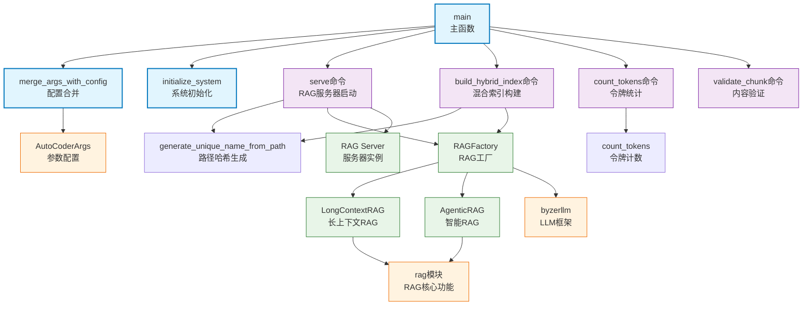

# auto_coder_rag

Auto-Coder 系统的 RAG (检索增强生成) 服务器模块，提供完整的 RAG 服务器启动、配置管理、混合索引构建和文档检索功能，支持多种存储后端和智能文档处理，是 Auto-Coder RAG 功能的主要命令行入口。

## 模块位置

**源码路径**: `src/autocoder/auto_coder_rag.py`  
**文档路径**: `specs/auto_coder_rag.ac.mod.md`  
**模块类型**: 单文件模块

## 文件结构

```python
# auto_coder_rag.py 内容结构
├── 导入部分                    # byzerllm, rag相关模块等依赖导入
├── generate_unique_name_from_path() # 从路径生成唯一名称函数
├── initialize_system()         # 系统初始化函数
├── merge_args_with_config()    # 配置合并函数
├── main()                      # 主函数
│   ├── 参数解析器设置          # 创建主解析器和子命令解析器
│   ├── build_hybrid_index子命令 # 构建混合索引
│   ├── serve子命令             # 启动RAG服务器
│   ├── count_tokens子命令      # 计算token数量
│   ├── validate_chunk子命令    # 验证chunk内容
│   └── 命令执行逻辑            # 根据子命令执行相应功能
└── count_tokens()              # token计数工具函数
```

## 快速开始

### 基本使用方式

```python
# 1. 直接调用main函数
from autocoder.auto_coder_rag import main

# 启动RAG服务器
main(["serve", "--doc_dir", "/path/to/docs", "--model", "gpt-4"])

# 构建混合索引
main(["build_hybrid_index", "--doc_dir", "/path/to/docs", "--emb_model", "text-embedding-ada-002"])

# 计算token数量
main(["count_tokens", "--file", "/path/to/file.txt"])
```

### 命令行使用

```bash
# 启动RAG服务器
auto-coder.rag serve --doc_dir /path/to/docs --model gpt-4 --port 8000

# 构建混合索引
auto-coder.rag build_hybrid_index --doc_dir /path/to/docs --emb_model text-embedding-ada-002

# 计算文件token数量
auto-coder.rag count_tokens --file /path/to/file.txt

# 验证chunk内容
auto-coder.rag validate_chunk --model gpt-4 --query "测试查询" --content "测试内容"
```

### 支持的子命令

该模块提供多个子命令，每个都有特定的RAG功能：

#### 1. serve - 启动RAG服务器
```bash
auto-coder.rag serve \
  --doc_dir /path/to/docs \
  --model gpt-4 \
  --emb_model text-embedding-ada-002 \
  --host 0.0.0.0 \
  --port 8000 \
  --workers 4 \
  --agentic  # 使用智能RAG模式
```

#### 2. build_hybrid_index - 构建混合索引
```bash
auto-coder.rag build_hybrid_index \
  --doc_dir /path/to/docs \
  --emb_model text-embedding-ada-002 \
  --rag_storage_type duckdb \
  --rag_index_build_workers 5 \
  --required_exts ".md,.txt,.py"
```

#### 3. count_tokens - 计算token数量
```bash
auto-coder.rag count_tokens \
  --file /path/to/file.txt \
  --tokenizer_path /path/to/tokenizer.json
```

#### 4. validate_chunk - 验证chunk内容
```bash
auto-coder.rag validate_chunk \
  --model gpt-4 \
  --query "查询内容" \
  --content "待验证的chunk内容"
```

### 主要功能

该模块提供完整的RAG服务器功能，包括文档索引构建、智能检索、多模型支持、配置管理等，是Auto-Coder系统RAG功能的核心入口。

## 核心组件详解

### 1. 主要函数

**generate_unique_name_from_path(path: str) -> str**
- **功能**: 从文件路径生成唯一的MD5哈希名称
- **参数**: path - 文件路径
- **返回值**: MD5哈希字符串
- **用途**: 为RAG构建生成唯一标识符
- **处理逻辑**: 
  - 规范化路径（绝对路径，移除尾部分隔符）
  - 生成MD5哈希值作为唯一名称
- **使用示例**:
```python
unique_name = generate_unique_name_from_path("/path/to/docs")
print(f"生成的唯一名称: {unique_name}")
```

**initialize_system(args)**
- **功能**: 初始化Auto-Coder系统
- **参数**: args - 包含系统配置的参数对象
- **功能**: 
  - 显示系统初始化状态
  - 配置基础环境
  - 准备RAG服务运行环境

**merge_args_with_config(args, config, arg_class, parser)**
- **功能**: 合并命令行参数和配置文件参数
- **参数**: 
  - args - 命令行参数
  - config - 配置文件内容
  - arg_class - 参数类
  - parser - 参数解析器
- **返回值**: 合并后的参数对象
- **优先级**: 命令行参数 > 配置文件参数 > 默认值

**main(input_args: Optional[List[str]] = None) -> None**
- **功能**: 主入口函数，处理所有RAG命令和子命令
- **参数**: input_args - 可选的参数列表
- **流程**:
  1. 显示启动banner
  2. 设置tokenizer路径
  3. 创建参数解析器和子命令
  4. 解析命令行参数
  5. 根据子命令执行相应功能

**count_tokens(tokenizer_path: str, file_path: str) -> None**
- **功能**: 计算文件的token数量并显示统计表格
- **参数**: 
  - tokenizer_path - tokenizer文件路径
  - file_path - 要计算的文件路径
- **输出**: 显示包含文件名、字符数、token数的表格

### 2. 子命令详解

#### serve 子命令
**功能**: 启动完整的RAG服务器

**主要参数**:
- `--doc_dir`: 文档目录路径（必需）
- `--model`: 主要LLM模型名称
- `--emb_model`: 嵌入模型名称
- `--host`: 服务器主机地址（默认：127.0.0.1）
- `--port`: 服务器端口（默认：8000）
- `--workers`: 工作线程数（默认：4）
- `--agentic`: 启用智能RAG模式
- `--monitor_mode`: 启用文档监控模式
- `--enable_local_image_host`: 启用本地图片托管

**高级配置**:
- `--rag_context_window_limit`: RAG上下文窗口限制（默认：56000）
- `--full_text_ratio`: 全文区域比例（默认：0.7）
- `--segment_ratio`: 分段区域比例（默认：0.2）
- `--rag_doc_filter_relevance`: 文档过滤相关性阈值（默认：5）

#### build_hybrid_index 子命令
**功能**: 构建混合索引以支持高效检索

**主要参数**:
- `--doc_dir`: 文档目录路径
- `--emb_model`: 嵌入模型名称（必需）
- `--rag_storage_type`: 存储类型（duckdb/byzer-storage）
- `--rag_index_build_workers`: 索引构建工作线程数（默认：5）
- `--required_exts`: 需要处理的文件扩展名
- `--enable_hybrid_index`: 启用混合索引

#### count_tokens 子命令
**功能**: 统计文件的token使用量

**主要参数**:
- `--file`: 要分析的文件路径
- `--tokenizer_path`: tokenizer文件路径

**输出格式**:
```
┌─────────────┬────────────┬────────┐
│ File        │ Characters │ Tokens │
├─────────────┼────────────┼────────┤
│ example.py  │ 1234       │ 567    │
│ Total       │ 1234       │ 567    │
└─────────────┴────────────┴────────┘
```

#### validate_chunk 子命令
**功能**: 验证chunk内容的质量和相关性

**主要参数**:
- `--model`: 验证模型名称
- `--query`: 验证查询
- `--content`: 待验证的chunk内容

### 3. 配置管理

该模块支持丰富的配置选项：

**模型配置**:
```python
# 模型相关配置
model = "gpt-4"              # 主要模型
emb_model = "text-embedding-ada-002"  # 嵌入模型
index_model = "gpt-3.5-turbo"  # 索引模型
```

**服务器配置**:
```python
# 服务器相关配置
host = "0.0.0.0"             # 监听地址
port = 8000                  # 监听端口
workers = 4                  # 工作线程数
api_key = "your-api-key"     # API密钥
```

**RAG配置**:
```python
# RAG相关配置
rag_context_window_limit = 56000    # 上下文窗口限制
rag_doc_filter_relevance = 5        # 文档过滤相关性
full_text_ratio = 0.7               # 全文比例
segment_ratio = 0.2                 # 分段比例
```

**存储配置**:
```python
# 存储相关配置
rag_storage_type = "duckdb"          # 存储类型
rag_index_build_workers = 5         # 索引构建线程
required_exts = ".md,.txt,.py"      # 处理文件类型
```

### 4. 特殊功能

**文档监控模式**:
- 支持实时监控文档变化
- 自动更新索引
- 热重载功能

**本地图片托管**:
- 支持本地图片服务
- 自动生成图片URL
- 静态文件服务

**智能RAG模式**:
- 使用AgenticRAG而非LongContextRAG
- 更智能的文档检索
- 支持复杂查询理解

## Mermaid 依赖图



## 依赖关系说明

### 对其他模块的依赖
该模块依赖以下核心模块：

- `specs/rag.ac.mod.md` - 所有RAG核心功能的实现
- `specs/common.ac.mod.md` - AutoCoderArgs配置类
- `specs/models.ac.mod.md` - 模型配置管理
- `specs/lang.ac.mod.md` - 多语言描述支持
- **外部依赖**: byzerllm, prompt_toolkit, rich, fastapi

### 被依赖关系
作为RAG服务器的主要入口，该模块被以下方式调用：

- **命令行入口**: `auto-coder.rag` 命令
- **setup.py**: 注册为 console_scripts 入口点
- **独立RAG服务**: 作为独立的RAG服务器使用

## 可以验证模块可运行的测试命令

```bash
# Python模块测试
python -c "from autocoder.auto_coder_rag import generate_unique_name_from_path; print(f'路径哈希: {generate_unique_name_from_path(\"/test/path\")}')"

# 测试配置合并
python -c "from autocoder.auto_coder_rag import merge_args_with_config; print('配置合并函数导入成功')"

# 测试令牌计数功能
python -c "from autocoder.auto_coder_rag import count_tokens; print('令牌计数函数导入成功')"

# 启动RAG服务器（需要文档目录）
# auto-coder.rag serve --quick --doc_dir /tmp --model gpt-4

# 构建索引（需要嵌入模型）
# auto-coder.rag build_hybrid_index --quick --doc_dir /tmp --emb_model text-embedding-ada-002

# 验证主函数
python -c "from autocoder.auto_coder_rag import main; print('主函数导入成功')"

# 测试参数解析
python -c "import sys; sys.argv = ['auto_coder_rag', '--help']; from autocoder.auto_coder_rag import main; print('参数解析正常')"
``` 