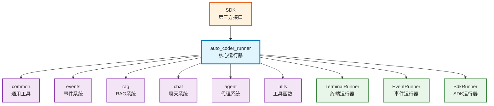

# auto_coder_runner

Auto-Coder 的核心运行器模块，负责管理整个系统的生命周期、处理各种命令、协调不同组件之间的交互，是 SDK 和其他模块的主要依赖。

## 模块位置

**源码路径**: `src/autocoder/auto_coder_runner.py`  
**文档路径**: `specs/auto_coder_runner.ac.mod.md`  
**模块类型**: 单文件模块

## 文件结构

```python
# auto_coder_runner.py 内容结构
├── 导入部分                    # 大量外部依赖和内部模块导入
├── 常量定义                    
│   ├── memory                 # 全局内存字典
│   ├── project_root           # 项目根目录
│   ├── base_persist_dir       # 持久化目录
│   ├── defaut_exclude_dirs    # 默认排除目录
│   └── commands               # 支持的命令列表
├── 数据模型                    
│   ├── SymbolItem             # 符号项模型
│   └── InitializeSystemRequest # 系统初始化请求模型
├── 系统初始化函数              
│   ├── load_tokenizer()       # 加载分词器
│   ├── configure_logger()     # 配置日志系统
│   ├── init_singleton_instances() # 初始化单例
│   ├── start()                # 启动引擎
│   ├── stop()                 # 停止引擎
│   └── initialize_system()    # 初始化系统
├── 内存管理函数                
│   ├── save_memory()          # 保存内存
│   ├── load_memory()          # 加载内存
│   └── get_memory()           # 获取内存
├── 文件管理函数                
│   ├── add_files()            # 添加文件
│   ├── remove_files()         # 移除文件
│   ├── list_files()           # 列出文件
│   └── exclude_files()        # 排除文件
├── 核心命令函数                
│   ├── configure()            # 配置管理
│   ├── ask()                  # 询问功能
│   ├── coding()               # 编码功能
│   ├── chat()                 # 聊天功能
│   ├── commit()               # 提交功能
│   ├── auto_command()         # 自动命令（/auto）
│   └── run_auto_command()     # SDK调用的核心函数
├── 辅助功能函数                
│   ├── index_build/query()    # 索引构建/查询
│   ├── mcp()                  # MCP服务管理
│   ├── manage_models()        # 模型管理
│   └── voice_input()          # 语音输入
└── if __name__ == "__main__":  # 直接运行逻辑（无）
```

## 快速开始

### 基本使用方式

```python
# 导入模块
from autocoder import auto_coder_runner

# 1. 初始化系统
auto_coder_runner.initialize_system(
    InitializeSystemRequest(
        product_mode="lite",
        skip_provider_selection=False,
        debug=False,
        quick=False,
        lite=True,
        pro=False
    )
)

# 2. 启动引擎
auto_coder_runner.start()

# 3. 配置项目
auto_coder_runner.configure("project_type:.py,.ts")
auto_coder_runner.configure("model:v3_chat")

# 4. 执行自动命令（SDK 核心功能）
events = auto_coder_runner.run_auto_command(
    query="实现一个简单的 HTTP 服务器",
    pre_commit=False,
    post_commit=False,
    pr=False,
    extra_args={}
)

# 处理事件流
for event in events:
    print(f"Event: {event.event_type} - {event.data}")

# 5. 使用其他功能
# 添加文件到上下文
auto_coder_runner.add_files(["src/main.py", "src/utils.py"])

# 执行编码任务
auto_coder_runner.coding("优化代码性能")

# 提交代码
auto_coder_runner.commit("feat: add new feature")

# 6. 停止引擎
auto_coder_runner.stop()
```

### 主要功能

本模块提供了 Auto-Coder 系统的所有核心功能，包括系统管理、文件操作、AI 交互、代码管理等。

## 核心组件详解

### 1. 系统管理函数

**initialize_system**
- **功能**: 初始化整个 Auto-Coder 系统，包括项目配置、模型选择等
- **参数**: `InitializeSystemRequest` 对象，包含产品模式、调试选项等
- **使用示例**: 
```python
initialize_system(InitializeSystemRequest(
    product_mode="lite",  # 或 "pro"
    skip_provider_selection=False,
    debug=False,
    quick=False,
    lite=True,
    pro=False
))
```

**start/stop**
- **功能**: 启动和停止 Auto-Coder 引擎
- **说明**: `start()` 会初始化日志系统、文件监控、规则管理等；`stop()` 会清理资源

### 2. 核心执行函数

**run_auto_command**
- **功能**: SDK 的核心函数，执行自动编码命令并返回事件流
- **参数**: 
  - `query`: 用户查询
  - `pre_commit`: 是否预提交
  - `post_commit`: 是否后提交
  - `pr`: 是否创建 PR
  - `extra_args`: 额外参数（如对话历史）
- **返回值**: 事件流生成器
- **重要性**: 这是 SDK 桥接层调用的主要函数

**auto_command**
- **功能**: 处理 `/auto` 命令的终端版本
- **特点**: 支持新建对话、恢复对话、列出对话等功能

### 3. 文件管理函数

**add_files/remove_files**
- **功能**: 管理当前上下文中的文件
- **说明**: 文件信息保存在全局 `memory` 字典中

**exclude_files/exclude_dirs**
- **功能**: 管理排除的文件和目录
- **用途**: 防止某些文件被包含在处理范围内

### 4. AI 交互函数

**ask**
- **功能**: 简单的问答功能，不修改代码
- **用途**: 获取信息、解释概念等

**coding**
- **功能**: 执行编码任务，会修改代码
- **特点**: 支持自动合并、人工确认等选项

**chat**
- **功能**: 交互式聊天，支持多轮对话
- **特点**: 保持对话上下文

### 5. 配置管理

**configure**
- **功能**: 设置各种配置项
- **示例**: 
```python
configure("model:v3_chat")
configure("project_type:.py,.ts")
configure("auto_merge:editblock")
```

**get_memory/save_memory**
- **功能**: 获取和保存全局内存状态
- **用途**: 持久化配置和上下文信息

### 6. 模块常量

- `memory`: 全局内存字典，存储配置、文件列表、对话历史等
- `commands`: 支持的所有命令列表
- `defaut_exclude_dirs`: 默认排除的目录
- `project_root`: 当前项目根目录
- `base_persist_dir`: 持久化数据目录

## Mermaid 依赖图



## 依赖关系说明

### 对其他模块的依赖
- `specs/common.ac.mod.md` - 使用 AutoCoderArgs、文件管理等基础功能
- `specs/events.ac.mod.md` - 事件系统支持
- `specs/rag.ac.mod.md` - 变量持有器、RAG 功能
- `specs/utils.llms.ac.mod.md` - LLM 管理功能
- `specs/chat.ac.mod.md` - 聊天相关功能
- `specs/agent.ac.mod.md` - 代理功能（自动猜测、项目读取等）
- `specs/memory.ac.mod.md` - 主动上下文管理
- `specs/plugins.ac.mod.md` - 插件系统

### 被依赖关系
- `specs/sdk.ac.mod.md` - SDK 通过 bridge.py 调用 run_auto_command
- `specs/chat_auto_coder.ac.mod.md` - 终端界面使用各种命令函数

## 可以验证模块可运行的测试命令

```bash
# Python 模块测试
python -c "from autocoder import auto_coder_runner; print(auto_coder_runner.__name__)"

# 验证主要函数
python -c "from autocoder.auto_coder_runner import start, stop, configure, get_memory; print('Functions loaded successfully')"

# 查看支持的命令
python -c "from autocoder.auto_coder_runner import commands; print('Supported commands:', commands)"
``` 