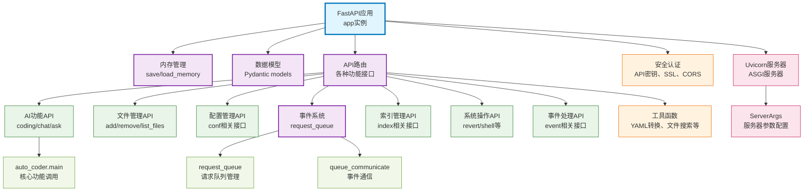

# auto_coder_server

Auto-Coder 系统的 Web 服务器模块，基于 FastAPI 构建的完整 RESTful API 服务，提供文件管理、配置管理、AI 功能调用、索引管理、事件处理等全套 Web 接口，支持跨域访问、身份验证、SSL 加密，为前端应用和第三方集成提供统一的服务端点。

## 模块位置

**源码路径**: `src/autocoder/auto_coder_server.py`  
**文档路径**: `specs/auto_coder_server.ac.mod.md`  
**模块类型**: 单文件模块

## 文件结构

```python
# auto_coder_server.py 内容结构
├── 导入部分                    # FastAPI, Pydantic, uvicorn等依赖导入
├── 全局变量                    # app实例和内存管理
├── 工具函数                    # YAML配置转换、输出重定向、内存管理
│   ├── convert_yaml_config_to_str() # YAML配置转字符串
│   ├── redirect_stdout()       # 标准输出重定向上下文管理器
│   ├── save_memory()          # 保存内存状态
│   └── load_memory()          # 加载内存状态
├── 数据模型                    # Pydantic请求/响应模型
│   ├── FileRequest            # 文件请求模型
│   ├── QueryRequest           # 查询请求模型
│   ├── ConfigRequest          # 配置请求模型
│   ├── FileQueryRequest       # 文件查询请求模型
│   ├── EventGetRequest        # 事件获取请求模型
│   ├── EventResponseRequest   # 事件响应请求模型
│   └── ServerArgs             # 服务器参数模型
├── API 路由                    # FastAPI路由定义
│   ├── 文件管理接口            # /add_files, /remove_files, /list_files
│   ├── 配置管理接口            # /conf, /conf/list, /extra/conf/list
│   ├── AI功能接口             # /coding, /chat, /ask
│   ├── 索引管理接口            # /index/build, /index/query
│   ├── 系统操作接口            # /revert, /shell, /exclude_dirs
│   ├── 事件处理接口            # /extra/event/get, /extra/event/response
│   └── 工具接口               # /extra/files, /extra/result, /extra/logs
├── 辅助函数                    # 业务逻辑辅助函数
│   ├── find_files_in_project() # 项目文件搜索
│   └── convert_config_value()  # 配置值转换
├── 参数解析                    # 命令行参数解析
│   └── parse_args()           # 解析服务器启动参数
└── main()                     # 主函数，启动Web服务器
```

## 快速开始

### 基本使用方式

```python
# 1. 直接启动服务器
from autocoder.auto_coder_server import main
main()

# 2. 自定义配置启动
import sys
sys.argv = ["auto_coder_server", "--host", "0.0.0.0", "--port", "8080"]
main()
```

### 命令行启动

```bash
# 基本启动
auto-coder-serve
# 或
auto-coder.serve

# 自定义配置启动
auto-coder-serve --host 0.0.0.0 --port 8080 --api-key your-secret-key

# SSL支持
auto-coder-serve --ssl-keyfile server.key --ssl-certfile server.crt

# CORS配置
auto-coder-serve --allowed-origins "http://localhost:3000" "https://myapp.com"
```

### 服务器配置选项

该模块支持丰富的服务器配置选项：

```bash
# 网络配置
--host 0.0.0.0                    # 绑定地址（默认：0.0.0.0）
--port 8000                       # 端口号（默认：8000）

# 安全配置
--api-key SECRET_KEY               # API密钥认证
--ssl-keyfile server.key           # SSL私钥文件
--ssl-certfile server.crt          # SSL证书文件

# CORS配置
--allow-credentials                # 允许凭据
--allowed-origins "*"              # 允许的源（默认：*）
--allowed-methods "*"              # 允许的方法（默认：*）
--allowed-headers "*"              # 允许的头部（默认：*）

# 服务配置
--uvicorn-log-level info           # 日志级别（默认：info）
--served-model-name model_name     # 服务模型名称
--prompt-template template         # 提示模板
--response-role assistant          # 响应角色（默认：assistant）
```

### API 接口概览

该模块提供完整的 RESTful API，主要分为以下几类：

#### 文件管理 API
- `POST /add_files` - 添加文件到当前会话
- `POST /remove_files` - 从当前会话移除文件
- `GET/POST /list_files` - 列出当前会话中的文件

#### 配置管理 API
- `POST /conf` - 设置配置项
- `DELETE /conf/{key}` - 删除配置项
- `GET/POST /conf/list` - 列出用户配置
- `GET/POST /extra/conf/list` - 列出所有可用配置选项

#### AI 功能 API
- `POST /coding` - 代码生成功能
- `POST /chat` - 聊天对话功能
- `POST /ask` - 问答功能

#### 索引管理 API
- `POST /index/build` - 构建项目索引
- `POST /index/query` - 查询索引

#### 系统操作 API
- `POST /revert` - 撤销操作
- `POST /shell` - 执行Shell命令
- `POST /exclude_dirs` - 排除目录

#### 事件处理 API
- `POST /extra/event/get` - 获取事件
- `POST /extra/event/response` - 响应事件
- `POST /test/event/send` - 发送测试事件

### 主要功能

该模块为Auto-Coder系统提供完整的Web服务接口，支持所有核心功能的远程调用，是前端应用、IDE插件和第三方集成的重要基础设施。

## 核心组件详解

### 1. FastAPI 应用实例

**app = FastAPI()**
- **功能**: 核心的FastAPI应用实例
- **中间件**: CORS支持，允许跨域访问
- **特点**: 自动生成OpenAPI文档，支持Swagger UI

### 2. 内存管理系统

该模块实现了完整的会话状态管理：

**内存结构**:
```python
memory = {
    "current_files": {"files": []},    # 当前会话文件列表
    "conf": {},                        # 用户配置
    "conversation": []                 # 对话历史（可选）
}
```

**主要函数**:

**save_memory()**
- **功能**: 将内存状态保存到文件
- **路径**: `.autocoder/memory.json`
- **格式**: JSON格式持久化

**load_memory()**
- **功能**: 从文件加载内存状态
- **容错**: 文件不存在时自动初始化默认结构

**get_memory()**
- **功能**: 获取当前内存状态
- **用途**: 其他模块访问会话数据

### 3. 数据模型

该模块定义了完整的请求/响应数据模型：

#### 请求模型

**FileRequest**
```python
class FileRequest(BaseModel):
    files: List[str]  # 文件路径列表
```

**QueryRequest**
```python
class QueryRequest(BaseModel):
    query: str  # 查询字符串
```

**ConfigRequest**
```python
class ConfigRequest(BaseModel):
    key: str    # 配置键
    value: str  # 配置值
```

**EventGetRequest**
```python
class EventGetRequest(BaseModel):
    request_id: str  # 请求ID
```

**EventResponseRequest**
```python
class EventResponseRequest(BaseModel):
    request_id: str          # 请求ID
    event: Dict[str, str]    # 事件数据
    response: str            # 响应内容
```

#### 服务器参数模型

**ServerArgs**
```python
class ServerArgs(BaseModel):
    host: str = None                        # 主机地址
    port: int = 8000                        # 端口号
    uvicorn_log_level: str = "info"         # 日志级别
    allow_credentials: bool = False         # 允许凭据
    allowed_origins: List[str] = ["*"]      # 允许的源
    allowed_methods: List[str] = ["*"]      # 允许的方法
    allowed_headers: List[str] = ["*"]      # 允许的头部
    api_key: Optional[str] = None           # API密钥
    served_model_name: Optional[str] = None # 服务模型名称
    prompt_template: Optional[str] = None   # 提示模板
    response_role: Optional[str] = "assistant"  # 响应角色
    ssl_keyfile: Optional[str] = None       # SSL私钥文件
    ssl_certfile: Optional[str] = None      # SSL证书文件
```

### 4. API 路由详解

#### 文件管理路由

**POST /add_files**
- **功能**: 添加文件到当前会话
- **逻辑**: 
  - 支持glob模式匹配文件
  - 避免重复添加已存在文件
  - 返回实际添加的文件列表
- **示例**:
```python
# 请求
{"files": ["src/*.py", "tests/test_*.py"]}

# 响应
{"message": "Added files: ['src/main.py', 'src/utils.py']"}
```

**POST /remove_files**
- **功能**: 从当前会话移除文件
- **特殊值**: "/all" 清空所有文件
- **匹配**: 支持文件名或完整路径匹配

**GET/POST /list_files**
- **功能**: 列出当前会话中的所有文件
- **返回**: 文件路径列表

#### 配置管理路由

**POST /conf**
- **功能**: 设置配置项
- **验证**: 自动转换配置值类型
- **持久化**: 立即保存到内存文件

**DELETE /conf/{key}**
- **功能**: 删除指定配置项
- **错误处理**: 配置不存在时返回404

**GET/POST /extra/conf/list**
- **功能**: 列出所有可用的配置选项
- **数据源**: 从AutoCoderArgs模型字段获取

#### AI 功能路由

**POST /coding**
- **功能**: 代码生成和修改
- **处理流程**:
  1. 创建临时YAML配置文件
  2. 合并用户配置和请求参数
  3. 调用auto_coder_main执行代码生成
  4. 清理临时文件
- **异步处理**: 使用BackgroundTasks异步执行
- **事件通知**: 发送开始和结束事件

**POST /chat**
- **功能**: AI聊天对话
- **上下文**: 包含当前会话文件内容
- **实现**: 调用agent chat命令
- **流式处理**: 支持流式响应

**POST /ask**
- **功能**: 项目相关问答
- **模式**: 使用project_reader代理
- **配置**: 支持多种模型配置

#### 索引管理路由

**POST /index/build**
- **功能**: 构建项目索引
- **异步**: 后台任务执行
- **配置**: 使用当前项目配置

**POST /index/query**
- **功能**: 查询项目索引
- **参数**: 查询字符串
- **返回**: 相关文件和内容

#### 系统操作路由

**POST /revert**
- **功能**: 撤销最近的操作
- **实现**: 调用auto_coder_main的revert功能

**POST /shell**
- **功能**: 执行Shell命令
- **安全**: 在项目目录中执行
- **超时**: 5秒执行超时

**POST /exclude_dirs**
- **功能**: 排除指定目录
- **用途**: 配置项目索引和搜索范围

### 5. 事件处理系统

该模块集成了完整的事件处理机制：

**事件队列**:
- 使用request_queue管理异步请求
- 支持流式和默认值两种响应模式
- 提供请求状态跟踪

**事件类型**:
- CODE_START: 代码生成开始
- CODE_END: 代码生成结束
- CUSTOM: 自定义事件

**API接口**:

**POST /extra/event/get**
- **功能**: 获取指定请求的事件
- **参数**: request_id
- **返回**: 事件数据或错误信息

**POST /extra/event/response**
- **功能**: 响应事件请求
- **用途**: 处理交互式事件

### 6. 工具函数

**convert_yaml_config_to_str(yaml_config)**
- **功能**: 将Python字典转换为YAML字符串
- **配置**: 支持Unicode，不使用流式风格

**redirect_stdout()**
- **功能**: 上下文管理器，重定向标准输出
- **用途**: 捕获命令执行的输出

**find_files_in_project(patterns)**
- **功能**: 在项目中搜索匹配的文件
- **支持**: glob模式匹配
- **过滤**: 排除虚拟环境和缓存目录

**convert_config_value(key, value)**
- **功能**: 转换配置值为合适的类型
- **规则**: 
  - "true"/"false" -> bool
  - 数字字符串 -> int/float
  - 其他保持字符串

### 7. 身份验证与安全

该模块支持多种安全特性：

**API密钥认证**:
```python
@app.middleware("http")
async def authentication(request: Request, call_next):
    if request.headers.get("Authorization") != "Bearer " + args.api_key:
        return JSONResponse(content={"error": "Unauthorized"}, status_code=401)
    return await call_next(request)
```

**CORS配置**:
- 可配置允许的源、方法、头部
- 支持凭据传递
- 生产环境建议限制源

**SSL支持**:
- 支持HTTPS加密传输
- 可配置SSL证书和私钥文件

### 8. 服务器启动

**main()函数**:
```python
def main():
    import uvicorn
    
    args = parse_args()
    
    # 配置CORS中间件
    app.add_middleware(CORSMiddleware, ...)
    
    # 配置身份验证（如果提供API密钥）
    if args.api_key: ...
    
    # 启动Uvicorn服务器
    uvicorn.run(
        app,
        host=args.host,
        port=args.port,
        log_level=args.uvicorn_log_level,
        ssl_keyfile=args.ssl_keyfile,
        ssl_certfile=args.ssl_certfile,
        workers=1,
    )
```

## Mermaid 依赖图



## 依赖关系说明

### 对其他模块的依赖
该模块依赖以下Auto-Coder核心模块：

- `src/autocoder/auto_coder.py` - 调用main函数执行核心功能
- `src/autocoder/common/__init__.py` - 使用AutoCoderArgs配置类
- `src/autocoder/utils/request_queue.py` - 请求队列管理
- `src/autocoder/utils/queue_communicate.py` - 事件通信机制
- `src/autocoder/utils/__init__.py` - 工具函数（get_last_yaml_file等）
- **外部依赖**: FastAPI, Pydantic, Uvicorn, PyYAML

### 被依赖关系
作为Web服务器入口，该模块被以下方式使用：

- **命令行入口**: `auto-coder-serve` 和 `auto-coder.serve` 命令
- **IDE插件**: VSCode插件启动后端服务
- **前端应用**: Web界面的后端API服务
- **第三方集成**: 其他系统通过HTTP API调用Auto-Coder功能

## 可以验证模块可运行的测试命令

```bash
# Python模块测试
python -c "from autocoder.auto_coder_server import FastAPI, app; print(f'FastAPI应用创建成功: {type(app)}')"

# 测试数据模型
python -c "from autocoder.auto_coder_server import FileRequest, QueryRequest; fr = FileRequest(files=['test.py']); print(f'请求模型: {fr.files}')"

# 测试工具函数
python -c "from autocoder.auto_coder_server import convert_yaml_config_to_str; config = {'key': 'value'}; yaml_str = convert_yaml_config_to_str(config); print(f'YAML转换: {len(yaml_str)} chars')"

# 测试内存管理
python -c "from autocoder.auto_coder_server import save_memory, load_memory; print('内存管理函数导入成功')"

# 测试参数解析
python -c "from autocoder.auto_coder_server import ServerArgs, parse_args; args = ServerArgs(); print(f'默认端口: {args.port}')"

# 验证服务器启动配置
python -c "
import sys
sys.argv = ['test', '--host', '127.0.0.1', '--port', '8888']
from autocoder.auto_coder_server import parse_args
args = parse_args()
print(f'解析配置: host={args.host}, port={args.port}')
"

# 测试文件搜索功能
python -c "
from autocoder.auto_coder_server import find_files_in_project
import os
os.chdir('.')
files = find_files_in_project(['*.py'])
print(f'找到Python文件: {len(files)}个')
"

# 验证主函数（不实际启动）
python -c "
from autocoder.auto_coder_server import main
import inspect
sig = inspect.signature(main)
print(f'主函数签名: {sig}')
"

# 测试配置值转换
python -c "
from autocoder.auto_coder_server import convert_config_value
tests = [('test', 'true'), ('num', '123'), ('str', 'hello')]
for key, value in tests:
    result = convert_config_value(key, value)
    print(f'{key}={value} -> {result} ({type(result).__name__})')
"
``` 