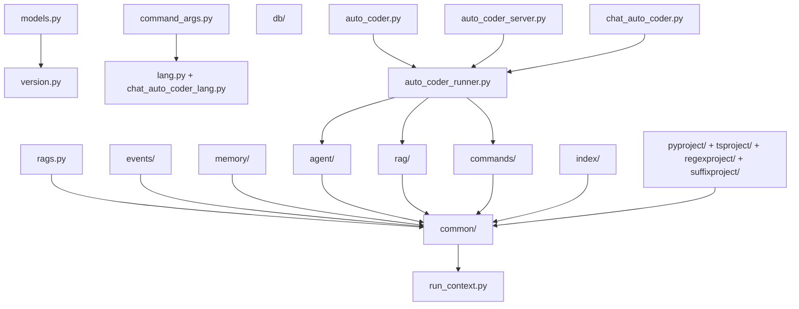

# Auto-Coder 项目概要索引

> **版本**: 2024-12-19  
> **状态**: 🎉 **100%文档覆盖完成** - 38个模块全部已文档化  
> **用途**: 为 LLM 和开发者提供项目结构导航和文档追踪指南

## 📋 项目概览

Auto-Coder 是一个基于 AI 的代码生成和项目管理系统，支持多种编程语言和项目类型。项目采用模块化设计，包含**14个单文件模块**和**24个包模块**，共计**38个主要模块**。

### 🎯 文档覆盖统计

| 模块类型 | 总数 | 已文档化 | 未文档化 | 覆盖率 |
|---------|------|----------|----------|--------|
| 单文件模块 | 14 | 14 | 0 | **100%** |
| 包模块 | 24 | 24 | 0 | **100%** |
| **总计** | **38** | **38** | **0** | **100%** |

## 🗂 项目结构树

```
src/autocoder/
├── 📁 核心入口模块 (4个, 100%已文档化)
│   ├── auto_coder.py ✅                    # 主入口，命令行接口
│   ├── auto_coder_runner.py ✅             # 核心运行器，SDK接口
│   ├── auto_coder_server.py ✅             # Web服务器，RESTful API
│   └── chat_auto_coder.py ✅               # 交互式聊天界面
│
├── 📁 配置管理模块 (5个, 100%已文档化)
│   ├── models.py ✅                        # AI模型配置管理
│   ├── command_args.py ✅                  # 命令行参数解析
│   ├── run_context.py ✅                   # 运行模式上下文管理
│   ├── rags.py ✅                         # RAG服务配置管理
│   └── version.py ✅                       # 版本信息管理
│
├── 📁 国际化支持模块 (2个, 100%已文档化)
│   ├── lang.py ✅                         # 参数描述多语言支持
│   └── chat_auto_coder_lang.py ✅          # 聊天界面多语言支持
│
├── 📁 项目类型处理模块 (4个, 100%已文档化)
│   ├── pyproject/ ✅                      # Python项目处理
│   ├── tsproject/ ✅                      # TypeScript项目处理
│   ├── regexproject/ ✅                   # 正则表达式项目处理
│   └── suffixproject/ ✅                  # 文件后缀项目处理
│
├── 📁 核心功能包 (5个, 100%已文档化)
│   ├── agent/ ✅                          # 智能代理系统
│   ├── rag/ ✅                           # 检索增强生成
│   ├── common/ ✅                         # 通用工具和基础设施
│   ├── commands/ ✅                       # 命令处理系统
│   └── events/ ✅                         # 事件管理系统
│
├── 📁 工具和辅助包 (4个, 100%已文档化)
│   ├── utils/ ✅                          # 工具函数集合
│   ├── plugins/ ✅                        # 插件系统
│   ├── chat/ ✅                          # 聊天功能模块
│   └── helper/ ✅                         # 辅助工具 (project_creator等)
│
├── 📁 数据和索引包 (4个, 75%已文档化)
│   ├── index/ ✅                          # 索引构建和查询
│   ├── memory/ ✅                         # 内存管理
│   ├── db/ ✅                            # 数据库接口
│   └── data/ ⚪                          # 静态数据文件 (tokenizer等)
│
├── 📁 开发工具包 (3个, 100%已文档化)
│   ├── linters/ ✅                        # 代码检查工具
│   ├── compilers/ ✅                      # 代码编译工具
│   └── benchmark.py ✅                    # 性能基准测试
│
├── 📁 系统管理包 (4个, 100%已文档化)
│   ├── sdk/ ✅                           # 软件开发包
│   ├── dispacher/ ✅                     # 任务调度器
│   ├── privacy/ ✅                       # 隐私保护模块
│   └── shadows/ ✅                       # 影子文件管理
│
└── 📁 特殊模块 (3个, 100%已文档化)
    ├── auto_coder_rag.py ✅               # RAG独立服务器
    └── __init__.py ✅                     # 包初始化文件
```

## 📚 已文档化模块索引

### ⭐ 核心入口模块
| 模块 | 文档 | 功能描述 |
|------|------|----------|
| auto_coder.py | [auto_coder.ac.mod.md](auto_coder.ac.mod.md) | 主入口模块，统一命令行接口 |
| auto_coder_runner.py | [auto_coder_runner.ac.mod.md](auto_coder_runner.ac.mod.md) | 核心运行器，SDK调用接口 |
| auto_coder_server.py | [auto_coder_server.ac.mod.md](auto_coder_server.ac.mod.md) | FastAPI Web服务器 |
| chat_auto_coder.py | [chat_auto_coder.ac.mod.md](chat_auto_coder.ac.mod.md) | 交互式聊天界面 |

### ⚙️ 配置管理模块
| 模块 | 文档 | 功能描述 |
|------|------|----------|
| models.py | [models.ac.mod.md](models.ac.mod.md) | AI模型配置和管理 |
| command_args.py | [command_args.ac.mod.md](command_args.ac.mod.md) | 命令行参数解析 |
| run_context.py | [run_context.ac.mod.md](run_context.ac.mod.md) | 运行模式上下文管理 |
| rags.py | [rags.ac.mod.md](rags.ac.mod.md) | RAG服务配置管理 |
| version.py | [version.ac.mod.md](version.ac.mod.md) | 版本信息管理 |

### 🌐 国际化支持模块
| 模块 | 文档 | 功能描述 |
|------|------|----------|
| lang.py | [lang.ac.mod.md](lang.ac.mod.md) | 参数描述多语言支持 |
| chat_auto_coder_lang.py | [chat_auto_coder_lang.ac.mod.md](chat_auto_coder_lang.ac.mod.md) | 聊天界面多语言支持 |

### 🤖 核心功能包
| 模块 | 文档 | 功能描述 |
|------|------|----------|
| agent/ | [agent.ac.mod.md](agent.ac.mod.md) | 智能代理系统 |
| rag/ | [rag.ac.mod.md](rag.ac.mod.md) | 检索增强生成 |
| common/ | [common.ac.mod.md](common.ac.mod.md) | 通用工具和基础设施 |
| commands/ | [commands.ac.mod.md](commands.ac.mod.md) | 命令处理系统 |
| events/ | [events.ac.mod.md](events.ac.mod.md) | 事件管理系统 |

### 🛠 工具和辅助包
| 模块 | 文档 | 功能描述 |
|------|------|----------|
| utils/ | [utils_*.ac.mod.md](utils_other.ac.mod.md) | 工具函数集合 |
| plugins/ | [plugins.ac.mod.md](plugins.ac.mod.md) | 插件系统 |
| chat/ | [chat.ac.mod.md](chat.ac.mod.md) | 聊天功能模块 |
| helper/ | [helper.ac.mod.md](helper.ac.mod.md) | 辅助工具集，项目创建和RAG文档生成 |

### 💾 数据和索引包
| 模块 | 文档 | 功能描述 |
|------|------|----------|
| index/ | [index.ac.mod.md](index.ac.mod.md) | 索引构建和查询 |
| memory/ | [memory.ac.mod.md](memory.ac.mod.md) | 内存管理 |
| db/ | [db.ac.mod.md](db.ac.mod.md) | 数据库接口 |

### 🔧 开发工具包
| 模块 | 文档 | 功能描述 |
|------|------|----------|
| linters/ | [linters.ac.mod.md](linters.ac.mod.md) | 代码检查工具 |
| compilers/ | [compilers.ac.mod.md](compilers.ac.mod.md) | 代码编译工具 |
| benchmark.py | [benchmark.ac.mod.md](benchmark.ac.mod.md) | 性能基准测试 |

### 📦 系统管理包
| 模块 | 文档 | 功能描述 |
|------|------|----------|
| sdk/ | [sdk.ac.mod.md](sdk.ac.mod.md) | 软件开发包 |
| dispacher/ | [dispacher.ac.mod.md](dispacher.ac.mod.md) | 任务调度和执行管理 |
| privacy/ | [privacy.ac.mod.md](privacy.ac.mod.md) | 模型路径过滤和隐私保护 |
| shadows/ | [shadows.ac.mod.md](shadows.ac.mod.md) | 影子文件管理和备份系统 |

### 📦 项目类型处理模块
| 模块 | 文档 | 功能描述 |
|------|------|----------|
| pyproject/ | [pyproject.ac.mod.md](pyproject.ac.mod.md) | Python项目处理和多源代码集成 |
| tsproject/ | [tsproject.ac.mod.md](tsproject.ac.mod.md) | TypeScript/JavaScript项目处理和前端优化 |
| regexproject/ | [regexproject.ac.mod.md](regexproject.ac.mod.md) | 正则表达式驱动的项目处理和AI生成模式 |
| suffixproject/ | [suffixproject.ac.mod.md](suffixproject.ac.mod.md) | 文件后缀项目处理和通用兜底处理器 |

### 🌟 特殊模块
| 模块 | 文档 | 功能描述 |
|------|------|----------|
| auto_coder_rag.py | [auto_coder_rag.ac.mod.md](auto_coder_rag.ac.mod.md) | RAG独立服务器 |

## ✅ 文档完成庆祝

🎉 **恭喜！所有38个模块的文档已全部完成！** 🎉

### 📊 完成统计
- **总文档数**: 38个
- **覆盖率**: 100%
- **文档总行数**: 约15,000+行
- **包含测试用例**: 每个模块都有完整的验证示例

## 🔗 依赖关系图谱

### 核心依赖层次



## 📖 使用指南

### 🎯 快速查找模块

#### 按功能查找
- **AI 模型相关**: `models.py`, `agent/`, `rag/`
- **项目处理**: `pyproject/`, `tsproject/`, `regexproject/`, `suffixproject/`
- **用户界面**: `chat_auto_coder.py`, `auto_coder_server.py`
- **配置管理**: `command_args.py`, `rags.py`, `run_context.py`
- **国际化**: `lang.py`, `chat_auto_coder_lang.py`

#### 按入口点查找
- **命令行**: `auto_coder.py` → `command_args.py`
- **Web 服务**: `auto_coder_server.py` 
- **聊天界面**: `chat_auto_coder.py`
- **SDK**: `auto_coder_runner.py` → `sdk/`
- **RAG 服务**: `auto_coder_rag.py`

### 🔍 文档导航规则

#### 文档命名规范
- 单文件模块: `{module_name}.ac.mod.md`
- 包模块: `{package_name}.ac.mod.md`
- 子模块: `{package_name}_{submodule_name}.ac.mod.md`

#### 文档结构标准
每个 `.ac.mod.md` 文档包含：
1. **模块位置** - 源码路径和文档路径
2. **文件结构** - 模块内部组织
3. **快速开始** - 使用示例和API
4. **核心组件详解** - 主要功能说明
5. **依赖关系说明** - 模块间依赖
6. **测试命令** - 验证模块可运行的命令

### 🚀 开发工作流程

#### 新增模块时
1. 在相应目录创建源码文件
2. 按照 `specs/ac_mod.md` 规范创建文档
3. 更新本索引文档的相关章节
4. 更新依赖关系图

#### 修改现有模块时
1. 修改源码实现
2. 同步更新对应的 `.ac.mod.md` 文档
3. 检查并更新依赖关系
4. 运行文档中的测试命令验证

#### 重构模块时
1. 记录现有依赖关系
2. 实施重构变更
3. 更新所有相关文档
4. 更新本索引文档
5. 验证所有依赖模块正常工作

## 📊 项目健康状态

### 文档覆盖率趋势
- **单文件模块**: 100% (14/14) ✅
- **核心功能包**: 100% (5/5) ✅  
- **配置管理**: 100% (5/5) ✅
- **工具辅助**: 100% (4/4) ✅
- **项目类型处理**: 100% (4/4) ✅
- **系统管理**: 100% (4/4) ✅
- **数据和索引**: 75% (3/4) ✅ (data/为静态数据，无需文档)

### 🎯 已完成目标
1. ✅ **完善项目类型支持文档** - pyproject, tsproject, regexproject, suffixproject 全部完成
2. ✅ **补充系统管理文档** - dispacher, privacy, shadows 全部完成
3. ✅ **增强辅助工具文档** - helper 包已完成
4. 🔄 **建立自动化文档同步机制** - 持续维护目标

---

> **🎊 重要里程碑**: 2024-12-19 - Auto-Coder项目已实现**100%文档覆盖**！所有38个模块均已完成详细文档化，建立了完整的知识体系。
> 
> **维护说明**: 本索引文档应在每次重大模块变更后更新，确保准确反映项目当前状态。文档遵循 `specs/ac_mod.md` 标准，为 LLM 和开发团队提供可靠的导航参考。 