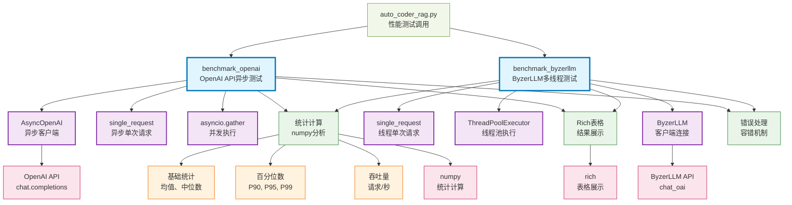

# benchmark

Auto-Coder 系统的 AI 模型性能基准测试模块，提供 OpenAI API 和 ByzerLLM 的并发性能测试功能，支持多轮测试、统计分析和美观的结果展示，用于评估不同模型的响应时间、并发能力和系统吞吐量。

## 模块位置

**源码路径**: `src/autocoder/benchmark.py`  
**文档路径**: `specs/benchmark.ac.mod.md`  
**模块类型**: 单文件模块

## 文件结构

```python
# benchmark.py 内容结构
├── 导入部分                    # openai, asyncio, rich, numpy等依赖导入
├── benchmark_openai()          # OpenAI API异步基准测试函数
│   ├── 客户端初始化            # AsyncOpenAI客户端设置
│   ├── single_request()        # 单次请求函数
│   ├── 多轮并发测试            # asyncio.gather并发执行
│   ├── 统计计算               # numpy统计分析
│   └── 结果展示               # rich表格输出
└── benchmark_byzerllm()        # ByzerLLM多线程基准测试函数
    ├── ByzerLLM连接           # 集群连接和模型设置
    ├── single_request()        # 单次请求函数
    ├── 多轮并发测试            # ThreadPoolExecutor多线程执行
    ├── 统计计算               # numpy统计分析
    └── 结果展示               # rich表格输出
```

## 快速开始

### 基本使用方式

```python
# 1. 导入基准测试函数
from autocoder.benchmark import benchmark_openai, benchmark_byzerllm
import asyncio

# 2. OpenAI API基准测试
async def test_openai():
    await benchmark_openai(
        model="gpt-3.5-turbo",
        parallel=10,              # 并发数
        api_key="your-api-key",
        base_url="https://api.openai.com/v1",
        rounds=3,                 # 测试轮数
        query="Hello, how are you?"
    )

# 运行OpenAI测试
asyncio.run(test_openai())

# 3. ByzerLLM基准测试
benchmark_byzerllm(
    model="gpt-4",
    parallel=5,               # 并发数
    rounds=2,                 # 测试轮数
    query="解释什么是机器学习"
)
```

### 命令行集成使用

```python
# 在auto_coder_rag.py中的使用示例
from autocoder.benchmark import benchmark_openai, benchmark_byzerllm

# 通过命令行触发基准测试
if args.benchmark_mode == "openai":
    await benchmark_openai(
        model=args.model,
        parallel=args.parallel_requests,
        api_key=args.api_key,
        base_url=args.base_url,
        rounds=args.test_rounds
    )
elif args.benchmark_mode == "byzerllm":
    benchmark_byzerllm(
        model=args.model,
        parallel=args.parallel_requests,
        rounds=args.test_rounds
    )
```

### 测试参数说明

两个基准测试函数都支持以下核心参数：

- **model**: 要测试的模型名称
- **parallel**: 并发请求数量
- **rounds**: 测试轮数（每轮执行parallel个请求）
- **query**: 测试查询内容

### 主要功能

该模块提供AI模型的性能基准测试，包括响应时间分析、并发性能评估和详细的统计报告，帮助用户选择最适合的模型和配置参数。

## 核心组件详解

### 1. OpenAI API基准测试

**benchmark_openai()** 函数提供OpenAI API的异步性能测试：

**函数签名**:
```python
async def benchmark_openai(
    model: str, 
    parallel: int, 
    api_key: str, 
    base_url: str = None, 
    rounds: int = 1, 
    query: str = "Hello, how are you?"
):
```

**参数说明**:
- `model`: OpenAI模型名称（如 "gpt-3.5-turbo", "gpt-4"）
- `parallel`: 并发请求数量
- `api_key`: OpenAI API密钥
- `base_url`: API基础URL（可选，默认为OpenAI官方API）
- `rounds`: 测试轮数
- `query`: 测试用的查询内容

**核心特性**:

#### 异步并发执行
```python
async def single_request():
    try:
        t1 = time.time()
        response = await client.chat.completions.create(
            model=model,
            messages=[{"role": "user", "content": query}],
        )
        t2 = time.time()
        return t2 - t1
    except Exception as e:
        logger.error(f"Request failed: {e}")
        return None
```

#### 多轮测试机制
```python
all_results = []
for round_num in range(rounds):
    print(f"Running round {round_num + 1}/{rounds}")
    tasks = [single_request() for _ in range(parallel)]
    results = await asyncio.gather(*tasks)
    all_results.extend(results)
```

#### 统计分析
使用numpy计算详细的性能指标：
- 平均响应时间
- 中位数（P50）
- 90th、95th、99th百分位数
- 总吞吐量（请求/秒）

### 2. ByzerLLM基准测试

**benchmark_byzerllm()** 函数提供ByzerLLM的多线程性能测试：

**函数签名**:
```python
def benchmark_byzerllm(
    model: str, 
    parallel: int, 
    rounds: int = 1, 
    query: str = "Hello, how are you?"
):
```

**参数说明**:
- `model`: ByzerLLM模型名称
- `parallel`: 并发请求数量
- `rounds`: 测试轮数
- `query`: 测试用的查询内容

**核心特性**:

#### ByzerLLM连接设置
```python
byzerllm.connect_cluster(address="auto")
llm = byzerllm.ByzerLLM()
llm.setup_default_model_name(model)
```

#### 多线程并发执行
```python
def single_request(llm):
    try:
        t1 = time.time()
        llm.chat_oai(
            conversations=[{"role": "user", "content": query}]
        )
        t2 = time.time()
        return t2 - t1
    except Exception as e:
        logger.error(f"Request failed: {e}")
        return None

with ThreadPoolExecutor(max_workers=parallel) as executor:
    futures = [executor.submit(single_request, llm) for _ in range(parallel)]
    results = [future.result() for future in futures]
```

### 3. 统计分析模块

两个基准测试函数都使用相同的统计分析逻辑：

**基础统计**:
```python
# 过滤失败的请求
results = [r for r in results if r is not None]

# 计算统计指标
avg_time = np.mean(results)          # 平均时间
p50 = np.percentile(results, 50)     # 中位数
p90 = np.percentile(results, 90)     # 90th百分位数
p95 = np.percentile(results, 95)     # 95th百分位数
p99 = np.percentile(results, 99)     # 99th百分位数
```

**性能指标**:
- **总时间**: 完整测试的耗时
- **平均响应时间**: 所有请求的平均耗时
- **百分位数**: 不同比例请求的响应时间
- **吞吐量**: 每秒处理的请求数

### 4. 结果展示系统

使用Rich库创建美观的表格输出：

**表格结构**:
```python
from rich.console import Console
from rich.table import Table

console = Console()
table = Table(title=f"Benchmark Results (Parallel={parallel})")

table.add_column("Metric", style="cyan")
table.add_column("Value (seconds)", style="magenta")

table.add_row("Total Time", f"{total_time:.2f}")
table.add_row("Average Response Time", f"{avg_time:.2f}")
table.add_row("Median (P50)", f"{p50:.2f}")
table.add_row("P90", f"{p90:.2f}")
table.add_row("P95", f"{p95:.2f}")
table.add_row("P99", f"{p99:.2f}")
table.add_row("Requests/Second", f"{parallel/total_time:.2f}")

console.print(table)
```

**输出示例**:
```
┏━━━━━━━━━━━━━━━━━━━━━━━━┳━━━━━━━━━━━━━━━━━━━━━━┓
┃ Metric                 ┃ Value (seconds)      ┃
┡━━━━━━━━━━━━━━━━━━━━━━━━╇━━━━━━━━━━━━━━━━━━━━━━┩
│ Total Time            │ 25.34               │
│ Average Response Time │ 2.18                │
│ Median (P50)          │ 2.05                │
│ P90                   │ 3.21                │
│ P95                   │ 3.67                │
│ P99                   │ 4.12                │
│ Requests/Second       │ 3.95                │
└───────────────────────┴─────────────────────┘
```

### 5. 错误处理与容错

两个函数都包含完善的错误处理机制：

**请求级错误处理**:
```python
try:
    # 执行API请求
    response = await client.chat.completions.create(...)
    return response_time
except Exception as e:
    logger.error(f"Request failed: {e}")
    return None  # 返回None标记失败请求
```

**结果过滤**:
```python
# 过滤掉失败的请求
results = [r for r in results if r is not None]

if not results:
    print("All requests failed")
    return
```

### 6. 使用场景

该模块主要用于以下场景：

#### 模型性能评估
- 比较不同模型的响应速度
- 评估模型在并发场景下的表现
- 确定最优的并发数设置

#### 系统调优
- 测试不同配置下的性能
- 评估API限流和配额影响
- 优化请求参数设置

#### 容量规划
- 确定系统的最大吞吐量
- 评估负载下的响应时间分布
- 规划生产环境配置

#### 故障诊断
- 识别性能瓶颈
- 分析请求失败模式
- 验证系统稳定性

### 7. 扩展示例

基于该模块可以构建更复杂的测试场景：

```python
import asyncio
from autocoder.benchmark import benchmark_openai, benchmark_byzerllm

async def comprehensive_benchmark():
    """全面的基准测试"""
    
    # 测试不同并发级别
    for parallel in [1, 5, 10, 20]:
        print(f"\n=== Testing with {parallel} parallel requests ===")
        await benchmark_openai(
            model="gpt-3.5-turbo",
            parallel=parallel,
            api_key="your-key",
            rounds=3
        )
    
    # 测试不同查询复杂度
    queries = [
        "Hello",
        "Explain machine learning in one paragraph",
        "Write a detailed analysis of climate change impacts"
    ]
    
    for i, query in enumerate(queries, 1):
        print(f"\n=== Query complexity level {i} ===")
        await benchmark_openai(
            model="gpt-4",
            parallel=5,
            api_key="your-key",
            query=query
        )

# 运行综合测试
asyncio.run(comprehensive_benchmark())
```

## Mermaid 依赖图



## 依赖关系说明

### 对其他模块的依赖
该模块主要依赖外部库，对Auto-Coder内部模块依赖较少：

**外部依赖**:
- **openai**: AsyncOpenAI客户端用于OpenAI API调用
- **asyncio**: 异步并发执行框架
- **numpy**: 统计分析和数值计算
- **rich**: 美观的控制台输出和表格展示
- **byzerllm**: ByzerLLM客户端和集群连接
- **concurrent.futures**: ThreadPoolExecutor多线程执行
- **loguru**: 日志记录

**内部依赖**:
- 无直接的Auto-Coder内部模块依赖

### 被依赖关系
作为性能测试工具，被以下模块使用：

- `src/autocoder/auto_coder_rag.py` - 导入benchmark函数进行模型性能测试
- **未来扩展**: 其他需要性能评估的模块

## 可以验证模块可运行的测试命令

```bash
# Python模块测试
python -c "from autocoder.benchmark import benchmark_openai, benchmark_byzerllm; print('基准测试函数导入成功')"

# 测试依赖导入
python -c "
import asyncio
import numpy as np
from rich.console import Console
from rich.table import Table
print('所有依赖导入成功')
"

# 测试统计计算功能
python -c "
import numpy as np
results = [1.2, 1.5, 1.1, 2.0, 1.8, 1.3, 1.7]
avg_time = np.mean(results)
p50 = np.percentile(results, 50)
p90 = np.percentile(results, 90)
print(f'统计计算测试: 平均={avg_time:.2f}, P50={p50:.2f}, P90={p90:.2f}')
"

# 测试Rich表格功能
python -c "
from rich.console import Console
from rich.table import Table
console = Console()
table = Table(title='测试表格')
table.add_column('指标', style='cyan')
table.add_column('数值', style='magenta')
table.add_row('测试项', '1.23')
print('Rich表格创建成功')
"

# 测试异步函数结构
python -c "
import asyncio
import inspect
from autocoder.benchmark import benchmark_openai
sig = inspect.signature(benchmark_openai)
print(f'benchmark_openai函数签名: {sig}')
print(f'是否为异步函数: {asyncio.iscoroutinefunction(benchmark_openai)}')
"

# 测试同步函数结构
python -c "
import inspect
from autocoder.benchmark import benchmark_byzerllm
sig = inspect.signature(benchmark_byzerllm)
print(f'benchmark_byzerllm函数签名: {sig}')
"

# 验证错误处理模拟
python -c "
import time
def mock_single_request():
    try:
        t1 = time.time()
        # 模拟请求
        time.sleep(0.1)
        t2 = time.time()
        return t2 - t1
    except Exception as e:
        print(f'Request failed: {e}')
        return None

result = mock_single_request()
print(f'模拟请求测试: {result:.3f}秒' if result else '请求失败')
"

# 验证过滤机制
python -c "
results = [1.2, None, 1.5, None, 1.1, 2.0]
filtered = [r for r in results if r is not None]
print(f'过滤前: {len(results)}个结果, 过滤后: {len(filtered)}个有效结果')
"
``` 