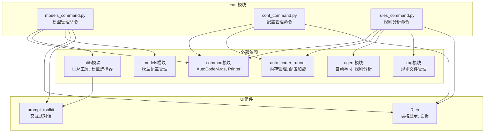

# chat.ac.mod.md

## 模块概述

`chat` 模块是 Auto-Coder 系统的交互式命令处理核心，提供聊天界面的命令解析、配置管理、模型操作和规则处理功能。该模块实现了丰富的斜杠命令系统，支持模型管理、配置设置、规则分析等功能，是用户与 Auto-Coder 系统交互的主要入口。

**模块类型**: 包模块  
**主要功能**: 聊天命令处理、配置管理、模型操作  
**依赖关系**: 依赖 `common`、`utils`、`auto_coder_runner`、`agent` 等模块

## 核心组件

### 1. 命令处理系统
- **models_command.py**: 模型管理命令处理
- **conf_command.py**: 配置管理命令处理  
- **rules_command.py**: 规则分析命令处理

### 2. 配置管理
- 配置项的增删改查
- 通配符模式匹配
- 配置导入导出
- 类型自动转换

### 3. 模型管理
- 模型列表显示和过滤
- 模型添加和删除
- 模型速度测试
- 价格配置管理

### 4. 规则分析
- 代码规则分析
- 提交历史分析
- 文件规则匹配
- 自动学习集成

## 主要功能

### 1. 模型管理命令 (/models)

```python
from autocoder.chat.models_command import handle_models_command

# 模型管理示例
memory = {"product_mode": "lite"}

# 列出所有模型
handle_models_command("/list", memory)

# 过滤模型列表
handle_models_command("/list gpt*", memory)

# 添加模型
handle_models_command("/add gpt-4 your-api-key", memory)

# 删除模型
handle_models_command("/remove gpt-4", memory)

# 模型速度测试
handle_models_command("/speed-test", memory)

# 与模型对话
handle_models_command("/chat gpt-4 你好，请介绍一下自己", memory)
```

**支持的子命令**:
- `/list [pattern]`: 列出模型，支持通配符过滤
- `/add <name> <api_key>`: 添加模型（简化格式）
- `/add_model name=xxx base_url=xxx ...`: 添加模型（完整格式）
- `/remove <name>`: 删除模型
- `/speed-test [rounds]`: 模型速度测试
- `/chat <model> <question>`: 与指定模型对话
- `/input_price <name> <price>`: 设置输入价格
- `/output_price <name> <price>`: 设置输出价格

### 2. 配置管理命令 (/conf)

```python
from autocoder.chat.conf_command import handle_conf_command

# 配置管理示例
memory = {"conf": {}}

# 显示所有配置
result = handle_conf_command("", memory)
print(result)

# 设置配置
handle_conf_command("/set auto_merge editblock", memory)
handle_conf_command("/set skip_confirm true", memory)
handle_conf_command("/set max_tokens 4096", memory)

# 获取配置
value = handle_conf_command("/get auto_merge", memory)
print(f"auto_merge: {value}")

# 删除配置
handle_conf_command("/delete max_tokens", memory)

# 通配符过滤
handle_conf_command("auto_*", memory)

# 导入导出配置
handle_conf_command("/export ./config.json", memory)
handle_conf_command("/import ./config.json", memory)
```

**支持的子命令**:
- `/list [pattern]`: 列出配置，支持通配符过滤
- `/get <key>`: 获取指定配置值
- `/set <key> <value>`: 设置配置值
- `/delete <key>`: 删除配置项
- `/export <path>`: 导出配置到文件
- `/import <path>`: 从文件导入配置

### 3. 规则分析命令 (/rules)

```python
from autocoder.chat.rules_command import handle_rules_command

# 规则分析示例
memory = {"current_files": {"files": ["src/main.py", "src/utils.py"]}}

# 列出规则文件
handle_rules_command("/list", memory)

# 过滤规则文件
handle_rules_command("/list **/*.md", memory)

# 查看规则内容
handle_rules_command("/get coding_*", memory)

# 分析当前文件
handle_rules_command("/analyze 检查代码质量", memory)

# 分析特定提交
handle_rules_command("/commit abc123 /query 分析这次提交的影响", memory)

# 删除规则文件
handle_rules_command("/remove temp_*", memory)
```

**支持的子命令**:
- `/list [pattern]`: 列出规则文件，支持通配符
- `/get <pattern>`: 显示匹配的规则文件内容
- `/remove <pattern>`: 删除匹配的规则文件
- `/analyze [query]`: 分析当前文件
- `/commit <id> /query <text>`: 分析特定提交
- `/help`: 显示帮助信息

## 详细功能解析

### 1. 模型管理功能

#### 模型列表和过滤
```python
def list_models_with_filter(pattern="*"):
    """列出并过滤模型"""
    from autocoder.chat.models_command import handle_models_command
    
    memory = {"product_mode": "lite"}
    
    # 支持的过滤模式
    patterns = [
        "*",           # 所有模型
        "gpt*",        # GPT 系列模型
        "*chat*",      # 包含 chat 的模型
        "claude*",     # Claude 系列模型
    ]
    
    for pattern in patterns:
        print(f"\n=== 过滤模式: {pattern} ===")
        handle_models_command(f"/list {pattern}", memory)
```

#### 模型配置管理
```python
def manage_model_config():
    """管理模型配置"""
    from autocoder.chat.models_command import handle_models_command
    
    memory = {"product_mode": "lite"}
    
    # 添加自定义模型
    model_config = {
        "name": "custom-gpt",
        "model_type": "saas/openai",
        "model_name": "gpt-4",
        "base_url": "https://api.custom.com/v1",
        "api_key_path": "custom.api.key",
        "description": "自定义 GPT 模型"
    }
    
    # 使用完整格式添加
    config_str = " ".join([f"{k}={v}" for k, v in model_config.items()])
    handle_models_command(f"/add_model {config_str}", memory)
    
    # 设置价格
    handle_models_command("/input_price custom-gpt 2.0", memory)
    handle_models_command("/output_price custom-gpt 8.0", memory)
    
    # 设置速度
    handle_models_command("/speed custom-gpt 1.5", memory)
```

### 2. 配置管理功能

#### 配置类型处理
```python
def config_type_examples():
    """配置类型处理示例"""
    from autocoder.chat.conf_command import handle_conf_command
    
    memory = {"conf": {}}
    
    # 布尔值配置
    handle_conf_command("/set enable_feature true", memory)
    handle_conf_command("/set disable_feature false", memory)
    
    # 数值配置
    handle_conf_command("/set max_tokens 4096", memory)
    handle_conf_command("/set temperature 0.7", memory)
    
    # 字符串配置
    handle_conf_command('/set model_name "gpt-4"', memory)
    handle_conf_command("/set base_url https://api.openai.com", memory)
    
    # 空值配置
    handle_conf_command("/set optional_param null", memory)
    
    # 查看所有配置
    result = handle_conf_command("", memory)
    print(result)
```

#### 配置模式匹配
```python
def config_pattern_matching():
    """配置模式匹配示例"""
    from autocoder.chat.conf_command import handle_conf_command
    
    memory = {
        "conf": {
            "auto_merge": "editblock",
            "auto_confirm": True,
            "api_key": "secret",
            "api_base": "https://api.com",
            "model_name": "gpt-4",
            "model_temperature": 0.7
        }
    }
    
    # 通配符匹配
    patterns = [
        "auto_*",      # 所有以 auto_ 开头的配置
        "*_model*",    # 包含 _model 的配置
        "api*",        # 以 api 开头的配置
        "*temperature" # 以 temperature 结尾的配置
    ]
    
    for pattern in patterns:
        print(f"\n=== 模式: {pattern} ===")
        result = handle_conf_command(pattern, memory)
        print(result)
```

### 3. 规则分析功能

#### 代码规则分析
```python
def analyze_code_rules():
    """代码规则分析示例"""
    from autocoder.chat.rules_command import handle_rules_command
    
    # 设置当前文件
    memory = {
        "current_files": {
            "files": [
                "src/main.py",
                "src/utils.py", 
                "src/config.py"
            ]
        }
    }
    
    # 分析代码质量
    handle_rules_command("/analyze 检查代码质量和最佳实践", memory)
    
    # 分析安全问题
    handle_rules_command("/analyze 查找潜在的安全漏洞", memory)
    
    # 分析性能问题
    handle_rules_command("/analyze 识别性能瓶颈", memory)
```

#### 提交历史分析
```python
def analyze_commit_history():
    """提交历史分析示例"""
    from autocoder.chat.rules_command import handle_rules_command
    
    memory = {}
    
    # 分析特定提交
    commit_analyses = [
        ("/commit abc123 /query 这次提交修复了什么问题？", "问题修复分析"),
        ("/commit def456 /query 新增功能的影响范围", "功能影响分析"),
        ("/commit ghi789 /query 性能优化的效果", "性能优化分析")
    ]
    
    for command, description in commit_analyses:
        print(f"\n=== {description} ===")
        handle_rules_command(command, memory)
```

## 命令解析架构

### 1. 命令分发机制
```python
# 命令处理器映射
COMMAND_HANDLERS = {
    "/models": handle_models_command,
    "/conf": handle_conf_command, 
    "/rules": handle_rules_command
}

def dispatch_command(command: str, args: str, memory: dict):
    """命令分发处理"""
    handler = COMMAND_HANDLERS.get(command)
    if handler:
        return handler(args, memory)
    else:
        return f"未知命令: {command}"
```

### 2. 参数解析
```python
def parse_command_args(args_string: str) -> dict:
    """解析命令参数"""
    from autocoder.common.ac_style_command_parser import CommandParser
    
    parser = CommandParser()
    commands = parser.parse(args_string)
    
    return commands
```

### 3. 错误处理
```python
def safe_command_execution(command_func, *args, **kwargs):
    """安全的命令执行"""
    try:
        return command_func(*args, **kwargs)
    except Exception as e:
        error_msg = f"命令执行错误: {str(e)}"
        logger.error(error_msg)
        return error_msg
```

## 集成使用示例

### 1. 完整聊天会话
```python
from autocoder.chat.models_command import handle_models_command
from autocoder.chat.conf_command import handle_conf_command
from autocoder.chat.rules_command import handle_rules_command

def interactive_chat_session():
    """交互式聊天会话示例"""
    
    # 初始化内存
    memory = {
        "product_mode": "lite",
        "conf": {},
        "current_files": {"files": []}
    }
    
    # 会话命令序列
    commands = [
        # 1. 配置系统
        ("/conf /set auto_merge editblock", "设置自动合并模式"),
        ("/conf /set skip_confirm true", "跳过确认"),
        
        # 2. 管理模型
        ("/models /list", "查看可用模型"),
        ("/models /add gpt-4 your-api-key", "添加 GPT-4 模型"),
        
        # 3. 分析代码
        ("/rules /list", "查看规则文件"),
        ("/rules /analyze 检查代码规范", "分析代码规范"),
        
        # 4. 与模型对话
        ("/models /chat gpt-4 请解释这段代码的功能", "代码解释")
    ]
    
    for command, description in commands:
        print(f"\n=== {description} ===")
        print(f"命令: {command}")
        
        # 解析并执行命令
        if command.startswith("/conf"):
            result = handle_conf_command(command[5:].strip(), memory)
        elif command.startswith("/models"):
            result = handle_models_command(command[7:].strip(), memory)
        elif command.startswith("/rules"):
            result = handle_rules_command(command[6:].strip(), memory)
        
        print(f"结果: {result}")
```

### 2. 批量配置管理
```python
def batch_configuration():
    """批量配置管理"""
    
    memory = {"conf": {}}
    
    # 批量配置项
    configs = {
        "auto_merge": "editblock",
        "skip_confirm": True,
        "silence": True,
        "max_tokens": 4096,
        "temperature": 0.7,
        "model_name": "gpt-4",
        "base_url": "https://api.openai.com/v1"
    }
    
    # 批量设置
    for key, value in configs.items():
        command = f"/set {key} {value}"
        result = handle_conf_command(command, memory)
        print(f"设置 {key}: {result}")
    
    # 验证配置
    result = handle_conf_command("", memory)
    print(f"\n当前配置:\n{result}")
    
    # 导出配置
    handle_conf_command("/export ./batch_config.json", memory)
    print("配置已导出到 batch_config.json")
```

## 依赖关系图



## 验证命令

验证 chat 模块功能：

```bash
# 检查模块结构
list_dir("src/autocoder/chat")

# 验证核心命令处理函数
grep_search("def handle_models_command" --include="*.py")
grep_search("def handle_conf_command" --include="*.py")
grep_search("def handle_rules_command" --include="*.py")

# 验证命令处理器映射
grep_search("COMMAND_HANDLERS" --include="*.py" "src/autocoder/chat")

# 检查依赖关系
grep_search("from autocoder.common" --include="*.py" "src/autocoder/chat")
grep_search("from autocoder.utils" --include="*.py" "src/autocoder/chat")
grep_search("from autocoder.auto_coder_runner" --include="*.py" "src/autocoder/chat")

# 验证 Rich UI 组件使用
grep_search("from rich" --include="*.py" "src/autocoder/chat")
grep_search("Table\|Panel\|Console" --include="*.py" "src/autocoder/chat")
```

通过这些验证命令可以确认 chat 模块的完整性和功能正确性。 