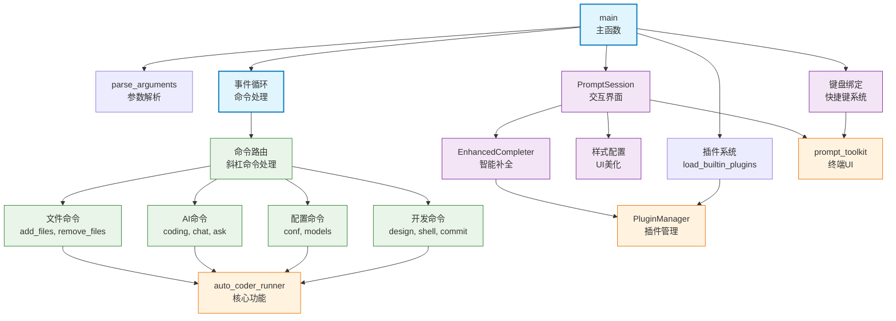

# chat_auto_coder

Auto-Coder 系统的交互式聊天界面模块，提供友好的命令行聊天环境，支持插件系统、智能命令补全、多种AI功能和丰富的快捷键操作，是用户与Auto-Coder系统进行实时交互的主要入口。

## 模块位置

**源码路径**: `src/autocoder/chat_auto_coder.py`  
**文档路径**: `specs/chat_auto_coder.ac.mod.md`  
**模块类型**: 单文件模块

## 文件结构

```python
# chat_auto_coder.py 内容结构
├── 导入部分                    # prompt_toolkit, autocoder模块等依赖导入
├── 全局变量                    # plugin_manager, original_functions等
├── parse_arguments()           # 命令行参数解析函数
├── show_help()                 # 帮助信息显示函数
├── EnhancedCompleter          # 增强命令补全器类
│   ├── __init__()             # 初始化补全器
│   ├── get_completions()      # 获取补全建议
│   ├── _process_command_completions() # 处理命令补全
│   └── get_completions_async() # 异步获取补全
├── load_builtin_plugins()      # 加载内置插件函数
└── main()                      # 主函数
    ├── 系统初始化              # 分词器、参数解析、引擎启动
    ├── 插件系统初始化          # 加载插件目录和配置
    ├── 键盘绑定设置            # 设置快捷键和事件处理
    ├── 聊天会话配置            # 配置提示符、样式、补全器
    └── 主事件循环              # 处理用户输入和命令执行
```

## 快速开始

### 基本使用方式

```python
# 1. 直接启动聊天界面
from autocoder.chat_auto_coder import main
main()

# 2. 带参数启动
import sys
sys.argv = ["chat_auto_coder", "--lite", "--debug"]
main()

# 3. 快速模式启动（跳过系统初始化）
sys.argv = ["chat_auto_coder", "--quick"]
main()
```

### 命令行启动

```bash
# 基本启动
chat-auto-coder
# 或
auto-coder.chat

# 启动模式选项
chat-auto-coder --lite          # 轻量模式
chat-auto-coder --pro           # 专业模式
chat-auto-coder --quick         # 快速模式（跳过初始化）
chat-auto-coder --debug         # 调试模式

# 跳过供应商选择
chat-auto-coder --skip_provider_selection
```

### 支持的聊天命令

该模块支持丰富的斜杠命令，提供完整的AI编程助手功能：

```bash
# 核心AI功能
/coding 实现一个HTTP服务器        # 代码生成和修改
/chat 解释这段代码的工作原理      # AI对话交互
/ask 什么是依赖注入？            # 简单问答
/auto 创建一个用户管理系统       # 自动化命令

# 文件管理
/add_files src/main.py src/utils.py  # 添加文件到上下文
/remove_files main.py                # 从上下文移除文件
/list_files                          # 列出当前文件

# 配置管理
/conf model:gpt-4                    # 设置配置项
/models /list                        # 管理AI模型

# 开发工具
/design 设计一个登录界面          # UI/UX设计
/shell ls -la                        # 执行Shell命令
/commit feat: add new feature        # Git提交

# 系统功能
/mcp 查询文档                       # MCP服务调用
/lib /add byzer-llm                 # 库管理
/revert                             # 撤销操作
/help                               # 显示帮助
/exit                               # 退出程序
```

### 主要功能

该模块提供完整的交互式AI编程环境，集成了代码生成、项目管理、配置设置、插件扩展等功能，支持实时对话和命令执行。

## 核心组件详解

### 1. 主要函数

**parse_arguments() -> argparse.Namespace**
- **功能**: 解析聊天界面的命令行参数
- **支持参数**:
  - `--debug`: 启用调试模式
  - `--quick`: 快速启动，跳过系统初始化
  - `--skip_provider_selection`: 跳过供应商选择
  - `--product_mode`: 产品模式（lite/pro）
  - `--lite`: 轻量模式
  - `--pro`: 专业模式
- **返回值**: 解析后的参数对象

**show_help() -> None**
- **功能**: 显示详细的帮助信息，包括所有可用命令
- **内容**: 涵盖文件管理、AI功能、配置管理、开发工具等分类命令
- **格式**: 彩色终端输出，易于阅读

**load_builtin_plugins() -> None**
- **功能**: 自动发现和加载内置插件
- **机制**: 
  - 扫描 `autocoder.plugins` 模块
  - 排除示例插件
  - 自动注册有效插件
  - 提供加载状态反馈

**main() -> None**
- **功能**: 主入口函数，启动完整的聊天界面
- **流程**:
  1. 加载分词器和解析参数
  2. 初始化系统（可选）
  3. 启动引擎和插件系统
  4. 配置键盘绑定和UI
  5. 进入主事件循环

### 2. EnhancedCompleter 类

**功能**: 提供智能命令补全功能，支持插件扩展

**主要方法**:

**__init__(base_completer: Completer, plugin_manager: PluginManager)**
- **功能**: 初始化增强补全器
- **参数**: 基础补全器和插件管理器

**get_completions(document, complete_event) -> Iterator[Completion]**
- **功能**: 获取当前输入的补全建议
- **特点**: 
  - 支持命令补全
  - 文件路径补全
  - 插件命令补全
  - 上下文感知补全

**_process_command_completions(command, current_input, completions)**
- **功能**: 处理特定命令的补全逻辑
- **支持**: `/add_files`, `/models`, `/conf` 等命令的智能补全

### 3. 键盘快捷键系统

该模块提供丰富的键盘快捷键，提升用户体验：

**Ctrl+C**: 
- 如果在历史搜索模式：清除搜索并重置缓冲区
- 其他情况：退出程序

**Tab**: 
- 如果已有补全状态：选择下一个补全项
- 其他情况：开始补全

**Ctrl+G**: 
- 激活语音输入功能
- 将转录文本插入当前位置

**Ctrl+K**: 
- 快速插入常用命令前缀
- 循环切换 `/coding`, `/chat`, `/ask` 等

**Ctrl+N**: 
- 切换运行模式
- 在 normal, auto_detect, voice_input 间循环

### 4. 插件系统集成

**插件管理**:
- 全局插件目录管理
- 运行时配置加载
- 自动发现和加载机制
- 插件生命周期管理

**命令拦截**:
- 支持插件处理自定义命令
- 函数包装和拦截机制
- 插件优先级处理

### 5. 命令处理系统

该模块支持丰富的命令集合，主要分类包括：

#### 文件管理命令
- `/add_files`: 添加文件到活跃上下文
- `/remove_files`: 移除上下文中的文件
- `/list_files`: 列出当前文件

#### AI功能命令
- `/coding`: 代码生成和修改
- `/chat`: AI对话交互
- `/ask`: 简单问答
- `/auto`: 自动化任务处理

#### 配置管理命令
- `/conf`: 配置项设置
- `/models`: 模型管理
- `/exclude_files`: 排除文件
- `/exclude_dirs`: 排除目录

#### 开发工具命令
- `/design`: UI/UX设计
- `/shell`: Shell命令执行
- `/commit`: Git提交
- `/revert`: 撤销操作

#### 系统功能命令
- `/mcp`: MCP服务调用
- `/lib`: 库管理
- `/rules`: 规则分析
- `/help`: 帮助信息
- `/debug`: 调试命令
- `/exit`: 退出程序

### 6. 用户界面特性

**提示符设计**:
```
coding@auto-coder.chat:~$ 
```

**样式配置**:
- 彩色终端输出
- 语法高亮支持
- 状态栏显示

**历史记录**:
- 命令历史持久化
- 智能历史建议
- 搜索历史支持

**工具栏信息**:
- 显示当前模式
- 快捷键提示
- 状态信息

## Mermaid 依赖图



## 依赖关系说明

### 对其他模块的依赖
该模块依赖以下核心模块：

- `specs/auto_coder_runner.ac.mod.md` - 所有核心AI功能的实现
- `specs/chat.ac.mod.md` - models_command 命令处理
- `specs/plugins.ac.mod.md` - 插件管理系统
- `specs/events.ac.mod.md` - 事件管理和文件路径生成
- `specs/common.ac.mod.md` - 对话管理和全局取消机制
- **外部依赖**: prompt_toolkit, argparse, os, time

### 被依赖关系
作为主要的用户交互界面，该模块被以下方式调用：

- **命令行入口**: `chat-auto-coder` 和 `auto-coder.chat` 命令
- **setup.py**: 注册为 console_scripts 入口点
- **用户直接调用**: 作为主要的交互界面使用

## 可以验证模块可运行的测试命令

```bash
# Python模块测试
python -c "from autocoder.chat_auto_coder import parse_arguments; args = parse_arguments(); print(f'参数解析成功: {args.product_mode}')"

# 测试帮助显示
python -c "from autocoder.chat_auto_coder import show_help; show_help()"

# 测试插件加载
python -c "from autocoder.chat_auto_coder import load_builtin_plugins; load_builtin_plugins()"

# 启动聊天界面（交互式）
chat-auto-coder --quick

# 检查补全器
python -c "from autocoder.chat_auto_coder import EnhancedCompleter; from autocoder.plugins import PluginManager; from autocoder.auto_coder_runner import completer; ec = EnhancedCompleter(completer, PluginManager()); print('补全器创建成功')"

# 验证命令行参数
python -c "import sys; sys.argv = ['chat_auto_coder', '--lite', '--debug']; from autocoder.chat_auto_coder import parse_arguments; args = parse_arguments(); print(f'Lite模式: {args.lite}, 调试模式: {args.debug}')"
``` 