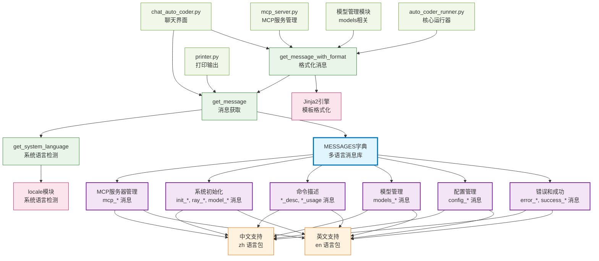

# chat_auto_coder_lang

Auto-Coder 系统的聊天界面国际化支持模块，提供聊天功能、系统消息、命令描述、错误提示等全方位的多语言支持，支持中英文双语切换，集成 Jinja2 模板引擎进行动态消息格式化，为整个系统的用户界面提供统一的本地化基础设施。

## 模块位置

**源码路径**: `src/autocoder/chat_auto_coder_lang.py`  
**文档路径**: `specs/chat_auto_coder_lang.ac.mod.md`  
**模块类型**: 单文件模块

## 文件结构

```python
# chat_auto_coder_lang.py 内容结构
├── 导入部分                    # locale, byzerllm.utils 等依赖导入
├── MESSAGES                    # 主要的多语言消息字典
│   ├── MCP服务器管理           # mcp_* 相关消息
│   ├── 系统初始化              # init_*, ray_*, model_* 相关消息
│   ├── 项目配置                # project_type_*, language_* 相关消息
│   ├── 命令描述                # *_desc, *_usage 相关消息
│   ├── 模型管理                # models_* 相关消息
│   ├── 配置管理                # config_* 相关消息
│   ├── 文件操作                # file_* 相关消息
│   ├── 错误和成功消息          # error_*, success_* 相关消息
│   └── 通用界面消息            # commands, description 等
├── get_system_language()       # 获取系统语言函数
├── get_message()               # 获取本地化消息函数
└── get_message_with_format()   # 格式化消息函数
```

## 快速开始

### 基本使用方式

```python
# 1. 导入国际化函数
from autocoder.chat_auto_coder_lang import (
    get_message, 
    get_message_with_format, 
    get_system_language
)

# 2. 获取系统语言
lang = get_system_language()
print(f"系统语言: {lang}")  # 输出: zh 或 en

# 3. 获取简单消息
message = get_message("init_complete")
print(message)  # 输出中文或英文消息

# 4. 获取格式化消息
formatted_msg = get_message_with_format(
    "mcp_install_success", 
    result="gpt4o-mini-search"
)
print(formatted_msg)  # 输出: "成功安装 MCP 服务器：gpt4o-mini-search"

# 5. 错误消息处理
error_msg = get_message_with_format(
    "mcp_install_error",
    error="连接超时"
)
print(error_msg)  # 输出: "安装 MCP 服务器时出错：连接超时"
```

### 在系统中的集成使用

```python
# 在聊天界面中的使用示例
from autocoder.chat_auto_coder_lang import get_message, get_message_with_format

def show_help():
    """显示帮助信息"""
    print(get_message("supported_commands"))
    print(get_message("add_files_desc"))
    print(get_message("coding_desc"))
    print(get_message("chat_desc"))

def handle_model_operation(name: str, result: str):
    """处理模型操作结果"""
    if result == "success":
        message = get_message_with_format("models_added", name=name)
    else:
        message = get_message_with_format("models_add_failed", name=name)
    print(message)

def display_mcp_status(servers: list):
    """显示MCP服务器状态"""
    print(get_message("mcp_list_running_title"))
    for server in servers:
        print(f"- {server}")
```

### 支持的消息类别

该模块提供全面的多语言支持，涵盖系统的各个功能模块：

#### MCP 服务器管理
- `mcp_install_success/error`: MCP 服务器安装结果
- `mcp_remove_success/error`: MCP 服务器移除结果
- `mcp_list_*_title`: 各种 MCP 服务器列表标题
- `mcp_refresh_success/error`: MCP 服务器刷新结果

#### 系统初始化
- `init_complete`: 项目初始化完成
- `ray_*`: Ray 系统状态管理
- `model_*`: 模型可用性检查
- `provider_selection`: 供应商选择
- `deploy_*`: 模型部署状态

#### 命令描述
- `*_desc`: 各种命令的功能描述
- `*_usage`: 命令使用说明
- `supported_commands`: 支持的命令列表

#### 模型管理
- `models_*`: 模型增删改查操作
- `models_add_*`: 模型添加相关消息
- `models_price_*`: 模型价格设置
- `models_speed_*`: 模型速度配置

### 主要功能

该模块为Auto-Coder系统的聊天界面和交互功能提供完整的国际化支持，确保所有用户消息、系统提示、错误信息都能以用户本地语言显示。

## 核心组件详解

### 1. MESSAGES 消息字典

**功能**: 系统的主要多语言消息配置字典
**结构**: 三级字典结构：消息键 -> 语言代码 -> 具体消息文本

```python
MESSAGES = {
    "message_key": {
        "en": "English message",
        "zh": "中文消息"
    },
    # ... 更多消息
}
```

**主要消息类别**:

#### MCP 服务器管理消息
```python
# 安装和移除
"mcp_install_success": {
    "en": "Successfully installed MCP server: {{result}}",
    "zh": "成功安装 MCP 服务器：{{result}}"
}
"mcp_remove_error": {
    "en": "Error removing MCP server: {{error}}",
    "zh": "移除 MCP 服务器时出错:{{error}}"
}

# 列表和状态
"mcp_list_running_title": {
    "en": "Running MCP servers:",
    "zh": "正在运行的 MCP 服务器："
}
```

#### 系统初始化消息
```python
# 项目初始化
"init_complete": {
    "en": "Project initialization completed.",
    "zh": "项目初始化完成。"
}

# Ray 系统管理
"ray_not_running": {
    "en": "Ray is not running. Starting Ray...",
    "zh": "Ray未运行。正在启动Ray..."
}

# 模型检查
"model_available": {
    "en": "deepseek_chat model is available.",
    "zh": "deepseek_chat模型可用。"
}
```

#### 命令描述消息
```python
# 功能描述
"coding_desc": {
    "en": "Request the AI to modify code based on requirements",
    "zh": "根据需求请求AI修改代码"
}
"chat_desc": {
    "en": "Chat with the AI about the current active files to get insights",
    "zh": "与AI聊天，获取关于当前活动文件的见解"
}

# 使用说明
"models_usage": {
    "en": '''Usage: /models <command>
Available subcommands:
  /list - List all configured models
  /add <name> <api_key> - Add or activate a model''',
    "zh": '''用法: /models <命令>
可用的子命令:
  /list - 列出所有已配置的模型
  /add <名称> <API密钥> - 添加或激活一个模型'''
}
```

#### 模型管理消息
```python
# 模型操作结果
"models_added": {
    "en": "Added/Updated model '{{name}}' successfully.",
    "zh": "成功添加/更新模型 '{{name}}'。"
}
"models_add_failed": {
    "en": "Failed to add model '{{name}}'. Model not found in defaults.",
    "zh": "添加模型 '{{name}}' 失败。在默认模型中未找到该模型。"
}

# 价格和速度配置
"models_input_price_updated": {
    "en": "Updated input price for model {{name}} to {{price}} M/token",
    "zh": "已更新模型 {{name}} 的输入价格为 {{price}} M/token"
}
```

### 2. 核心函数

#### get_system_language() -> str

**功能**: 自动检测系统语言设置

**实现**:
```python
def get_system_language():
    try:
        return locale.getdefaultlocale()[0][:2]
    except:
        return "en"
```

**特性**:
- 使用Python标准库locale模块
- 自动提取语言代码前两位（如：zh_CN -> zh）
- 异常时默认返回英文（en）
- 支持的语言：中文（zh）和英文（en）

#### get_message(key: str) -> str

**功能**: 根据消息键获取本地化消息

**实现**:
```python
def get_message(key):
    lang = get_system_language()
    if key in MESSAGES:
        return MESSAGES[key].get(lang, MESSAGES[key].get("en", ""))
    return ""
```

**特性**:
- 自动检测系统语言
- 优先返回系统语言对应的消息
- 系统语言不存在时回退到英文
- 消息键不存在时返回空字符串
- 确保不会抛出异常

#### get_message_with_format(msg_key: str, **kwargs) -> str

**功能**: 获取消息并进行Jinja2模板格式化

**实现**:
```python
def get_message_with_format(msg_key: str, **kwargs):
    return format_str_jinja2(get_message(msg_key), **kwargs)
```

**特性**:
- 集成Jinja2模板引擎
- 支持动态参数替换
- 支持复杂的模板语法
- 适用于需要动态内容的消息

**使用示例**:
```python
# 简单变量替换
message = get_message_with_format(
    "mcp_install_success", 
    result="my-server"
)
# 输出: "成功安装 MCP 服务器：my-server"

# 多个变量
message = get_message_with_format(
    "models_input_price_updated",
    name="gpt-4",
    price="0.03"
)
# 输出: "已更新模型 gpt-4 的输入价格为 0.03 M/token"
```

### 3. 消息模板语法

该模块使用Jinja2模板语法支持动态消息格式化：

#### 基本变量替换
```python
# 模板
"Successfully installed MCP server: {{result}}"

# 使用
get_message_with_format("mcp_install_success", result="gpt4o-mini")
```

#### 复杂模板
```python
# 多行模板
"models_usage": {
    "en": '''Usage: /models <command>
Available subcommands:
  /list - List all models
  /add <name> <key> - Add model'''
}
```

### 4. 语言检测和回退机制

该模块实现了完善的语言检测和回退机制：

#### 语言检测流程
1. 使用`locale.getdefaultlocale()`获取系统语言
2. 提取语言代码前两位（支持zh, en）
3. 异常时默认使用英文

#### 消息回退策略
1. 优先使用检测到的系统语言
2. 系统语言不存在时使用英文
3. 英文也不存在时返回空字符串
4. 消息键不存在时返回空字符串

#### 容错机制
```python
# 语言检测容错
try:
    return locale.getdefaultlocale()[0][:2]
except:
    return "en"  # 默认英文

# 消息获取容错
return MESSAGES[key].get(lang, MESSAGES[key].get("en", ""))
```

### 5. 在系统中的应用

该模块被广泛用于Auto-Coder系统的各个组件：

#### 聊天界面
```python
# 在 chat_auto_coder.py 中
from autocoder.chat_auto_coder_lang import get_message

def show_welcome():
    print(get_message("supported_commands"))
```

#### MCP 服务管理
```python
# 在 mcp_server.py 中
from autocoder.chat_auto_coder_lang import get_message_with_format

def install_server(name: str):
    try:
        # 安装逻辑
        return get_message_with_format("mcp_install_success", result=name)
    except Exception as e:
        return get_message_with_format("mcp_install_error", error=str(e))
```

#### 模型管理
```python
# 在模型管理中
def add_model(name: str, api_key: str):
    if success:
        return get_message_with_format("models_added", name=name)
    else:
        return get_message_with_format("models_add_failed", name=name)
```

#### 打印和日志
```python
# 在 printer.py 中
from autocoder.chat_auto_coder_lang import get_message as get_chat_message

def print_status(status: str):
    message = get_chat_message(f"status_{status}")
    print(message)
```

### 6. 扩展和维护

#### 添加新消息
```python
# 在 MESSAGES 字典中添加新条目
"new_message_key": {
    "en": "English message with {{param}}",
    "zh": "中文消息包含 {{param}}"
}
```

#### 支持新语言
```python
# 为现有消息添加新语言
"existing_message": {
    "en": "English message",
    "zh": "中文消息",
    "fr": "Message français"  # 新增法语
}

# 修改语言检测逻辑
def get_system_language():
    try:
        lang = locale.getdefaultlocale()[0][:2]
        # 支持的语言列表
        supported_langs = ["zh", "en", "fr"]
        return lang if lang in supported_langs else "en"
    except:
        return "en"
```

#### 消息分类管理
```python
# 可以考虑将消息按功能模块分组
MCP_MESSAGES = {
    "mcp_install_success": {...},
    "mcp_install_error": {...},
    # ...
}

MODEL_MESSAGES = {
    "models_added": {...},
    "models_add_failed": {...},
    # ...
}

# 合并到主字典
MESSAGES = {**MCP_MESSAGES, **MODEL_MESSAGES, ...}
```

## Mermaid 依赖图



## 依赖关系说明

### 对其他模块的依赖
该模块主要依赖外部库，对Auto-Coder内部模块依赖很少：

**外部依赖**:
- **locale**: Python标准库，用于系统语言检测
- **byzerllm.utils**: 提供format_str_jinja2函数进行Jinja2模板格式化

**内部依赖**:
- 无直接的Auto-Coder内部模块依赖

### 被依赖关系
作为国际化基础设施，该模块被广泛使用：

- `src/autocoder/chat_auto_coder.py` - 聊天界面的消息本地化
- `src/autocoder/auto_coder_rag.py` - RAG功能的消息本地化  
- `src/autocoder/common/mcp_server.py` - MCP服务器管理的消息本地化
- `src/autocoder/common/printer.py` - 打印输出的消息本地化
- `src/autocoder/auto_coder_runner.py` - 核心运行器的消息本地化
- `src/autocoder/chat/rules_command.py` - 规则命令的消息本地化
- **autocoder-slim**: Slim版本中的对应使用
- **未来扩展**: 其他需要国际化支持的模块

## 可以验证模块可运行的测试命令

```bash
# Python模块测试
python -c "from autocoder.chat_auto_coder_lang import get_message, get_message_with_format, get_system_language; print('国际化函数导入成功')"

# 测试系统语言检测
python -c "from autocoder.chat_auto_coder_lang import get_system_language; lang = get_system_language(); print(f'检测到的系统语言: {lang}')"

# 测试消息获取
python -c "from autocoder.chat_auto_coder_lang import get_message; msg = get_message('init_complete'); print(f'初始化完成消息: {msg}')"

# 测试格式化消息
python -c "
from autocoder.chat_auto_coder_lang import get_message_with_format
msg = get_message_with_format('mcp_install_success', result='test-server')
print(f'格式化消息: {msg}')
"

# 验证MESSAGES字典
python -c "
from autocoder.chat_auto_coder_lang import MESSAGES
print(f'消息总数: {len(MESSAGES)}')
print(f'支持的语言: {set().union(*(msg.keys() for msg in MESSAGES.values()))}')
"

# 测试特定消息类别
python -c "
from autocoder.chat_auto_coder_lang import MESSAGES
mcp_msgs = [key for key in MESSAGES.keys() if key.startswith('mcp_')]
models_msgs = [key for key in MESSAGES.keys() if key.startswith('models_')]
print(f'MCP相关消息: {len(mcp_msgs)}个')
print(f'模型相关消息: {len(models_msgs)}个')
"

# 验证回退机制
python -c "
from autocoder.chat_auto_coder_lang import get_message
# 测试不存在的消息键
empty_msg = get_message('non_existent_key')
print(f'不存在键的消息: \"{empty_msg}\" (应为空字符串)')
"

# 测试语言回退
python -c "
import locale
from autocoder.chat_auto_coder_lang import MESSAGES, get_message
# 找一个只有英文的消息（如果存在）
for key, msgs in MESSAGES.items():
    if 'en' in msgs and 'zh' not in msgs:
        print(f'测试英文回退消息键: {key}')
        break
"

# 验证模板变量
python -c "
from autocoder.chat_auto_coder_lang import get_message_with_format
# 测试错误处理
try:
    msg = get_message_with_format('mcp_install_error', error='测试错误')
    print(f'错误消息模板测试: {msg}')
except Exception as e:
    print(f'模板格式化错误: {e}')
"

# 检查消息完整性
python -c "
from autocoder.chat_auto_coder_lang import MESSAGES
incomplete = []
for key, msgs in MESSAGES.items():
    if 'en' not in msgs or 'zh' not in msgs:
        incomplete.append(key)
if incomplete:
    print(f'不完整的消息键 (缺少中英文): {incomplete[:5]}...' if len(incomplete) > 5 else f'不完整的消息键: {incomplete}')
else:
    print('所有消息都包含中英文版本')
"
``` 