# command_args

Auto-Coder 系统的命令行参数解析模块，负责解析命令行输入并转换为系统可识别的参数对象，支持多种子命令模式、国际化描述和丰富的配置参数，为整个系统提供统一的参数管理接口。

## 模块位置

**源码路径**: `src/autocoder/command_args.py`  
**文档路径**: `specs/command_args.ac.mod.md`  
**模块类型**: 单文件模块

## 文件结构

```python
# command_args.py 内容结构
├── 导入部分                    # argparse, AutoCoderArgs, lang_desc, locale 等依赖导入
└── parse_args()                # 核心参数解析函数
    ├── 语言检测和本地化          # 自动检测系统语言，支持中英文
    ├── 主解析器创建              # 创建主要的 ArgumentParser
    ├── 子解析器创建              # 创建多个子命令解析器
    ├── 参数定义                  # 定义各种命令行参数
    │   ├── 基础参数             # source_dir, query, model 等
    │   ├── 模型配置参数         # chat_model, code_model, emb_model 等
    │   ├── 索引配置参数         # index_filter_level, index_workers 等
    │   ├── RAG配置参数         # enable_rag_search, rag_url 等
    │   ├── 性能配置参数         # anti_quota_limit, workers 等
    │   └── 功能开关参数         # skip_confirm, human_as_model 等
    ├── 子命令定义                # 定义各种子命令及其参数
    │   ├── revert              # 撤销操作
    │   ├── store               # 存储操作
    │   ├── index               # 索引构建
    │   ├── index-query         # 索引查询
    │   ├── doc                 # 文档处理
    │   ├── agent               # 代理系统
    │   ├── init                # 项目初始化
    │   ├── screenshot          # 截图功能
    │   ├── next                # 创建新操作文件
    │   └── doc2html            # 文档转HTML
    └── 参数解析和返回            # 解析参数并返回 AutoCoderArgs 对象
```

## 快速开始

### 基本使用方式

```python
# 导入模块
from autocoder.command_args import parse_args

# 1. 解析命令行参数（不传入参数时使用 sys.argv）
args, raw_args = parse_args()
print(f"源目录: {args.source_dir}")
print(f"查询内容: {args.query}")
print(f"模型名称: {args.model}")

# 2. 解析指定的参数列表
input_args = [
    "--source_dir", "/path/to/project",
    "--query", "创建一个HTTP服务器",
    "--model", "gpt-4"
]
args, raw_args = parse_args(input_args)

# 3. 解析子命令
agent_args = [
    "agent", "chat",
    "--source_dir", "/path/to/project",
    "--query", "分析代码结构",
    "--model", "gpt-4"
]
args, raw_args = parse_args(agent_args)
print(f"命令: {raw_args.command}")
print(f"代理命令: {raw_args.agent_command}")

# 4. 解析索引命令
index_args = [
    "index",
    "--source_dir", "/path/to/project",
    "--model", "gpt-4"
]
args, raw_args = parse_args(index_args)
```

### 支持的子命令

该模块支持多种子命令，每个子命令都有特定的参数配置：

```bash
# 项目初始化
auto-coder init --source_dir /path/to/project

# 索引构建
auto-coder index --source_dir /path/to/project --model gpt-4

# 索引查询
auto-coder index-query --source_dir /path/to/project --query "查找用户认证相关代码"

# 代理系统
auto-coder agent chat --source_dir /path/to/project --query "分析代码结构"

# 文档处理
auto-coder doc build --source_dir /path/to/project --model gpt-4

# 撤销操作
auto-coder revert --file action_file.yml

# 截图功能
auto-coder screenshot --urls https://example.com --output /path/to/output
```

### 主要功能

该模块提供完整的命令行参数解析功能，支持多种操作模式和丰富的配置选项，包括模型配置、索引管理、RAG设置、代理系统等，为 Auto-Coder 系统的各个组件提供统一的参数接口。

## 核心组件详解

### 1. 主要函数

**parse_args(input_args: Optional[List[str]] = None) -> Tuple[AutoCoderArgs, argparse.Namespace]**
- **功能**: 解析命令行参数并返回结构化的参数对象
- **参数**: 
  - input_args - 可选的参数列表，如果为None则使用sys.argv
- **返回值**: 
  - AutoCoderArgs - 结构化的参数对象
  - argparse.Namespace - 原始的argparse解析结果
- **特点**: 
  - 自动检测系统语言，支持中英文描述
  - 支持多种子命令模式
  - 提供丰富的参数验证和默认值设置

### 2. 参数分类

#### 基础参数
- `--source_dir`: 项目源代码目录
- `--query`: 查询内容或指令
- `--target_file`: 目标文件路径
- `--project_type`: 项目类型（如 .py, .ts）
- `--template`: 模板类型
- `--execute`: 是否执行生成的代码

#### 模型配置参数
- `--model`: 主要模型名称
- `--chat_model`: 聊天模型名称
- `--code_model`: 代码生成模型名称
- `--emb_model`: 嵌入模型名称
- `--vl_model`: 视觉语言模型名称
- `--sd_model`: Stable Diffusion模型名称
- `--voice2text_model`: 语音转文本模型名称
- `--text2voice_model`: 文本转语音模型名称
- `--designer_model`: 设计模型名称
- `--planner_model`: 规划模型名称
- `--inference_model`: 推理模型名称
- `--generate_rerank_model`: 生成重排模型名称

#### 索引配置参数
- `--index_model`: 索引模型名称
- `--index_filter_level`: 索引过滤级别
- `--index_filter_workers`: 索引过滤工作线程数
- `--index_filter_file_num`: 索引过滤文件数量
- `--index_build_workers`: 索引构建工作线程数
- `--skip_build_index`: 是否跳过索引构建
- `--skip_filter_index`: 是否跳过索引过滤

#### RAG配置参数
- `--enable_rag_search`: 是否启用RAG搜索
- `--enable_rag_context`: 是否启用RAG上下文
- `--rag_url`: RAG服务URL
- `--rag_token`: RAG服务令牌
- `--rag_type`: RAG类型（simple/storage）
- `--rag_params_max_tokens`: RAG参数最大token数
- `--rag_doc_filter_relevance`: RAG文档过滤相关性

#### 性能配置参数
- `--anti_quota_limit`: 反配额限制
- `--model_max_length`: 模型最大长度
- `--model_max_input_length`: 模型最大输入长度
- `--generate_times_same_model`: 同一模型生成次数
- `--ray_address`: Ray集群地址

#### 功能开关参数
- `--human_as_model`: 是否使用人工作为模型
- `--print_request`: 是否打印请求信息
- `--skip_confirm`: 是否跳过确认
- `--silence`: 是否静默执行
- `--urls_use_model`: 是否对URL使用模型
- `--new_session`: 是否开启新会话

### 3. 子命令详解

#### revert 子命令
- **功能**: 撤销最后一次操作
- **参数**: `--file` (操作文件)

#### store 子命令
- **功能**: 存储相关操作
- **参数**: `--source_dir`, `--ray_address`, `--request_id`

#### index 子命令
- **功能**: 构建项目索引
- **参数**: `--file`, `--model`, `--index_model`, `--source_dir`, `--project_type`

#### index-query 子命令
- **功能**: 查询项目索引
- **参数**: `--file`, `--model`, `--index_model`, `--source_dir`, `--query`, `--index_filter_level`

#### doc 子命令
- **功能**: 文档处理
- **子命令**: 
  - `build`: 构建文档索引
  - `serve`: 启动文档服务
- **参数**: `--model`, `--emb_model`, `--source_dir`, `--collection`, `--description`

#### agent 子命令
- **功能**: 代理系统
- **子命令**: 
  - `chat`: 聊天代理
  - `project_reader`: 项目阅读代理
  - `generate_command`: 命令生成代理
  - `auto_tool`: 自动工具代理
  - `designer`: 设计代理
  - `planner`: 规划代理
- **参数**: `--source_dir`, `--query`, `--model`, `--execute`, `--new_session`

#### init 子命令
- **功能**: 项目初始化
- **参数**: `--source_dir` (必需)

#### screenshot 子命令
- **功能**: 网页截图
- **参数**: `--urls` (必需), `--output` (必需)

#### next 子命令
- **功能**: 创建新的操作文件
- **参数**: `name` (位置参数), `--from_yaml`

#### doc2html 子命令
- **功能**: 文档转HTML
- **参数**: `--file`, `--model`, `--vl_model`, `--urls`, `--output`

### 4. 国际化支持

模块支持中英文描述，自动检测系统语言：

```python
# 语言检测逻辑
system_lang, _ = locale.getdefaultlocale()
lang = "zh" if system_lang and system_lang.startswith("zh") else "en"
desc = lang_desc[lang]
```

参数描述会根据系统语言自动切换到对应的语言版本。

## Mermaid 依赖图

```mermaid
graph TB
    %% 核心函数
    ParseArgs[parse_args<br/>主解析函数]
    
    %% 参数处理层
    LanguageDetection[语言检测<br/>locale检测]
    ParserCreation[解析器创建<br/>ArgumentParser]
    SubparsersCreation[子解析器创建<br/>subparsers]
    
    %% 参数定义层
    BasicArgs[基础参数<br/>source_dir, query, model]
    ModelArgs[模型配置<br/>chat_model, code_model]
    IndexArgs[索引配置<br/>index_level, workers]
    RAGArgs[RAG配置<br/>rag_url, rag_token]
    PerformanceArgs[性能配置<br/>anti_quota_limit]
    FeatureArgs[功能开关<br/>skip_confirm, silence]
    
    %% 子命令定义层
    RevertCmd[revert命令<br/>撤销操作]
    IndexCmd[index命令<br/>索引构建]
    DocCmd[doc命令<br/>文档处理]
    AgentCmd[agent命令<br/>代理系统]
    InitCmd[init命令<br/>项目初始化]
    
    %% 外部依赖
    ArgParse[argparse<br/>参数解析库]
    AutoCoderArgs[AutoCoderArgs<br/>参数对象]
    LangDesc[lang_desc<br/>语言描述]
    
    %% 依赖关系
    ParseArgs --> LanguageDetection
    ParseArgs --> ParserCreation
    ParseArgs --> SubparsersCreation
    
    ParserCreation --> BasicArgs
    ParserCreation --> ModelArgs
    ParserCreation --> IndexArgs
    ParserCreation --> RAGArgs
    ParserCreation --> PerformanceArgs
    ParserCreation --> FeatureArgs
    
    SubparsersCreation --> RevertCmd
    SubparsersCreation --> IndexCmd
    SubparsersCreation --> DocCmd
    SubparsersCreation --> AgentCmd
    SubparsersCreation --> InitCmd
    
    ParseArgs --> ArgParse
    ParseArgs --> AutoCoderArgs
    LanguageDetection --> LangDesc
    
    %% 样式定义
    classDef coreClass fill:#e1f5fe,stroke:#0277bd,stroke-width:2px
    classDef argsClass fill:#f3e5f5,stroke:#7b1fa2,stroke-width:1px
    classDef cmdClass fill:#e8f5e8,stroke:#2e7d32,stroke-width:1px
    classDef extClass fill:#fff3e0,stroke:#ef6c00,stroke-width:1px
    
    class ParseArgs coreClass
    class BasicArgs,ModelArgs,IndexArgs,RAGArgs,PerformanceArgs,FeatureArgs argsClass
    class RevertCmd,IndexCmd,DocCmd,AgentCmd,InitCmd cmdClass
    class ArgParse,AutoCoderArgs,LangDesc extClass
```



## 依赖关系说明

### 对其他模块的依赖
该模块依赖以下模块：

- `specs/common.ac.mod.md` - 导入 AutoCoderArgs 类
- `specs/lang.ac.mod.md` - 导入 lang_desc 多语言描述
- **标准库依赖**: argparse, locale, typing

### 被依赖关系
作为命令行参数解析的入口模块，被以下模块使用：

- `specs/auto_coder.ac.mod.md` - 主入口模块使用该模块解析命令行参数

## 可以验证模块可运行的测试命令

```bash
# Python模块测试
python -c "from autocoder.command_args import parse_args; args, raw_args = parse_args(['--source_dir', '.', '--query', 'test']); print(f'解析成功: {args.source_dir}')"

# 测试子命令解析
python -c "from autocoder.command_args import parse_args; args, raw_args = parse_args(['agent', 'chat', '--query', 'test']); print(f'命令: {raw_args.command}, 代理命令: {raw_args.agent_command}')"

# 测试参数默认值
python -c "from autocoder.command_args import parse_args; args, raw_args = parse_args([]); print(f'默认模型: {args.model}, 默认项目类型: {args.project_type}')"

# 测试索引命令
python -c "from autocoder.command_args import parse_args; args, raw_args = parse_args(['index', '--source_dir', '.']); print(f'索引命令解析成功: {raw_args.command}')"

# 测试参数类型转换
python -c "from autocoder.command_args import parse_args; args, raw_args = parse_args(['--model_max_length', '4000', '--index_filter_level', '2']); print(f'整型参数: {args.model_max_length}, {args.index_filter_level}')"
``` 