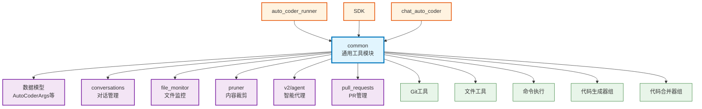

# common

Auto-Coder 的通用工具模块，提供了系统运行所需的基础设施和工具集，包括数据模型、文件操作、配置管理、代码生成与合并、命令解析、监控等核心功能。

## 模块位置

**源码路径**: `src/autocoder/common/`  
**文档路径**: `specs/common.ac.mod.md`  
**模块类型**: 包模块

## 目录结构

```
src/autocoder/common/
├── __init__.py                 # 包初始化文件，定义核心数据模型
├── types.py                    # 基础类型定义
├── const.py                    # 常量定义
├── printer.py                  # 打印工具
├── git_utils.py                # Git 操作工具
├── files.py                    # 文件操作工具
├── run_cmd.py                  # 命令执行工具
├── result_manager.py           # 结果管理器
├── action_yml_file_manager.py  # Action YAML 文件管理
├── memory_manager.py           # 内存管理器
├── global_cancel.py            # 全局取消机制
├── code_auto_generate*.py      # 代码自动生成系列（4个文件）
├── code_auto_merge*.py         # 代码自动合并系列（4个文件）
├── code_modification_ranker.py # 代码修改排序器
├── command_completer*.py       # 命令补全（2个版本）
├── command_templates.py        # 命令模板
├── command_generator.py        # 命令生成器
├── model_speed_tester.py       # 模型速度测试
├── mcp_*.py                    # MCP 服务相关（5个文件）
├── llm_friendly_package*.py    # LLM 友好包管理（4个文件）
├── openai_content.py           # OpenAI 内容处理
├── auto_configure.py           # 自动配置
├── conf_*.py                   # 配置相关（3个文件）
├── anything2*.py               # 文件转换工具（2个文件）
├── image_to_page.py            # 图片转页面
├── screenshots.py              # 截图工具
├── search*.py                  # 搜索相关（2个文件）
├── shells.py                   # Shell 操作
├── computer_use.py             # 计算机使用工具
├── interpreter.py              # 解释器
├── JupyterClient.py            # Jupyter 客户端
├── ShellClient.py              # Shell 客户端
├── audio.py                    # 音频处理
├── buildin_tokenizer.py        # 内置分词器
├── chunk_validation.py         # 块验证
├── cleaner.py                  # 清理工具
├── code_auto_execute.py        # 代码自动执行
├── recall_validation.py        # 召回验证
├── save_formatted_log.py       # 格式化日志保存
├── stats_panel.py              # 统计面板
├── stream_out_type.py          # 流输出类型
├── sys_prompt.py               # 系统提示
├── text.py                     # 文本处理
├── token_cost_caculate.py      # Token 成本计算
├── utils_code_auto_generate.py # 代码生成工具
├── index_import_export.py      # 索引导入导出
├── auto_coder_lang.py          # 多语言支持
├── v2/                         # V2 版本功能
│   └── agent/                  # 智能代理
├── conversations/              # 对话管理子模块
├── file_monitor/               # 文件监控子模块
├── file_checkpoint/            # 文件检查点子模块
├── command_file_manager/       # 命令文件管理子模块
├── directory_cache/            # 目录缓存子模块
├── ignorefiles/                # 忽略文件管理子模块
├── rulefiles/                  # 规则文件管理子模块
├── mcp_servers/                # MCP 服务器子模块
├── pull_requests/              # PR 管理子模块
├── tokens/                     # Token 统计子模块
├── pruner/                     # 内容裁剪子模块
├── ac_style_command_parser/    # AC 风格命令解析子模块
└── rag_manager/                # RAG 管理子模块
```

## 快速开始

### 基本使用方式

```python
# 导入核心数据模型
from autocoder.common import (
    AutoCoderArgs,      # 参数配置
    SourceCode,         # 源代码对象
    SourceCodeList,     # 源代码列表
    ExecuteStep,        # 执行步骤
    EnvInfo            # 环境信息
)

# 1. 创建参数配置
args = AutoCoderArgs(
    source_dir="/path/to/project",
    project_type=".py,.ts",
    model="v3_chat",
    query="实现一个 HTTP 服务器"
)

# 2. 管理源代码
source = SourceCode(
    module_name="main.py",
    source_code="def hello(): pass",
    tag="main",
    tokens=100
)

sources = SourceCodeList(sources=[source])
print(sources.to_str())

# 3. 执行命令
from autocoder.common.run_cmd import run_command
result = run_command("ls -la", cwd="/tmp")

# 4. Git 操作
from autocoder.common import git_utils
commit_info = git_utils.commit_changes("feat: add new feature")

# 5. 文件监控
from autocoder.common.file_monitor import FileMonitor
monitor = FileMonitor("/path/to/project")
monitor.start()
```

### 子模块说明

- **conversations**: 完整的对话管理系统，支持持久化、缓存、搜索
- **file_monitor**: 基于 watchfiles 的文件系统监控
- **command_file_manager**: 管理 .autocodercommands 目录中的命令文件
- **pruner**: 智能内容裁剪，优化 Token 使用
- **pull_requests**: 统一的 PR 创建和管理，支持多平台
- **v2/agent**: 新一代智能代理系统

### 配置管理

```python
# 使用 AutoCoderArgs 管理所有配置
args = AutoCoderArgs(
    # 基础配置
    source_dir=".",
    project_type=".py",
    
    # 模型配置
    model="v3_chat",
    chat_model="v3_chat",
    code_model="v3_chat",
    
    # RAG 配置
    enable_rag_search=True,
    rag_type="storage",
    
    # 性能配置
    index_filter_workers=4,
    anti_quota_limit=1,
    
    # 功能开关
    enable_agentic_edit=True,
    skip_confirm=False
)
```

## 核心组件详解

### 1. 数据模型 (\_\_init\_\_.py)

**AutoCoderArgs**
- **功能**: 系统的核心配置类，包含所有可配置参数
- **特点**: 使用 Pydantic 进行数据验证，支持环境变量覆盖
- **重要字段**: 
  - 项目配置: source_dir, project_type, git_url
  - 模型配置: model, chat_model, code_model 等
  - RAG 配置: rag_type, rag_url, rag_token 等
  - 性能配置: workers, anti_quota_limit 等

**SourceCode/SourceCodeList**
- **功能**: 源代码的标准化表示
- **用途**: 在系统各组件间传递代码内容

**ExecuteStep/ExecuteSteps**
- **功能**: 定义代码或命令的执行步骤
- **支持**: Python 代码和 Shell 命令

### 2. 代码生成与合并系列

**代码生成器** (code_auto_generate_*.py)
- `code_auto_generate.py`: 基础生成器
- `code_auto_generate_diff.py`: 基于 diff 的生成
- `code_auto_generate_editblock.py`: 基于编辑块的生成
- `code_auto_generate_strict_diff.py`: 严格 diff 生成

**代码合并器** (code_auto_merge_*.py)
- 对应的合并器，将生成的代码合并到原文件

### 3. 命令补全系统

**CommandCompleter/CommandCompleterV2**
- **功能**: 为交互式命令行提供智能补全
- **特点**: 支持文件路径、命令参数、模型名称等的补全

### 4. MCP 服务系统

**MCP 相关模块**
- `mcp_hub.py`: MCP 服务中心
- `mcp_server.py`: MCP 服务器管理
- `mcp_tools.py`: MCP 工具执行
- `mcp_server_types.py`: 类型定义
- `mcp_server_install.py`: 服务安装

### 5. 工具函数

**git_utils.py**
- Git 操作封装：提交、分支、差异等

**files.py**
- 文件操作工具：读写、遍历、过滤等

**run_cmd.py**
- 命令执行封装：支持超时、环境变量等

## Mermaid 依赖图



## 依赖关系说明

### 对其他模块的依赖
- `specs/utils.llms.ac.mod.md` - 使用 LLM 相关功能
- `specs/rag.ac.mod.md` - RAG 功能集成
- `specs/events.ac.mod.md` - 事件系统支持

### 被依赖关系
- `specs/auto_coder_runner.ac.mod.md` - 使用几乎所有 common 功能
- `specs/sdk.ac.mod.md` - 使用数据模型和工具函数
- `specs/chat.ac.mod.md` - 使用命令补全、文件监控等
- `specs/agent.ac.mod.md` - 使用文件操作、Git 工具等
- `specs/dispacher.ac.mod.md` - 使用 AutoCoderArgs

## 可以验证模块可运行的测试命令

```bash
# Python 模块测试
python -c "from autocoder.common import AutoCoderArgs, SourceCode; print('Common module loaded')"

# 测试子模块
python -c "from autocoder.common.conversations import get_conversation_manager; print('Conversations OK')"
python -c "from autocoder.common.file_monitor import FileMonitor; print('File monitor OK')"
python -c "from autocoder.common.pruner.context_pruner import PruneContext; print('Pruner OK')"

# 运行单元测试
pytest src/autocoder/common/test_run_cmd.py -v
pytest src/autocoder/common/conversations/tests -v
pytest src/autocoder/common/pruner/test_*.py -v
``` 