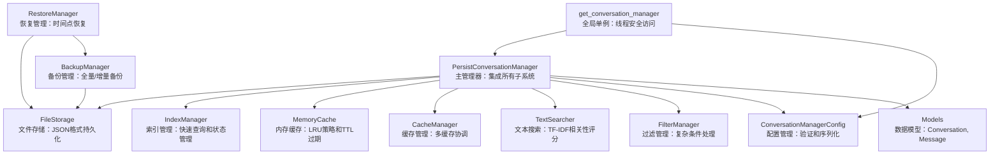

# common.conversations.ac.mod.md

## 模块信息
- **模块名称**: common.conversations
- **模块类型**: 包模块 (Package Module)
- **主要功能**: 对话管理系统，提供完整的对话和消息持久化存储、缓存、搜索、备份和恢复功能

## 核心功能

### 对话管理架构
- **PersistConversationManager**: 主对话管理器，集成所有子系统
- **分层设计**: 存储层、缓存层、搜索层、备份层的清晰分离
- **并发安全**: 跨平台文件锁，支持读写锁分离
- **高性能**: LRU缓存策略和智能索引管理

### 存储和持久化
- **FileStorage**: 基于文件系统的JSON格式存储
- **IndexManager**: 索引管理和当前对话状态持久化
- **并发控制**: 文件锁机制确保数据一致性
- **原子操作**: 保证数据写入的原子性

### 缓存系统
- **MemoryCache**: LRU策略的内存缓存
- **TTL支持**: 时间过期机制
- **多层缓存**: 支持多个缓存实例协调
- **性能优化**: 减少磁盘IO提升访问速度

### 搜索和过滤
- **全文搜索**: 基于TF-IDF的文本搜索
- **相关性评分**: 智能搜索结果排序
- **复杂过滤**: 支持元数据和时间范围过滤
- **模糊匹配**: 对话标题、描述和消息内容搜索

## 关键组件

### 1. 主管理器 (PersistConversationManager)
```python
class PersistConversationManager:
    def __init__(self, config: ConversationManagerConfig)
    
    # 对话管理
    def create_conversation(self, name: str, description: str = "", 
                           initial_messages: List[ConversationMessage] = None) -> str
    def get_conversation(self, conversation_id: str) -> Optional[Conversation]
    def update_conversation(self, conversation_id: str, **kwargs) -> bool
    def delete_conversation(self, conversation_id: str) -> bool
    
    # 消息管理
    def append_message(self, conversation_id: str, role: str, content: str) -> str
    def append_message_to_current(self, role: str, content: str) -> str
    def get_messages(self, conversation_id: str) -> List[ConversationMessage]
    
    # 当前对话管理
    def set_current_conversation(self, conversation_id: str) -> bool
    def get_current_conversation(self) -> Optional[Conversation]
    def clear_current_conversation(self) -> None
    
    # 搜索和统计
    def search_conversations(self, query: str, **filters) -> List[Conversation]
    def get_statistics(self) -> Dict[str, Any]
```

### 2. 配置管理 (ConversationManagerConfig)
```python
class ConversationManagerConfig:
    storage_path: str = "./conversations"
    max_cache_size: int = 100
    cache_ttl: float = 300.0
    backup_enabled: bool = True
    backup_interval: int = 3600
    search_enabled: bool = True
    
    def validate(self) -> bool
    def to_dict(self) -> Dict[str, Any]
    def from_dict(cls, data: Dict[str, Any]) -> 'ConversationManagerConfig'
```

### 3. 数据模型
```python
# 对话模型
class Conversation:
    id: str
    name: str
    description: str
    created_at: datetime
    updated_at: datetime
    message_count: int
    metadata: Dict[str, Any]

# 消息模型
class ConversationMessage:
    id: str
    conversation_id: str
    role: str  # "user", "assistant", "system"
    content: str
    timestamp: datetime
    metadata: Dict[str, Any]
```

### 4. 存储层
```python
# 文件存储实现
class FileStorage(BaseStorage):
    def save_conversation(self, conversation: Conversation) -> bool
    def load_conversation(self, conversation_id: str) -> Optional[Conversation]
    def delete_conversation(self, conversation_id: str) -> bool
    def list_conversations(self) -> List[str]

# 索引管理器
class IndexManager:
    def update_index(self, conversation: Conversation) -> None
    def get_current_conversation_id(self) -> Optional[str]
    def set_current_conversation_id(self, conversation_id: str) -> None
    def search_index(self, query: str) -> List[str]
```

### 5. 缓存层
```python
# 内存缓存
class MemoryCache(BaseCache):
    def __init__(self, max_size: int = 100, ttl: float = 300.0)
    def get(self, key: str) -> Optional[Any]
    def set(self, key: str, value: Any, ttl: Optional[float] = None) -> None
    def delete(self, key: str) -> None
    def clear(self) -> None

# 缓存管理器
class CacheManager:
    def get_cache(self, cache_name: str) -> BaseCache
    def clear_all_caches(self) -> None
    def get_cache_statistics(self) -> Dict[str, Any]
```

## 使用指南

### 1. 基本使用
```python
from autocoder.common.conversations.get_conversation_manager import get_conversation_manager

# 获取管理器实例（使用默认配置）
manager = get_conversation_manager()

# 创建对话
conversation_id = manager.create_conversation(
    name="AI助手对话",
    description="与AI助手的日常对话"
)

# 添加消息
message_id = manager.append_message(
    conversation_id=conversation_id,
    role="user",
    content="请帮我写一个Python函数"
)

# 设置当前对话并添加消息
manager.set_current_conversation(conversation_id)
manager.append_message_to_current(
    role="assistant",
    content="我来帮您写Python函数。请告诉我具体需求。"
)
```

### 2. 自定义配置
```python
from autocoder.common.conversations import ConversationManagerConfig

# 创建自定义配置
config = ConversationManagerConfig(
    storage_path="./my_conversations",
    max_cache_size=200,
    cache_ttl=600.0,
    backup_enabled=True,
    backup_interval=1800
)

# 使用自定义配置获取管理器
manager = get_conversation_manager(config)
```

### 3. 搜索和过滤
```python
# 全文搜索
results = manager.search_conversations(
    query="Python函数",
    limit=10
)

# 按时间范围过滤
from datetime import datetime, timedelta
yesterday = datetime.now() - timedelta(days=1)

results = manager.search_conversations(
    query="",
    created_after=yesterday,
    limit=20
)

# 按元数据过滤
results = manager.search_conversations(
    query="",
    metadata_filter={"project": "web_app", "status": "active"}
)
```

### 4. 批量操作
```python
# 批量创建对话
conversations = []
for i in range(10):
    conv_id = manager.create_conversation(
        name=f"对话 {i+1}",
        description=f"第{i+1}个测试对话"
    )
    conversations.append(conv_id)

# 批量添加消息
for conv_id in conversations:
    manager.append_message(conv_id, "user", f"测试消息 {conv_id}")
    manager.append_message(conv_id, "assistant", f"回复消息 {conv_id}")
```

### 5. 备份和恢复
```python
from autocoder.common.conversations.backup import BackupManager, RestoreManager

# 创建备份
backup_manager = BackupManager(manager.config)
backup_path = backup_manager.create_backup()
print(f"备份已创建: {backup_path}")

# 恢复备份
restore_manager = RestoreManager(manager.config)
success = restore_manager.restore_from_backup(backup_path)
print(f"恢复状态: {'成功' if success else '失败'}")

# 时间点恢复
target_time = datetime.now() - timedelta(hours=1)
success = restore_manager.restore_to_point_in_time(target_time)
```

## 辅助函数

### 全局访问函数
```python
# 主要函数
from autocoder.common.conversations.get_conversation_manager import (
    get_conversation_manager,
    get_manager,  # 别名
    reset_conversation_manager,
    reset_manager  # 别名
)

# 获取管理器实例
manager = get_conversation_manager()

# 使用自定义配置
config = ConversationManagerConfig(storage_path="./custom_path")
manager = get_conversation_manager(config)

# 重置管理器（主要用于测试）
reset_conversation_manager()
```

### 便捷操作函数
```python
# 快速创建对话并设为当前
def create_and_set_current(name: str, description: str = "") -> str:
    manager = get_conversation_manager()
    conv_id = manager.create_conversation(name, description)
    manager.set_current_conversation(conv_id)
    return conv_id

# 向当前对话添加用户消息并获取回复
def chat_with_current(user_message: str) -> str:
    manager = get_conversation_manager()
    manager.append_message_to_current("user", user_message)
    # 这里可以集成AI回复逻辑
    ai_response = "AI回复内容"
    manager.append_message_to_current("assistant", ai_response)
    return ai_response
```

## 目录结构

```
src/autocoder/common/conversations/
├── __init__.py                      # 模块导出定义和核心组件集成
├── manager.py                       # 主对话管理器，集成所有子系统
├── config.py                        # 配置管理类，包含验证和序列化功能
├── models.py                        # 数据模型定义（Conversation, ConversationMessage）
├── get_conversation_manager.py      # 全局单例管理器获取方法
├── exceptions.py                    # 异常类定义
├── file_locker.py                   # 跨平台文件锁实现
├── storage/                         # 存储层实现
│   ├── __init__.py                  # 存储层导出
│   ├── base_storage.py              # 存储接口定义
│   ├── file_storage.py              # 文件系统存储实现
│   └── index_manager.py             # 索引管理和当前对话状态
├── cache/                           # 缓存层实现
│   ├── __init__.py                  # 缓存层导出
│   ├── base_cache.py                # 缓存接口定义
│   ├── memory_cache.py              # 内存缓存实现（LRU策略）
│   └── cache_manager.py             # 缓存管理器
├── search/                          # 搜索和过滤层
│   ├── __init__.py                  # 搜索层导出
│   ├── text_searcher.py             # 文本搜索实现
│   └── filter_manager.py            # 过滤管理器
└── backup/                          # 备份和恢复层
    ├── __init__.py                  # 备份层导出
    ├── backup_manager.py            # 备份管理器（全量/增量备份）
    └── restore_manager.py           # 恢复管理器（时间点恢复）
```

## 技术特性

### 1. 并发安全
- **文件锁机制**: 跨平台文件锁确保并发访问安全
- **原子操作**: 数据写入的原子性保证
- **读写分离**: 支持多读单写的并发模式
- **死锁预防**: 智能锁管理避免死锁情况

### 2. 性能优化
- **多层缓存**: LRU策略的内存缓存减少磁盘IO
- **智能索引**: 快速查询和元数据管理
- **惰性加载**: 按需加载对话内容
- **批量操作**: 支持批量读写优化性能

### 3. 数据可靠性
- **备份系统**: 支持全量和增量备份
- **时间点恢复**: 精确的时间点数据恢复
- **数据验证**: 完整的数据完整性检查
- **错误恢复**: 自动错误检测和恢复机制

### 4. 搜索功能
- **全文搜索**: 基于TF-IDF的相关性搜索
- **模糊匹配**: 智能的文本匹配算法
- **复合过滤**: 支持多条件组合过滤
- **结果排序**: 按相关性和时间排序

## 架构图



## 集成点

### 与其他模块的关系
- **独立模块**: 无外部AC模块依赖，为独立的对话管理解决方案
- **通用接口**: 可被其他模块集成使用
- **标准化**: 提供标准的对话管理接口

### 外部依赖
- **threading**: 线程安全和并发控制
- **json**: JSON格式数据序列化
- **datetime**: 时间戳和时间范围处理
- **pathlib**: 路径操作和文件管理

## 扩展指南

### 1. 自定义存储后端
```python
from autocoder.common.conversations.storage.base_storage import BaseStorage

class DatabaseStorage(BaseStorage):
    def __init__(self, connection_string: str):
        self.connection_string = connection_string
    
    def save_conversation(self, conversation: Conversation) -> bool:
        # 实现数据库存储逻辑
        pass
    
    def load_conversation(self, conversation_id: str) -> Optional[Conversation]:
        # 实现数据库加载逻辑
        pass
```

### 2. 自定义缓存策略
```python
from autocoder.common.conversations.cache.base_cache import BaseCache

class RedisCache(BaseCache):
    def __init__(self, redis_client):
        self.redis_client = redis_client
    
    def get(self, key: str) -> Optional[Any]:
        # 实现Redis缓存获取
        pass
    
    def set(self, key: str, value: Any, ttl: Optional[float] = None) -> None:
        # 实现Redis缓存设置
        pass
```

### 3. 自定义搜索引擎
```python
from autocoder.common.conversations.search.text_searcher import TextSearcher

class ElasticsearchSearcher(TextSearcher):
    def __init__(self, es_client):
        self.es_client = es_client
    
    def search(self, query: str, **filters) -> List[str]:
        # 实现Elasticsearch搜索
        pass
```

## 最佳实践

### 1. 配置优化
- 根据使用场景调整缓存大小和TTL
- 合理设置备份间隔和保留策略
- 启用搜索功能提升用户体验

### 2. 性能调优
- 使用批量操作减少IO开销
- 合理利用缓存减少重复查询
- 定期清理过期数据和索引

### 3. 数据管理
- 定期备份重要对话数据
- 监控存储空间使用情况
- 实施数据归档策略

### 4. 错误处理
- 实现完善的异常处理机制
- 记录详细的操作日志
- 提供用户友好的错误提示

---

common.conversations模块提供了完整的对话管理解决方案，通过分层架构和模块化设计，为AI应用提供了可靠、高性能的对话存储和管理基础设施。 