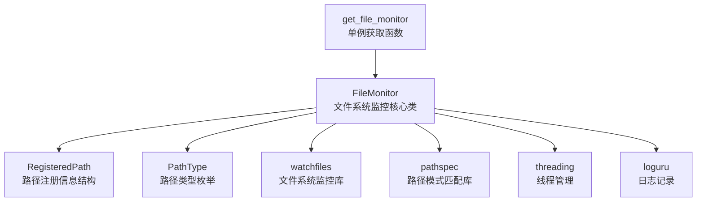

# common.file_monitor.ac.mod.md

## 模块信息
- **模块名称**: common.file_monitor
- **模块类型**: 包模块 (Package Module)
- **主要功能**: 基于watchfiles和pathspec的文件系统监控模块，提供单例模式的文件变化监控服务

## 核心功能

### 文件系统监控
- **FileMonitor**: 核心监控类，采用单例模式设计
- **实时监控**: 基于watchfiles库的高效文件系统监控
- **模式匹配**: 使用pathspec库实现灵活的路径模式匹配
- **异步处理**: 后台线程异步处理文件变化事件

### 路径管理系统
- **多路径支持**: 同时监控多个文件、目录和模式
- **动态注册**: 运行时动态注册和取消注册监控路径
- **精确匹配**: 支持精确路径和glob模式匹配
- **回调管理**: 线程安全的回调函数注册和执行

### 事件处理
- **变化类型**: 支持文件添加、修改、删除三种变化类型
- **回调机制**: 灵活的回调函数注册和触发机制
- **线程安全**: 确保多线程环境下的安全操作
- **错误处理**: 完善的异常处理和错误恢复机制

## 关键组件

### 1. FileMonitor 主监控类
```python
class FileMonitor:
    def __init__(self, root_dir: str)
    
    # 路径注册管理
    def register(self, path: str, callback: Callable[[Change, str], None]) -> None
    def unregister(self, path: str, callback: Callable[[Change, str], None] = None) -> None
    
    # 监控控制
    def start(self) -> None
    def stop(self) -> None
    def is_running(self) -> bool
    
    # 私有方法
    def _monitor_loop(self) -> None
    def _handle_changes(self, changes: Set[Tuple[Change, str]]) -> None
```

### 2. 数据模型和枚举
```python
# 变化类型枚举
class Change(Enum):
    added = "added"
    modified = "modified"
    deleted = "deleted"

# 路径类型枚举
class PathType(Enum):
    exact = "exact"      # 精确路径
    pattern = "pattern"  # 模式路径

# 注册路径信息
class RegisteredPath:
    path: str
    path_type: PathType
    callbacks: List[Callable[[Change, str], None]]
    pathspec: Optional[pathspec.PathSpec]
```

### 3. 辅助函数
```python
# 全局单例获取函数
def get_file_monitor(root_dir: str) -> FileMonitor:
    """获取FileMonitor的单例实例"""
    global _file_monitor_instance
    if _file_monitor_instance is None:
        _file_monitor_instance = FileMonitor(root_dir)
    return _file_monitor_instance
```

## 使用指南

### 1. 基本使用
```python
from autocoder.common.file_monitor import FileMonitor
from autocoder.common.file_monitor.monitor import get_file_monitor, Change

# 获取监控器实例（单例模式）
monitor = get_file_monitor("/path/to/project/root")

# 定义回调函数
def handle_file_change(change_type: Change, changed_path: str):
    if change_type == Change.added:
        print(f"新文件添加: {changed_path}")
    elif change_type == Change.modified:
        print(f"文件修改: {changed_path}")
    elif change_type == Change.deleted:
        print(f"文件删除: {changed_path}")

# 注册监控路径和回调
monitor.register("config.yaml", handle_file_change)          # 监控特定文件
monitor.register("src/utils/", handle_file_change)           # 监控目录及其内容
monitor.register("**/*.py", handle_file_change)              # 监控所有Python文件

# 启动监控
if not monitor.is_running():
    monitor.start()

# 停止监控
monitor.stop()
```

### 2. 高级使用场景
```python
# 多回调函数注册
def log_change(change_type: Change, path: str):
    print(f"[LOG] {change_type.name}: {path}")

def backup_change(change_type: Change, path: str):
    if change_type == Change.modified:
        # 执行备份逻辑
        print(f"[BACKUP] 备份文件: {path}")

def notify_change(change_type: Change, path: str):
    # 发送通知
    print(f"[NOTIFY] 文件变化通知: {path}")

# 为同一路径注册多个回调
monitor.register("**/*.py", log_change)
monitor.register("**/*.py", backup_change)
monitor.register("important.txt", notify_change)

# 启动监控
monitor.start()
```

### 3. 动态路径管理
```python
# 动态添加监控路径
def add_monitoring_path(path: str):
    def dynamic_callback(change_type: Change, changed_path: str):
        print(f"动态监控 - {change_type.name}: {changed_path}")
    
    monitor.register(path, dynamic_callback)
    print(f"已添加监控路径: {path}")

# 动态移除监控路径
def remove_monitoring_path(path: str, callback=None):
    monitor.unregister(path, callback)
    print(f"已移除监控路径: {path}")

# 使用示例
add_monitoring_path("temp/*.log")
# ... 一段时间后
remove_monitoring_path("temp/*.log")
```

### 4. 项目级别监控
```python
import os
from pathlib import Path

class ProjectFileMonitor:
    def __init__(self, project_root: str):
        self.project_root = Path(project_root)
        self.monitor = get_file_monitor(str(self.project_root))
        self.setup_monitoring()
    
    def setup_monitoring(self):
        """设置项目级别的文件监控"""
        # 监控源代码文件
        self.monitor.register("src/**/*.py", self.handle_source_change)
        self.monitor.register("src/**/*.js", self.handle_source_change)
        self.monitor.register("src/**/*.ts", self.handle_source_change)
        
        # 监控配置文件
        self.monitor.register("*.yaml", self.handle_config_change)
        self.monitor.register("*.json", self.handle_config_change)
        self.monitor.register("*.toml", self.handle_config_change)
        
        # 监控文档文件
        self.monitor.register("docs/**/*.md", self.handle_doc_change)
        self.monitor.register("README.md", self.handle_doc_change)
        
        # 监控依赖文件
        self.monitor.register("requirements.txt", self.handle_dependency_change)
        self.monitor.register("package.json", self.handle_dependency_change)
        self.monitor.register("pyproject.toml", self.handle_dependency_change)
    
    def handle_source_change(self, change_type: Change, path: str):
        """处理源代码文件变化"""
        print(f"[SOURCE] {change_type.name}: {path}")
        if change_type == Change.modified:
            self.trigger_linting(path)
    
    def handle_config_change(self, change_type: Change, path: str):
        """处理配置文件变化"""
        print(f"[CONFIG] {change_type.name}: {path}")
        if change_type == Change.modified:
            self.reload_config(path)
    
    def handle_doc_change(self, change_type: Change, path: str):
        """处理文档文件变化"""
        print(f"[DOC] {change_type.name}: {path}")
        if change_type == Change.modified:
            self.regenerate_docs()
    
    def handle_dependency_change(self, change_type: Change, path: str):
        """处理依赖文件变化"""
        print(f"[DEPS] {change_type.name}: {path}")
        if change_type == Change.modified:
            self.update_dependencies()
    
    def trigger_linting(self, file_path: str):
        """触发代码检查"""
        print(f"触发代码检查: {file_path}")
    
    def reload_config(self, config_path: str):
        """重新加载配置"""
        print(f"重新加载配置: {config_path}")
    
    def regenerate_docs(self):
        """重新生成文档"""
        print("重新生成文档")
    
    def update_dependencies(self):
        """更新依赖"""
        print("检查依赖更新")
    
    def start(self):
        """启动项目监控"""
        self.monitor.start()
        print(f"项目监控已启动: {self.project_root}")
    
    def stop(self):
        """停止项目监控"""
        self.monitor.stop()
        print("项目监控已停止")

# 使用示例
project_monitor = ProjectFileMonitor("/path/to/project")
project_monitor.start()
```

### 5. 条件监控
```python
import time
from datetime import datetime

class ConditionalFileMonitor:
    def __init__(self, root_dir: str):
        self.monitor = get_file_monitor(root_dir)
        self.last_change_time = {}
        self.debounce_interval = 1.0  # 防抖间隔（秒）
    
    def debounced_callback(self, change_type: Change, path: str):
        """防抖回调函数，避免频繁触发"""
        current_time = time.time()
        last_time = self.last_change_time.get(path, 0)
        
        if current_time - last_time >= self.debounce_interval:
            self.last_change_time[path] = current_time
            self.actual_callback(change_type, path)
    
    def actual_callback(self, change_type: Change, path: str):
        """实际的处理回调"""
        timestamp = datetime.now().strftime("%Y-%m-%d %H:%M:%S")
        print(f"[{timestamp}] {change_type.name}: {path}")
    
    def setup_monitoring(self):
        """设置条件监控"""
        # 只监控工作时间的变化
        current_hour = datetime.now().hour
        if 9 <= current_hour <= 18:  # 工作时间
            self.monitor.register("**/*.py", self.debounced_callback)
            self.monitor.register("**/*.js", self.debounced_callback)
            print("工作时间监控已启用")
        else:
            print("非工作时间，监控已禁用")

# 使用示例
conditional_monitor = ConditionalFileMonitor("/path/to/project")
conditional_monitor.setup_monitoring()
conditional_monitor.monitor.start()
```

## 目录结构

```
src/autocoder/common/file_monitor/
├── __init__.py                  # 模块导出接口，提供FileMonitor类
├── monitor.py                   # 核心监控实现，包含FileMonitor类和get_file_monitor函数
├── test_file_monitor.py         # 完整的功能测试，包含增删改查四个测试用例
└── .ac.mod.md                   # 本文档
```

## 技术特性

### 1. 单例模式
- **全局唯一**: 确保整个应用程序中只有一个监控实例
- **线程安全**: 使用线程安全的单例实现
- **资源优化**: 避免重复创建监控器，节省系统资源
- **状态一致**: 保证监控状态的全局一致性

### 2. 高效监控
- **底层优化**: 基于watchfiles库的高性能文件系统监控
- **事件驱动**: 异步事件处理，不阻塞主线程
- **批量处理**: 批量处理文件变化事件，提高效率
- **内存友好**: 低内存占用的监控实现

### 3. 灵活匹配
- **多种模式**: 支持精确路径和glob模式匹配
- **动态更新**: 运行时动态添加和移除监控路径
- **回调管理**: 支持一对多的路径回调关系
- **条件过滤**: 可根据条件过滤监控事件

### 4. 错误处理
- **异常捕获**: 完善的异常处理机制
- **错误恢复**: 监控线程异常后的自动恢复
- **日志记录**: 详细的错误日志和调试信息
- **优雅关闭**: 安全的监控器关闭机制

## 架构图



## 集成点

### 与其他模块的关系
- **common.pruner模块**: 为代码修剪功能提供文件变化监控
- **memory模块**: 为上下文管理提供文件变化通知
- **events模块**: 可集成到事件系统中发送文件变化事件

### 外部依赖
- **watchfiles**: 高性能的文件系统监控库
- **pathspec**: Git风格的路径模式匹配库
- **threading**: Python标准库，用于线程管理
- **loguru**: 现代化的日志记录库

## 扩展指南

### 1. 自定义事件过滤器
```python
from autocoder.common.file_monitor.monitor import FileMonitor

class FilteredFileMonitor(FileMonitor):
    def __init__(self, root_dir: str, filters: List[Callable[[str], bool]] = None):
        super().__init__(root_dir)
        self.filters = filters or []
    
    def add_filter(self, filter_func: Callable[[str], bool]):
        """添加文件过滤器"""
        self.filters.append(filter_func)
    
    def _handle_changes(self, changes):
        """重写变化处理，添加过滤逻辑"""
        filtered_changes = []
        for change_type, path in changes:
            if all(f(path) for f in self.filters):
                filtered_changes.append((change_type, path))
        
        super()._handle_changes(set(filtered_changes))

# 使用示例
monitor = FilteredFileMonitor("/project/root")
monitor.add_filter(lambda path: not path.endswith('.tmp'))  # 过滤临时文件
monitor.add_filter(lambda path: 'node_modules' not in path)  # 过滤node_modules
```

### 2. 事件聚合器
```python
import time
from collections import defaultdict

class EventAggregator:
    def __init__(self, monitor: FileMonitor, window_size: float = 5.0):
        self.monitor = monitor
        self.window_size = window_size
        self.events = defaultdict(list)
        self.timer = None
    
    def aggregate_callback(self, change_type: Change, path: str):
        """聚合回调函数"""
        self.events[change_type].append(path)
        
        # 重置定时器
        if self.timer:
            self.timer.cancel()
        
        self.timer = threading.Timer(self.window_size, self.flush_events)
        self.timer.start()
    
    def flush_events(self):
        """刷新聚合的事件"""
        if self.events:
            print(f"聚合事件报告 ({len(sum(self.events.values(), []))} 个事件):")
            for change_type, paths in self.events.items():
                print(f"  {change_type.name}: {len(paths)} 个文件")
                for path in paths[:5]:  # 只显示前5个
                    print(f"    - {path}")
                if len(paths) > 5:
                    print(f"    ... 还有 {len(paths) - 5} 个文件")
            
            self.events.clear()

# 使用示例
monitor = get_file_monitor("/project/root")
aggregator = EventAggregator(monitor, window_size=3.0)
monitor.register("**/*", aggregator.aggregate_callback)
```

### 3. 监控统计
```python
class MonitoringStats:
    def __init__(self, monitor: FileMonitor):
        self.monitor = monitor
        self.stats = {
            'total_events': 0,
            'added_files': 0,
            'modified_files': 0,
            'deleted_files': 0,
            'start_time': None
        }
    
    def stats_callback(self, change_type: Change, path: str):
        """统计回调函数"""
        self.stats['total_events'] += 1
        
        if change_type == Change.added:
            self.stats['added_files'] += 1
        elif change_type == Change.modified:
            self.stats['modified_files'] += 1
        elif change_type == Change.deleted:
            self.stats['deleted_files'] += 1
    
    def start_monitoring(self, pattern: str = "**/*"):
        """开始监控并统计"""
        self.stats['start_time'] = time.time()
        self.monitor.register(pattern, self.stats_callback)
        self.monitor.start()
    
    def get_stats(self) -> dict:
        """获取统计信息"""
        current_time = time.time()
        uptime = current_time - (self.stats['start_time'] or current_time)
        
        return {
            **self.stats,
            'uptime_seconds': uptime,
            'events_per_minute': self.stats['total_events'] / (uptime / 60) if uptime > 0 else 0
        }

# 使用示例
monitor = get_file_monitor("/project/root")
stats = MonitoringStats(monitor)
stats.start_monitoring()

# 一段时间后查看统计
print(stats.get_stats())
```

## 最佳实践

### 1. 性能优化
- 合理设置监控路径范围，避免监控不必要的目录
- 使用具体的文件模式而不是通配符来减少事件数量
- 实现防抖机制避免频繁触发回调
- 定期清理不需要的监控路径

### 2. 资源管理
- 及时停止不需要的监控器
- 避免在回调函数中执行耗时操作
- 合理控制回调函数的数量
- 监控内存使用情况

### 3. 错误处理
- 在回调函数中添加异常处理
- 记录详细的错误日志用于调试
- 实现监控器的健康检查机制
- 提供监控状态的查询接口

### 4. 使用建议
- 优先使用单例模式获取监控器实例
- 根据应用场景选择合适的监控粒度
- 实现条件监控减少不必要的处理
- 建立监控事件的统计和分析机制

---

common.file_monitor模块提供了高效、灵活的文件系统监控解决方案，通过单例模式和事件驱动架构，为应用程序提供了实时的文件变化感知能力，是构建智能开发工具的重要基础设施。 