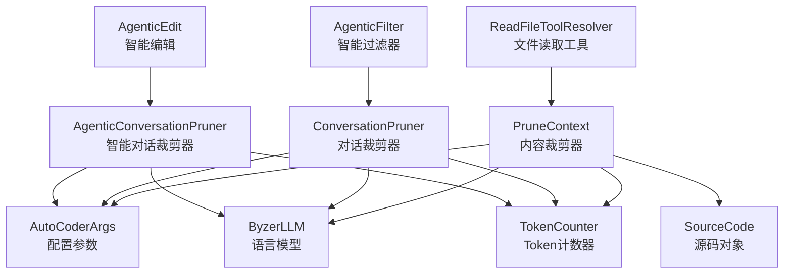

# common.pruner.ac.mod.md

## 模块信息
- **模块名称**: common.pruner
- **模块类型**: 包模块 (Package Module)
- **主要功能**: 智能内容裁剪模块，提供多种策略来管理和优化Token使用，包括文件内容裁剪、对话历史管理和智能对话工具结果清理

## 核心功能

### 内容裁剪系统
- **PruneContext**: 智能文件内容裁剪器，支持多种裁剪策略
- **相关性评估**: 基于LLM的智能文件相关性评分
- **代码片段提取**: 从大文件中提取与对话相关的代码片段
- **滑动窗口处理**: 处理超大文件的分块分析和提取

### 对话管理
- **ConversationPruner**: 对话历史管理器
- **摘要式裁剪**: 对早期对话进行分组摘要，保留关键信息
- **截断式裁剪**: 直接删除早期对话组
- **混合策略**: 自适应的摘要和截断组合策略

### 智能工具结果清理
- **AgenticConversationPruner**: 智能对话工具结果清理器
- **工具结果检测**: 识别包含tool_result的消息
- **渐进式清理**: 从最早的工具结果开始逐步清理
- **上下文保持**: 保留对话逻辑和工具调用历史

## 关键组件

### 1. PruneContext 内容裁剪器
```python
class PruneContext:
    def __init__(self, max_tokens: int, args: AutoCoderArgs, llm: ByzerLLM, verbose: bool = False)
    
    # 主要裁剪方法
    def handle_overflow(self, file_sources: List[SourceCode], conversations: List[Dict], strategy: str) -> List[SourceCode]
    
    # 策略实现
    def _score_and_filter_files(self, file_sources: List[SourceCode], conversations: List[Dict]) -> List[SourceCode]
    def _extract_code_snippets(self, file_sources: List[SourceCode], conversations: List[Dict]) -> List[SourceCode]
    def _delete_overflow_files(self, file_sources: List[SourceCode]) -> List[SourceCode]
    
    # 辅助方法
    def _calculate_total_tokens(self, file_sources: List[SourceCode], conversations: List[Dict]) -> int
    def _extract_snippets_from_file(self, source: SourceCode, conversations: List[Dict]) -> Optional[SourceCode]
```

### 2. ConversationPruner 对话裁剪器
```python
class ConversationPruner:
    def __init__(self, args: AutoCoderArgs, llm: ByzerLLM)
    
    # 主要裁剪方法
    def prune_conversations(self, conversations: List[Dict], strategy_name: str = "summarize") -> List[Dict]
    
    # 策略实现
    def _summarize_prune(self, conversations: List[Dict]) -> List[Dict]
    def _truncate_prune(self, conversations: List[Dict]) -> List[Dict]
    def _hybrid_prune(self, conversations: List[Dict]) -> List[Dict]
    
    # 辅助方法
    def _group_conversations(self, conversations: List[Dict]) -> List[List[Dict]]
    def _summarize_group(self, group: List[Dict]) -> Dict
```

### 3. AgenticConversationPruner 智能对话裁剪器
```python
class AgenticConversationPruner:
    def __init__(self, args: AutoCoderArgs, llm: ByzerLLM)
    
    # 主要清理方法
    def prune_conversations(self, conversations: List[Dict]) -> List[Dict]
    
    # 工具结果处理
    def _tool_output_cleanup_prune(self, conversations: List[Dict]) -> List[Dict]
    def _extract_tool_name(self, content: str) -> str
    def _create_placeholder_message(self, tool_name: str, original_length: int) -> str
    
    # 统计和监控
    def get_cleanup_statistics(self) -> Dict[str, Any]
```

## 使用指南

### 1. 基本使用
```python
from autocoder.common.pruner.context_pruner import PruneContext
from autocoder.common.pruner.conversation_pruner import ConversationPruner
from autocoder.common.pruner.agentic_conversation_pruner import AgenticConversationPruner
from autocoder.common import AutoCoderArgs, SourceCode
from autocoder.sdk import get_llm
from autocoder.common.tokens import count_string_tokens

# 初始化配置
args = AutoCoderArgs(
    source_dir=".",
    context_prune=True,
    context_prune_strategy="extract",
    context_prune_sliding_window_size=100,
    context_prune_sliding_window_overlap=20,
    conversation_prune_safe_zone_tokens=50000,
    conversation_prune_group_size=4,
    query="用户的具体问题或需求"
)

# 创建LLM实例
llm = get_llm("v3_chat", product_mode="lite")

# 内容裁剪器 - 处理文件内容
context_pruner = PruneContext(max_tokens=10000, args=args, llm=llm, verbose=True)
file_sources = [
    SourceCode(
        module_name="src/example.py",
        source_code="def hello(): pass",
        tokens=count_string_tokens("def hello(): pass")
    )
]
conversations = [{"role": "user", "content": "如何修改hello函数？"}]
pruned_files = context_pruner.handle_overflow(file_sources, conversations, strategy="extract")

# 对话裁剪器 - 管理对话历史
conversation_pruner = ConversationPruner(args=args, llm=llm)
conversations = [{"role": "user", "content": "Hello"}, {"role": "assistant", "content": "Hi"}]
pruned_conversations = conversation_pruner.prune_conversations(conversations, strategy_name="summarize")

# 智能对话裁剪器 - 清理工具结果
agentic_pruner = AgenticConversationPruner(args=args, llm=llm)
agentic_conversations = [...] # 包含工具执行结果的对话
cleaned_conversations = agentic_pruner.prune_conversations(agentic_conversations)
```

### 2. PruneContext Extract策略完整示例
```python
import tempfile
import shutil
import os
from autocoder.common.pruner.context_pruner import PruneContext
from autocoder.common import AutoCoderArgs, SourceCode
from autocoder.sdk import get_llm, init_project_if_required
from autocoder.common.tokens import count_string_tokens

def context_pruner_extract_example():
    """PruneContext Extract策略示例"""
    temp_dir = None
    original_cwd = os.getcwd()
    
    try:
        # 创建临时测试环境
        temp_dir = tempfile.mkdtemp()
        os.chdir(temp_dir)
        
        # 创建配置和LLM实例
        args = AutoCoderArgs(
            source_dir=".",
            context_prune=True,
            context_prune_strategy="extract",
            context_prune_sliding_window_size=10,
            context_prune_sliding_window_overlap=2,
            query="如何实现加法和减法运算？"
        )
        
        llm = get_llm("v3_chat", product_mode="lite")
        
        # 创建PruneContext实例（设置较小token限制以触发裁剪）
        pruner = PruneContext(max_tokens=60, args=args, llm=llm, verbose=True)
        
        # 创建示例项目结构
        src_dir = os.path.join(temp_dir, "src")
        utils_dir = os.path.join(src_dir, "utils")
        os.makedirs(utils_dir, exist_ok=True)
        
        # 创建数学工具模块（与用户查询相关）
        math_utils_content = '''def add(a, b):
    """加法函数"""
    return a + b

def subtract(a, b):
    """减法函数"""
    return a - b

def multiply(a, b):
    """乘法函数"""
    return a * b

def divide(a, b):
    """除法函数"""
    if b == 0:
        raise ValueError("Cannot divide by zero")
    return a / b
'''
        
        # 创建字符串工具模块（与用户查询无关）
        string_utils_content = '''def format_string(s):
    """格式化字符串"""
    return s.strip().lower()

def reverse_string(s):
    """反转字符串"""
    return s[::-1]

def count_characters(s):
    """计算字符数"""
    return len(s)
'''
        
        # 创建主程序文件
        main_content = '''from utils.math_utils import add, subtract
from utils.string_utils import format_string

def main():
    print("计算结果:", add(5, 3))
    print("格式化结果:", format_string("  Hello World  "))

if __name__ == "__main__":
    main()
'''
        
        # 写入文件
        with open(os.path.join(utils_dir, "math_utils.py"), "w") as f:
            f.write(math_utils_content)
        with open(os.path.join(utils_dir, "string_utils.py"), "w") as f:
            f.write(string_utils_content)
        with open(os.path.join(src_dir, "main.py"), "w") as f:
            f.write(main_content)
        
        # 初始化项目
        init_project_if_required(target_dir=temp_dir)
        
        # 创建SourceCode对象列表
        file_sources = [
            SourceCode(
                module_name="src/utils/math_utils.py",
                source_code=math_utils_content,
                tokens=count_string_tokens(math_utils_content)
            ),
            SourceCode(
                module_name="src/utils/string_utils.py", 
                source_code=string_utils_content,
                tokens=count_string_tokens(string_utils_content)
            ),
            SourceCode(
                module_name="src/main.py",
                source_code=main_content,
                tokens=count_string_tokens(main_content)
            )
        ]
        
        # 创建对话上下文
        conversations = [
            {"role": "user", "content": "很好继续"},
            {"role": "assistant", "content": "好的，我明白了"},
            {"role": "user", "content": "项目如何实现加法和减法运算？"},
        ]
        
        # 执行extract策略
        print("🚀 执行extract策略处理...")
        result = pruner.handle_overflow(
            file_sources=file_sources,
            conversations=conversations,
            strategy="extract"
        )
        
        # 分析结果
        print(f"\n🎯 处理结果:")
        print(f"   • 输入文件数: {len(file_sources)} (总tokens: 194)")
        print(f"   • 输出文件数: {len(result)}")
        
        for processed_file in result:
            print(f"\n📄 文件: {processed_file.module_name}")
            print(f"   Token数: {processed_file.tokens}")
            if "Snippets:" in processed_file.source_code:
                print("   ✂️ 已提取代码片段")
                print(f"   内容预览: {processed_file.source_code[:100]}...")
            else:
                print("   📋 完整文件内容")
        
        return result
        
    finally:
        # 清理资源
        if original_cwd:
            os.chdir(original_cwd)
        if temp_dir and os.path.exists(temp_dir):
            shutil.rmtree(temp_dir)

if __name__ == "__main__":
    context_pruner_extract_example()
```

### 3. 对话裁剪策略示例
```python
def conversation_pruning_example():
    """对话裁剪策略示例"""
    
    # 创建配置
    args = AutoCoderArgs(
        conversation_prune_safe_zone_tokens=1000,
        conversation_prune_group_size=4
    )
    
    llm = get_llm("v3_chat", product_mode="lite")
    pruner = ConversationPruner(args=args, llm=llm)
    
    # 创建长对话历史
    conversations = [
        {"role": "user", "content": "你好"},
        {"role": "assistant", "content": "你好！有什么可以帮助您的吗？"},
        {"role": "user", "content": "我想学习Python"},
        {"role": "assistant", "content": "Python是一门很好的编程语言..."},
        {"role": "user", "content": "如何定义函数？"},
        {"role": "assistant", "content": "在Python中，使用def关键字定义函数..."},
        {"role": "user", "content": "能给个例子吗？"},
        {"role": "assistant", "content": "当然！这里是一个简单的例子..."},
        {"role": "user", "content": "现在我想学习类"},
        {"role": "assistant", "content": "类是面向对象编程的核心概念..."},
    ]
    
    # 摘要策略
    summarized = pruner.prune_conversations(conversations, strategy_name="summarize")
    print(f"摘要策略：{len(conversations)} -> {len(summarized)} 条对话")
    
    # 截断策略
    truncated = pruner.prune_conversations(conversations, strategy_name="truncate")
    print(f"截断策略：{len(conversations)} -> {len(truncated)} 条对话")
    
    # 混合策略
    hybrid = pruner.prune_conversations(conversations, strategy_name="hybrid")
    print(f"混合策略：{len(conversations)} -> {len(hybrid)} 条对话")
    
    return summarized, truncated, hybrid
```

### 4. 智能工具结果清理示例
```python
def agentic_pruning_example():
    """智能工具结果清理示例"""
    
    args = AutoCoderArgs()
    llm = get_llm("v3_chat", product_mode="lite")
    pruner = AgenticConversationPruner(args=args, llm=llm)
    
    # 包含工具结果的对话
    conversations = [
        {"role": "user", "content": "请读取文件内容"},
        {"role": "assistant", "content": "我来为您读取文件内容。"},
        {
            "role": "assistant", 
            "content": '''<tool_result>
<tool_name>read_file</tool_name>
<result>
这里是一个很长的文件内容，包含了大量的代码和注释...
[假设这里有几千行代码内容]
</result>
</tool_result>

文件内容已读取完成。'''
        },
        {"role": "user", "content": "能帮我分析一下这个文件的结构吗？"},
        {"role": "assistant", "content": "根据文件内容，我可以看到..."},
        {
            "role": "assistant",
            "content": '''<tool_result>
<tool_name>search_files</tool_name>
<result>
搜索结果：找到了以下相关文件...
[大量搜索结果]
</result>
</tool_result>

搜索完成，找到了相关文件。'''
        }
    ]
    
    # 执行清理
    cleaned = pruner.prune_conversations(conversations)
    
    # 获取统计信息
    stats = pruner.get_cleanup_statistics()
    print(f"清理统计: {stats}")
    
    return cleaned
```

### 5. 综合使用场景
```python
class IntelligentTokenManager:
    """智能Token管理器，综合使用所有裁剪器"""
    
    def __init__(self, max_context_tokens: int = 8000, max_conversation_tokens: int = 4000):
        self.args = AutoCoderArgs(
            context_prune=True,
            context_prune_strategy="score",
            conversation_prune_safe_zone_tokens=max_conversation_tokens
        )
        self.llm = get_llm("v3_chat", product_mode="lite")
        
        self.context_pruner = PruneContext(max_context_tokens, self.args, self.llm)
        self.conversation_pruner = ConversationPruner(self.args, self.llm)
        self.agentic_pruner = AgenticConversationPruner(self.args, self.llm)
    
    def optimize_context(self, file_sources: List[SourceCode], conversations: List[Dict]) -> Tuple[List[SourceCode], List[Dict]]:
        """优化上下文，包括文件和对话"""
        
        # 1. 清理工具结果
        cleaned_conversations = self.agentic_pruner.prune_conversations(conversations)
        
        # 2. 裁剪对话历史
        pruned_conversations = self.conversation_pruner.prune_conversations(
            cleaned_conversations, 
            strategy_name="hybrid"
        )
        
        # 3. 裁剪文件内容
        pruned_files = self.context_pruner.handle_overflow(
            file_sources, 
            pruned_conversations, 
            strategy="score"
        )
        
        return pruned_files, pruned_conversations
    
    def get_optimization_report(self) -> Dict[str, Any]:
        """获取优化报告"""
        return {
            "agentic_stats": self.agentic_pruner.get_cleanup_statistics(),
            "context_strategy": self.args.context_prune_strategy,
            "conversation_strategy": "hybrid"
        }

# 使用示例
manager = IntelligentTokenManager(max_context_tokens=6000, max_conversation_tokens=2000)
optimized_files, optimized_conversations = manager.optimize_context(file_sources, conversations)
report = manager.get_optimization_report()
```

## 裁剪策略详解

### 1. PruneContext策略

#### Score策略（推荐）
- **原理**: 使用LLM对每个文件进行0-10分的相关性评分
- **优点**: 智能保留最相关的文件，信息损失最小
- **适用**: 需要高质量上下文的场景
- **性能**: 需要多次LLM调用，速度较慢

#### Extract策略
- **原理**: 从大文件中提取与对话相关的代码片段
- **优点**: 保留关键代码，减少无关内容
- **适用**: 处理大型代码文件的场景
- **性能**: 需要LLM分析，速度中等

#### Delete策略
- **原理**: 简单删除超出限制的文件
- **优点**: 速度快，无需LLM调用
- **适用**: 对上下文质量要求不高的场景
- **性能**: 最快，但信息损失较大

### 2. ConversationPruner策略

#### Summarize策略（推荐）
- **原理**: 将早期对话分组并生成摘要
- **优点**: 保留对话历史的关键信息
- **适用**: 需要保持对话连贯性的场景

#### Truncate策略
- **原理**: 直接删除早期对话组
- **优点**: 速度快，简单有效
- **适用**: 对话历史不重要的场景

#### Hybrid策略
- **原理**: 先尝试摘要，如仍超限则截断
- **优点**: 平衡性能和信息保留
- **适用**: 大多数实际应用场景

## 目录结构

```
src/autocoder/common/pruner/
├── context_pruner.py              # PruneContext类，智能文件内容裁剪
├── conversation_pruner.py         # ConversationPruner类，对话历史管理
├── agentic_conversation_pruner.py # AgenticConversationPruner类，智能对话工具结果清理
├── test_agentic_conversation_pruner.py # 智能对话裁剪器测试文件
├── README.md                      # 原始文档
└── .ac.mod.md                     # 本文档
```

## 技术特性

### 1. 智能相关性评估
- **LLM驱动**: 基于大语言模型的智能文件相关性评分
- **上下文感知**: 结合对话历史进行相关性判断
- **并行处理**: 支持并行评估提高效率
- **评分标准**: 0-10分的标准化评分机制

### 2. 滑动窗口处理
- **大文件支持**: 处理超大文件的分块分析
- **重叠窗口**: 保证上下文连续性
- **智能合并**: 自动合并相邻的代码片段
- **内存优化**: 避免大文件导致的内存问题

### 3. 多策略支持
- **策略灵活**: 支持多种裁剪策略选择
- **自适应**: 根据场景自动选择最优策略
- **可配置**: 所有参数都可通过配置调整
- **渐进式**: 支持渐进式裁剪和优化

### 4. 工具结果清理
- **智能识别**: 自动识别工具执行结果
- **占位符替换**: 用简洁占位符替换大型输出
- **历史保留**: 保留工具调用的逻辑关系
- **统计监控**: 提供详细的清理统计信息

## 架构图



## 集成点

### 与其他模块的关系
- **common.tokens模块**: 使用token计数功能
- **utils.llms模块**: 使用LLM实例进行智能分析
- **agent模块**: 为智能代理提供上下文优化
- **rag模块**: 为检索系统提供内容裁剪

### 外部依赖
- **byzerllm**: 大语言模型集成
- **threading**: 并行处理支持
- **re**: 正则表达式处理
- **json**: 数据序列化

## 扩展指南

### 1. 自定义裁剪策略
```python
from autocoder.common.pruner.context_pruner import PruneContext

class CustomPruneContext(PruneContext):
    def handle_overflow(self, file_sources, conversations, strategy):
        if strategy == "custom":
            return self._custom_strategy(file_sources, conversations)
        return super().handle_overflow(file_sources, conversations, strategy)
    
    def _custom_strategy(self, file_sources, conversations):
        """实现自定义裁剪策略"""
        # 自定义逻辑
        return filtered_files
```

### 2. 扩展相关性评估
```python
class EnhancedRelevanceEvaluator:
    def __init__(self, llm):
        self.llm = llm
    
    def evaluate_file_relevance(self, file_content, conversations, metadata=None):
        """扩展的文件相关性评估"""
        # 结合文件元数据的评估逻辑
        prompt = self._build_enhanced_prompt(file_content, conversations, metadata)
        response = self.llm.chat_oai([{"role": "user", "content": prompt}])
        return self._parse_relevance_score(response)
    
    def _build_enhanced_prompt(self, file_content, conversations, metadata):
        """构建增强的评估提示"""
        # 包含更多上下文信息的提示构建
        pass
```

### 3. 性能优化
```python
import asyncio
from concurrent.futures import ThreadPoolExecutor

class OptimizedPruner:
    def __init__(self, max_workers=4):
        self.executor = ThreadPoolExecutor(max_workers=max_workers)
    
    async def parallel_evaluate(self, file_sources, conversations):
        """并行评估文件相关性"""
        tasks = []
        for source in file_sources:
            task = asyncio.create_task(
                self._async_evaluate_file(source, conversations)
            )
            tasks.append(task)
        
        results = await asyncio.gather(*tasks)
        return results
    
    async def _async_evaluate_file(self, source, conversations):
        """异步评估单个文件"""
        loop = asyncio.get_event_loop()
        return await loop.run_in_executor(
            self.executor, 
            self._evaluate_file_sync, 
            source, 
            conversations
        )
```

## 最佳实践

### 1. 策略选择指南
- **高质量上下文需求**: 使用score策略
- **大文件处理**: 使用extract策略
- **快速响应需求**: 使用delete策略
- **对话历史重要**: 使用summarize策略
- **性能优先**: 使用truncate策略

### 2. 参数调优
- **滑动窗口大小**: 根据文件平均长度调整
- **窗口重叠**: 保证上下文连续性，建议20-30%
- **安全区Token**: 根据模型上下文长度设置
- **分组大小**: 平衡摘要质量和处理速度

### 3. 性能优化
- 启用并行处理提高评估速度
- 合理设置Token限制避免过度裁剪
- 使用缓存机制减少重复计算
- 监控裁剪效果并调整策略

### 4. 错误处理
- 处理LLM调用失败的降级策略
- 验证裁剪结果的完整性
- 记录详细的裁剪日志用于调试
- 提供裁剪失败时的回退机制

---

common.pruner模块提供了完整的智能内容裁剪解决方案，通过多种策略和智能评估机制，有效管理Token使用，优化AI应用的性能和成本，是构建高效AI系统的重要工具。 