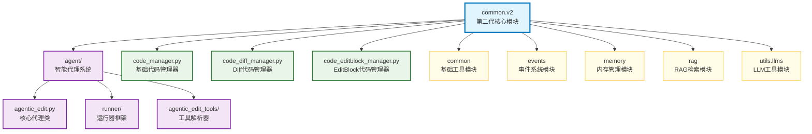

# common.v2

AutoCoder 项目中的第二代核心代码管理和智能代理模块，提供基于LLM的智能代码编辑、多格式代码生成管理和运行器框架。

## 模块位置

**源码路径**: `src/autocoder/common/v2/`  
**文档路径**: `specs/common_v2.ac.mod.md`  
**模块类型**: 包模块

## 目录结构

```
src/autocoder/common/v2/
├── __init__.py                          # 包初始化文件
├── agent/                               # 智能代理系统目录
│   ├── __init__.py                      # 代理模块初始化
│   ├── agentic_edit.py                  # 核心智能代理类，LLM交互和工具调度
│   ├── agentic_edit_types.py            # 类型定义，工具模型和事件类型
│   ├── agentic_tool_display.py          # 工具显示相关的国际化支持
│   ├── agentic_edit_tools/              # 工具解析器目录
│   │   ├── __init__.py                  # 工具模块初始化
│   │   ├── base_tool_resolver.py        # 工具解析器基类
│   │   ├── execute_command_tool_resolver.py # 命令执行工具解析器
│   │   ├── read_file_tool_resolver.py   # 文件读取工具解析器
│   │   ├── write_to_file_tool_resolver.py # 文件写入工具解析器
│   │   ├── replace_in_file_tool_resolver.py # 文件替换工具解析器
│   │   ├── search_files_tool_resolver.py # 文件搜索工具解析器
│   │   ├── list_files_tool_resolver.py  # 文件列表工具解析器
│   │   ├── list_code_definition_names_tool_resolver.py # 代码定义列表工具
│   │   ├── ask_followup_question_tool_resolver.py # 用户交互工具解析器
│   │   ├── attempt_completion_tool_resolver.py # 任务完成工具解析器
│   │   ├── plan_mode_respond_tool_resolver.py # 计划模式响应工具
│   │   ├── use_mcp_tool_resolver.py     # MCP工具解析器
│   │   ├── use_rag_tool_resolver.py     # RAG工具解析器
│   │   ├── ac_mod_read_tool_resolver.py # AC模块读取工具解析器
│   │   ├── ac_mod_write_tool_resolver.py # AC模块写入工具解析器
│   │   ├── todo_read_tool_resolver.py   # Todo读取工具解析器
│   │   ├── todo_write_tool_resolver.py  # Todo写入工具解析器
│   │   └── dangerous_command_checker.py # 危险命令检查器
│   └── runner/                          # 运行器框架目录
│       ├── __init__.py                  # 运行器模块初始化
│       ├── base_runner.py               # 基础运行器抽象类
│       ├── terminal_runner.py           # 终端运行模式实现
│       ├── event_runner.py              # 事件系统运行模式实现
│       ├── sdk_runner.py                # SDK运行模式实现
│       └── tool_display.py              # 工具显示辅助模块
├── code_manager.py                      # 基础代码生成管理器
├── code_diff_manager.py                 # Diff格式代码生成管理器
├── code_editblock_manager.py            # EditBlock格式代码生成管理器
├── code_strict_diff_manager.py          # 严格Diff格式代码生成管理器
├── code_agentic_editblock_manager.py    # 智能EditBlock代码生成管理器
├── code_auto_generate.py               # 普通代码生成器
├── code_auto_generate_diff.py          # Diff代码生成器
├── code_auto_generate_editblock.py     # EditBlock代码生成器
├── code_auto_generate_strict_diff.py   # 严格Diff代码生成器
├── code_auto_merge.py                  # 普通代码合并器
├── code_auto_merge_diff.py             # Diff代码合并器
├── code_auto_merge_editblock.py        # EditBlock代码合并器
└── code_auto_merge_strict_diff.py      # 严格Diff代码合并器
```

**注意**: 本文档保存在 `specs/` 目录下，不在包源码目录中。

## 快速开始

### 基本使用方式

```python
# 导入必要的模块
from autocoder.common.v2.agent import AgenticEdit
from autocoder.common.v2.agent.runner import TerminalRunner, EventRunner, SdkRunner
from autocoder.common.v2.agent.agentic_edit_types import AgenticEditRequest, MemoryConfig
from autocoder.common.v2.code_diff_manager import CodeDiffManager
from autocoder.common import AutoCoderArgs, SourceCodeList

# 1. 初始化配置
args = AutoCoderArgs(source_dir="/path/to/project", file="action.yml")
llm = get_single_llm(args)
conversation_history = []
files = SourceCodeList()
memory_config = MemoryConfig(memory={}, save_memory_func=lambda x: None)

# 2. 创建智能代理实例
agent = AgenticEdit(
    llm=llm,
    conversation_history=conversation_history,
    files=files,
    args=args,
    memory_config=memory_config
)

# 3. 使用运行器执行任务
terminal_runner = TerminalRunner(
    llm=llm,
    conversation_history=conversation_history,
    files=files,
    args=args,
    memory_config=memory_config
)

request = AgenticEditRequest(user_input="实现一个HTTP服务器")
terminal_runner.run(request)
```

### 子模块说明

- **agent**: 智能代理系统，包含核心代理类、工具系统和运行器框架
- **code_*_manager**: 各种代码管理器，支持不同格式的代码生成和合并
- **code_auto_generate_***: 代码生成器集合，支持多种输出格式
- **code_auto_merge_***: 代码合并器集合，对应各种生成格式

### 配置管理

```python
# 内存配置
memory_config = MemoryConfig(
    memory={"project_context": "Web应用开发"},
    save_memory_func=lambda memory: save_to_database(memory)
)

# 对话配置
from autocoder.common.v2.agent.agentic_edit_types import AgenticEditConversationConfig
conversation_config = AgenticEditConversationConfig(
    max_turns=50,
    enable_context_pruning=True,
    save_conversation=True
)
```

## 核心组件详解

### 1. AgenticEdit 主类

**核心功能：**
- LLM交互管理：处理与大语言模型的流式对话
- 工具调度：解析LLM输出中的工具调用并执行  
- 事件流处理：将交互过程转换为结构化事件流
- 文件变更跟踪：记录和管理代码文件的修改历史
- 对话状态管理：支持多轮对话的上下文保持

**主要方法：**
- `analyze()`: 核心分析方法，处理用户输入并生成事件流
- `run_in_terminal()`: 终端模式运行，适用于命令行交互
- `run_with_events()`: 事件模式运行，适用于Web界面集成
- `stream_and_parse_llm_response()`: 流式解析LLM响应

### 2. Runner 运行器框架

**BaseRunner**: 所有运行器的基类，提供统一接口
- **TerminalRunner**: 终端运行模式，Rich库美化显示，适用于命令行工具
- **EventRunner**: 事件系统运行模式，标准事件流处理，适用于Web应用
- **SdkRunner**: SDK运行模式，事件生成器接口，适用于自定义集成

**核心功能：**
- 代理生命周期管理：初始化、执行、清理
- 事件流生成：将用户请求转换为结构化事件流
- 变更管理：文件修改的应用和回滚
- 异常处理：统一的错误处理和恢复机制

### 3. 代码管理器架构

**CodeManager**: 基础代码生成管理器，支持普通格式代码生成
**CodeDiffManager**: Diff格式代码管理器，精确的代码修改，版本控制友好
**CodeEditBlockManager**: EditBlock格式代码管理器，直观的搜索替换操作
**CodeStrictDiffManager**: 严格Diff格式代码管理器，高精度的代码变更
**CodeAgenticEditBlockManager**: 智能EditBlock代码管理器，集成智能代理功能

每个管理器都包含：
- 代码生成器：负责根据用户需求生成代码
- 代码合并器：负责将生成的代码合并到现有项目中
- 自动修复：集成Linting和编译检查的自动错误修复

## 工具系统详解

### 文件操作工具
- **read_file**: 读取文件内容，支持编码自动检测
- **write_to_file**: 写入文件，支持创建新文件和覆盖现有文件
- **replace_in_file**: 文件内容替换，支持正则表达式和精确匹配

### 搜索和分析工具
- **search_files**: 多模式文件搜索（内容、文件名、正则表达式）
- **list_files**: 目录文件列表，支持过滤和递归
- **list_code_definition_names**: 代码定义分析，提取函数、类、变量名

### 项目管理工具
- **execute_command**: 安全命令执行，支持危险命令检查
- **use_rag**: RAG检索增强生成，智能上下文检索
- **use_mcp**: MCP工具集成，扩展外部工具能力

### 交互和控制工具
- **ask_followup_question**: 用户交互，获取澄清信息
- **attempt_completion**: 任务完成标记，提供完成摘要
- **plan_mode_respond**: 计划模式响应，支持分步执行

### 专业工具
- **ac_mod_read/write**: AC模块文档读写，支持项目文档管理
- **todo_read/write**: 任务管理，支持XML格式的任务标记

## 技术特性

### 1. 多格式代码生成
- **普通格式**: 直接代码生成，适用于新文件创建
- **Diff格式**: 统一差异格式，精确的代码修改
- **EditBlock格式**: 搜索替换块，直观的代码编辑
- **StrictDiff格式**: 严格差异格式，高精度的代码变更

### 2. 智能错误修复
```python
# 自动Linting修复流程
class CodeManager:
    def generate_and_apply_changes(self, query, source_code, context, enable_linting=True):
        # 1. 生成代码
        generated_code = self.code_generator.generate(query, source_code, context)
        
        # 2. Linting检查
        if enable_linting:
            lint_result = self.shadow_linter.lint_project()
            if lint_result.has_errors():
                # 3. 自动修复
                for attempt in range(self.auto_fix_lint_max_attempts):
                    fixed_code = self.fix_linter_errors(query, lint_result.format_issues())
                    # 重新生成和检查
                    if not self.shadow_linter.lint_project().has_errors():
                        break
        
        # 4. 应用代码变更
        return self.code_merger.merge(generated_code, source_code)
```

### 3. 事件驱动架构
```python
# 事件类型系统
class AgentEvent:
    - LLMOutputEvent: LLM文本输出
    - LLMThinkingEvent: LLM思考过程
    - ToolCallEvent: 工具调用请求
    - ToolResultEvent: 工具执行结果
    - CompletionEvent: 任务完成事件
    - TokenUsageEvent: Token使用统计
    - ErrorEvent: 错误事件
    - WindowLengthChangeEvent: 对话窗口变化
    - ConversationIdEvent: 会话ID事件
    - PlanModeRespondEvent: 计划模式响应
```

### 4. 内存和状态管理
```python
# 内存配置
memory_config = MemoryConfig(
    memory={"project_context": "Web应用开发"},
    save_memory_func=lambda memory: save_to_database(memory)
)

# 对话配置
conversation_config = AgenticEditConversationConfig(
    max_turns=50,
    enable_context_pruning=True,
    save_conversation=True
)
```

## Mermaid 依赖图




## 依赖关系说明

### 对其他模块的依赖
列出该模块依赖的其他具有 `.ac.mod.md` 文档的模块（使用specs目录下的文档路径）：

- `specs/common.ac.mod.md` - 基础工具模块，提供AutoCoderArgs、SourceCodeList等基础类型
- `specs/events.ac.mod.md` - 事件系统模块，提供事件类型定义和事件管理器
- `specs/memory.ac.mod.md` - 内存管理模块，提供ActiveContextManager等内存管理功能
- `specs/rag.ac.mod.md` - RAG检索模块，提供智能上下文检索功能
- `specs/utils_llms.ac.mod.md` - LLM工具模块，提供get_single_llm等LLM管理功能

### 被依赖关系
列出依赖于该模块的其他模块：

- `specs/auto_coder_runner.ac.mod.md` - 核心运行器模块，使用v2的代码管理器
- `specs/sdk.ac.mod.md` - SDK模块，通过runner框架提供智能代理功能

## 可以验证模块可运行的测试命令

提供可执行的验证命令，例如：

```bash
# 包模块测试
pytest src/autocoder/common/v2/agent/agentic_edit_tools/tests -v

# 直接运行模块验证
python -c "from autocoder.common.v2.agent import AgenticEdit; print('AgenticEdit imported successfully')"
python -c "from autocoder.common.v2.agent.runner import TerminalRunner; print('TerminalRunner imported successfully')"
python -c "from autocoder.common.v2.code_diff_manager import CodeDiffManager; print('CodeDiffManager imported successfully')"

# 工具解析器测试
python -c "from autocoder.common.v2.agent.agentic_edit_tools import BaseToolResolver; print('Tools imported successfully')"

# 验证事件类型
python -c "from autocoder.common.v2.agent.agentic_edit_types import AgenticEditRequest, MemoryConfig; print('Types imported successfully')"
``` 