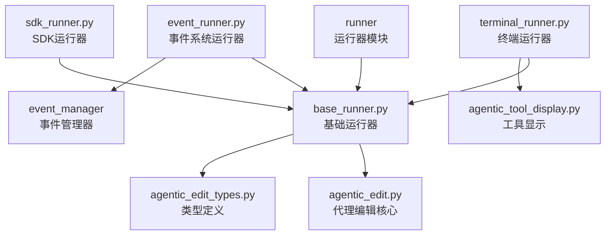

# common.v2.agent.runner.ac.mod.md

## 模块信息
- **模块名称**: common.v2.agent.runner
- **模块类型**: 包模块 (Package Module)
- **主要功能**: 提供多种运行模式，用于在不同环境下执行AgenticEdit代理，包括命令行终端、SDK环境以及标准事件系统

## 核心功能

### 多运行模式支持
- **TerminalRunner**: 终端运行模式，提供Rich格式化输出
- **EventRunner**: 事件系统运行模式，支持Web应用集成
- **SdkRunner**: SDK运行模式，提供最大灵活性
- **BaseRunner**: 统一的基础运行器抽象

### 代理执行管理
- **生命周期管理**: 管理代理执行的完整生命周期
- **事件流处理**: 处理和转换代理执行事件
- **异常处理**: 统一的异常处理和错误恢复
- **变更应用**: 管理代理执行前后的变更应用

### 配置和集成
- **配置管理**: 支持会话配置和命令配置
- **环境适配**: 适配不同的运行环境需求
- **工具显示**: 提供丰富的工具调用和结果显示
- **事件转换**: 将代理事件转换为标准事件格式

## 关键组件

### 1. BaseRunner 基础运行器
```python
class BaseRunner:
    def __init__(self, llm: ByzerLLM, conversation_history: List[Dict], files: SourceCodeList, 
                 args: AutoCoderArgs, memory_config: MemoryConfig, **kwargs)
    
    # 核心方法
    def run(self, request: AgenticEditRequest) -> Any:
        """执行代理，处理请求"""
        
    def apply_pre_changes(self) -> None:
        """应用预处理变更"""
        
    def apply_changes(self) -> None:
        """应用代理执行后的变更"""
        
    def analyze(self, request: AgenticEditRequest) -> Iterator[Any]:
        """分析请求并生成事件流"""
```

### 2. TerminalRunner 终端运行器
```python
class TerminalRunner(BaseRunner):
    def run(self, request: AgenticEditRequest) -> None:
        """在终端中执行代理"""
        
    def _format_content(self, content: str) -> str:
        """格式化输出内容"""
        
    def _display_tool_call(self, event: ToolCallEvent) -> None:
        """显示工具调用"""
        
    def _display_tool_result(self, event: ToolResultEvent) -> None:
        """显示工具结果"""
```

### 3. EventRunner 事件系统运行器
```python
class EventRunner(BaseRunner):
    def run(self, request: AgenticEditRequest) -> None:
        """执行代理并将事件写入事件系统"""
        
    def _convert_event(self, event: Any, event_manager: EventManager) -> None:
        """转换代理事件为标准事件"""
        
    def _create_event_content(self, event: Any) -> Dict[str, Any]:
        """创建事件内容"""
```

### 4. SdkRunner SDK运行器
```python
class SdkRunner(BaseRunner):
    def run(self, request: AgenticEditRequest) -> Iterator[Any]:
        """返回事件生成器"""
        
    def handle_completion_event(self, event: CompletionEvent) -> None:
        """处理完成事件"""
        
    def get_event_stream(self) -> Iterator[Any]:
        """获取事件流"""
```

## 使用指南

### 1. 基本使用
```python
from autocoder.common.v2.agent.runner import TerminalRunner, EventRunner, SdkRunner
from autocoder.common.v2.agent.agentic_edit_types import AgenticEditRequest
from autocoder.common import AutoCoderArgs

# 初始化配置
args = AutoCoderArgs(source_dir="/path/to/project", file="action.yml")
llm = get_single_llm(args)  # 获取LLM实例
conversation_history = []   # 对话历史
files = SourceCodeList()    # 源代码列表
memory_config = MemoryConfig(memory={}, save_memory_func=lambda x: None)

# 创建运行器实例 - 选择一种运行模式
# 终端运行模式
terminal_runner = TerminalRunner(
    llm=llm,
    conversation_history=conversation_history,
    files=files,
    args=args,
    memory_config=memory_config
)

# 事件系统运行模式
event_runner = EventRunner(
    llm=llm,
    conversation_history=conversation_history,
    files=files,
    args=args,
    memory_config=memory_config
)

# SDK运行模式
sdk_runner = SdkRunner(
    llm=llm,
    conversation_history=conversation_history,
    files=files,
    args=args,
    memory_config=memory_config
)

# 执行代理
request = AgenticEditRequest(user_input="请帮我实现一个简单的HTTP服务器")

# 使用终端运行模式
terminal_runner.run(request)

# 使用事件系统运行模式
event_runner.run(request)

# 使用SDK运行模式
for event in sdk_runner.run(request):
    # 处理事件
    if isinstance(event, CompletionEvent):
        print(f"任务完成: {event.completion.result}")
    elif isinstance(event, ToolCallEvent):
        print(f"调用工具: {type(event.tool).__name__}")
```

### 2. 配置管理
```python
# 创建会话配置
conversation_config = AgenticEditConversationConfig(
    conversation_name="my_conversation",  # 会话名称
    conversation_id=None,                 # 会话ID（可选）
    action="new",                         # 动作类型：new, list
    query=None,                           # 查询内容
    pull_request=False                    # 是否创建PR
)

# 创建命令配置
command_config = CommandConfig(
    coding=lambda x: None,
    chat=lambda x: None,
    # ... 其他命令处理函数
)

# 使用配置创建运行器
runner = TerminalRunner(
    llm=llm,
    conversation_history=conversation_history,
    files=files,
    args=args,
    memory_config=memory_config,
    command_config=command_config,
    conversation_name="current",
    conversation_config=conversation_config
)
```

### 3. 终端运行模式示例
```python
def run_in_terminal():
    """在终端中运行代理的示例"""
    
    # 创建终端运行器
    runner = TerminalRunner(
        llm=llm,
        conversation_history=conversation_history,
        files=files,
        args=args,
        memory_config=memory_config
    )
    
    # 创建请求
    request = AgenticEditRequest(
        user_input="请帮我重构这个函数，使其更加高效",
        additional_context="这是一个数据处理函数，需要优化性能"
    )
    
    # 在终端中执行
    runner.run(request)
    
    # 终端运行器会自动显示：
    # - LLM的思考过程
    # - 工具调用和结果
    # - 格式化的输出内容
    # - 任务完成状态
```

### 4. 事件系统运行模式示例
```python
def run_with_event_system():
    """使用事件系统运行代理的示例"""
    
    # 创建事件运行器
    runner = EventRunner(
        llm=llm,
        conversation_history=conversation_history,
        files=files,
        args=args,
        memory_config=memory_config
    )
    
    # 创建请求
    request = AgenticEditRequest(
        user_input="分析项目结构并生成文档"
    )
    
    # 执行并写入事件系统
    runner.run(request)
    
    # 事件系统会记录：
    # - 所有代理执行事件
    # - 工具调用和结果
    # - Token使用情况
    # - 执行时间统计
```

### 5. SDK运行模式示例
```python
def run_with_sdk():
    """使用SDK模式运行代理的示例"""
    
    # 创建SDK运行器
    runner = SdkRunner(
        llm=llm,
        conversation_history=conversation_history,
        files=files,
        args=args,
        memory_config=memory_config
    )
    
    # 创建请求
    request = AgenticEditRequest(
        user_input="实现一个缓存系统"
    )
    
    # 获取事件流
    events = []
    for event in runner.run(request):
        events.append(event)
        
        # 处理不同类型的事件
        if isinstance(event, LLMOutputEvent):
            print(f"LLM输出: {event.content}")
        elif isinstance(event, ToolCallEvent):
            print(f"调用工具: {event.tool_name}")
        elif isinstance(event, ToolResultEvent):
            print(f"工具结果: {event.result}")
        elif isinstance(event, CompletionEvent):
            print(f"任务完成: {event.completion.result}")
            break
        elif isinstance(event, ErrorEvent):
            print(f"发生错误: {event.error_message}")
            break
    
    return events
```

### 6. 自定义运行器示例
```python
class CustomRunner(BaseRunner):
    """自定义运行器示例"""
    
    def run(self, request: AgenticEditRequest):
        """自定义运行逻辑"""
        
        # 应用预处理变更
        self.apply_pre_changes()
        
        # 获取事件流
        events = []
        for event in self.analyze(request):
            events.append(event)
            
            # 自定义事件处理逻辑
            self._handle_custom_event(event)
            
            # 检查完成条件
            if isinstance(event, CompletionEvent):
                break
        
        # 应用变更
        self.apply_changes()
        
        return events
    
    def _handle_custom_event(self, event):
        """处理自定义事件"""
        if isinstance(event, LLMOutputEvent):
            # 自定义LLM输出处理
            self._process_llm_output(event)
        elif isinstance(event, ToolCallEvent):
            # 自定义工具调用处理
            self._process_tool_call(event)
    
    def _process_llm_output(self, event):
        """处理LLM输出"""
        # 实现自定义逻辑
        pass
    
    def _process_tool_call(self, event):
        """处理工具调用"""
        # 实现自定义逻辑
        pass

# 使用自定义运行器
custom_runner = CustomRunner(
    llm=llm,
    conversation_history=conversation_history,
    files=files,
    args=args,
    memory_config=memory_config
)

request = AgenticEditRequest(user_input="自定义任务")
result = custom_runner.run(request)
```

## 事件类型

runner模块处理以下事件类型：

### 1. 基础事件
- **LLMOutputEvent**: LLM的普通文本输出
- **LLMThinkingEvent**: LLM的思考过程
- **CompletionEvent**: 任务完成事件
- **ErrorEvent**: 错误事件

### 2. 工具相关事件
- **ToolCallEvent**: LLM调用工具的请求
- **ToolResultEvent**: 工具执行的结果

### 3. 系统事件
- **TokenUsageEvent**: Token使用情况
- **WindowLengthChangeEvent**: 对话窗口长度变化
- **ConversationIdEvent**: 会话ID事件
- **PlanModeRespondEvent**: 计划模式响应事件

## 目录结构

```
src/autocoder/common/v2/agent/runner/
├── __init__.py                 # 模块初始化文件，导出主要接口
├── base_runner.py              # 定义基础运行器抽象类
├── terminal_runner.py          # 终端运行模式实现
├── event_runner.py             # 事件系统运行模式实现
├── sdk_runner.py               # SDK 运行模式实现
└── .ac.mod.md                  # 本文档
```

## 技术特性

### 1. 多模式支持
- **环境适配**: 适配不同的运行环境和需求
- **接口统一**: 统一的运行器接口设计
- **灵活切换**: 可以轻松在不同运行模式间切换
- **扩展性**: 支持自定义运行器实现

### 2. 事件驱动
- **事件流**: 基于事件流的异步处理架构
- **实时响应**: 实时处理和响应代理事件
- **状态管理**: 完整的执行状态管理
- **错误恢复**: 异常情况的自动恢复机制

### 3. 丰富显示
- **Rich格式化**: 终端模式的丰富格式化输出
- **工具可视化**: 工具调用和结果的可视化显示
- **进度跟踪**: 任务执行进度的实时跟踪
- **交互反馈**: 用户友好的交互反馈

### 4. 集成友好
- **SDK接口**: 提供SDK友好的生成器接口
- **事件系统**: 与标准事件系统的无缝集成
- **配置灵活**: 灵活的配置和参数管理
- **扩展支持**: 支持自定义扩展和插件

## 架构图



## 集成点

### 与其他模块的关系
- **common.v2.agent模块**: 使用AgenticEdit核心功能
- **events模块**: 与事件系统的集成
- **memory模块**: 内存和上下文管理
- **utils.llms模块**: LLM实例管理

### 外部依赖
- **rich**: 终端格式化输出
- **typing**: 类型注解支持
- **abc**: 抽象基类支持
- **asyncio**: 异步处理支持

## 扩展指南

### 1. 自定义运行器
```python
from autocoder.common.v2.agent.runner.base_runner import BaseRunner

class WebRunner(BaseRunner):
    """Web应用运行器"""
    
    def __init__(self, websocket_connection, *args, **kwargs):
        super().__init__(*args, **kwargs)
        self.websocket = websocket_connection
    
    def run(self, request: AgenticEditRequest):
        """通过WebSocket运行代理"""
        self.apply_pre_changes()
        
        for event in self.analyze(request):
            # 通过WebSocket发送事件
            self._send_event_to_client(event)
            
            if isinstance(event, CompletionEvent):
                break
        
        self.apply_changes()
    
    def _send_event_to_client(self, event):
        """发送事件到客户端"""
        event_data = {
            "type": type(event).__name__,
            "data": event.to_dict()
        }
        self.websocket.send(json.dumps(event_data))
```

### 2. 事件过滤器
```python
class EventFilter:
    def __init__(self, filter_types=None):
        self.filter_types = filter_types or []
    
    def should_process(self, event) -> bool:
        """判断是否应该处理事件"""
        if not self.filter_types:
            return True
        return type(event).__name__ in self.filter_types

class FilteredRunner(BaseRunner):
    def __init__(self, event_filter: EventFilter, *args, **kwargs):
        super().__init__(*args, **kwargs)
        self.event_filter = event_filter
    
    def run(self, request: AgenticEditRequest):
        for event in self.analyze(request):
            if self.event_filter.should_process(event):
                self._process_event(event)
```

### 3. 性能监控
```python
import time
from typing import Dict, Any

class PerformanceMonitor:
    def __init__(self):
        self.start_time = None
        self.event_counts = {}
        self.tool_call_times = {}
    
    def start_monitoring(self):
        """开始监控"""
        self.start_time = time.time()
        self.event_counts.clear()
        self.tool_call_times.clear()
    
    def record_event(self, event):
        """记录事件"""
        event_type = type(event).__name__
        self.event_counts[event_type] = self.event_counts.get(event_type, 0) + 1
        
        if isinstance(event, ToolCallEvent):
            self.tool_call_times[event.tool_name] = time.time()
    
    def get_statistics(self) -> Dict[str, Any]:
        """获取统计信息"""
        total_time = time.time() - self.start_time if self.start_time else 0
        return {
            "total_time": total_time,
            "event_counts": self.event_counts,
            "events_per_second": sum(self.event_counts.values()) / total_time if total_time > 0 else 0
        }

class MonitoredRunner(BaseRunner):
    def __init__(self, *args, **kwargs):
        super().__init__(*args, **kwargs)
        self.monitor = PerformanceMonitor()
    
    def run(self, request: AgenticEditRequest):
        self.monitor.start_monitoring()
        
        for event in self.analyze(request):
            self.monitor.record_event(event)
            self._process_event(event)
        
        stats = self.monitor.get_statistics()
        print(f"执行统计: {stats}")
```

## 最佳实践

### 1. 运行器选择
- **终端应用**: 使用TerminalRunner获得最佳用户体验
- **Web应用**: 使用EventRunner集成事件系统
- **SDK集成**: 使用SdkRunner获得最大灵活性
- **批处理**: 自定义运行器实现特定需求

### 2. 事件处理
- 及时处理事件避免内存积累
- 实现适当的错误处理机制
- 监控事件流的性能指标
- 提供用户友好的进度反馈

### 3. 配置管理
- 合理配置内存和对话参数
- 根据使用场景调整运行器参数
- 实现配置的验证和默认值
- 支持运行时配置更新

### 4. 扩展开发
- 继承BaseRunner实现自定义逻辑
- 实现完整的事件处理流程
- 提供适当的错误处理和恢复
- 考虑性能和资源使用优化

---

common.v2.agent.runner模块提供了灵活而强大的代理执行框架，通过多种运行模式和丰富的事件处理能力，为不同环境下的AI代理应用提供了完整的运行时支持。 