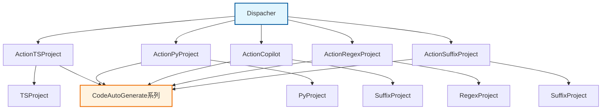
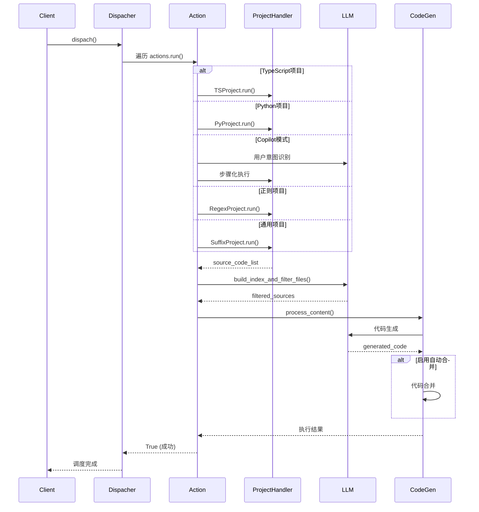

# dispacher/ 包模块文档

## 📍 模块位置
- **源码路径**: `src/autocoder/dispacher/`
- **文档路径**: `specs/dispacher.ac.mod.md`  
- **模块类型**: 包模块 (Package Module)
- **重要性**: ⭐⭐⭐⭐⭐ 核心任务调度器

## 📋 模块概述

`dispacher` 包是 Auto-Coder 的核心任务调度器，负责根据项目类型和用户输入智能选择和执行相应的处理动作。该包实现了基于责任链模式的调度机制，支持多种项目类型和AI辅助功能。

### 🎯 核心功能
- **任务调度管理**: 根据项目类型自动选择合适的处理器
- **多项目类型支持**: TypeScript、Python、通用文件、正则表达式等
- **AI智能助手**: Copilot模式支持步骤化执行和图片转代码
- **插件系统**: 支持通过插件扩展新的项目类型
- **代码生成和合并**: 集成多种代码生成和合并策略

## 🗂 文件结构

```
dispacher/
├── __init__.py                 # 包初始化，定义主调度器类
├── actions/                    # 动作执行模块目录
│   ├── action.py              # 核心动作类实现
│   ├── copilot.py             # AI智能助手功能
│   └── plugins/               # 插件动作目录
│       ├── __init__.py
│       └── action_regex_project.py  # 正则表达式项目处理插件
```

## 🚀 快速开始

### 基本用法

```python
from autocoder.common import AutoCoderArgs
from autocoder.dispacher import Dispacher
import byzerllm

# 创建参数配置
args = AutoCoderArgs(
    project_type="py",  # Python 项目
    query="实现一个计算器类",
    target_file="output.py",
    execute=True
)

# 初始化 LLM (可选)
llm = byzerllm.ByzerLLM()

# 创建调度器实例
dispacher = Dispacher(args=args, llm=llm)

# 执行调度
dispacher.dispach()
```

### 项目类型支持

```python
# TypeScript 项目
args = AutoCoderArgs(project_type="ts", query="创建React组件")

# Python 项目  
args = AutoCoderArgs(project_type="py", query="实现数据处理类")

# 通用文件项目 (基于文件后缀)
args = AutoCoderArgs(project_type=".js,.css", query="优化前端代码")

# Copilot 智能助手模式
args = AutoCoderArgs(project_type="copilot/.py", query="创建Flask应用")

# 正则表达式项目
args = AutoCoderArgs(project_type="regex://.*\\.txt$", query="处理文本文件")
```

### AI 辅助功能

```python
# 图片转HTML功能
args = AutoCoderArgs(
    project_type="copilot",
    image_file="design.png",
    image_mode="iterative",  # 或 "direct"
    image_max_iter=3
)

# 步骤化执行
args = AutoCoderArgs(
    project_type="copilot/.py",
    query="创建一个Web爬虫项目",
    search_engine="bing",
    search_engine_token="your_token"
)
```

## 🔧 核心组件详解

### 1. Dispacher 主调度器

```python
class Dispacher:
    def __init__(self, args: AutoCoderArgs, llm: Optional[byzerllm.ByzerLLM] = None):
        self.args = args
        self.llm = llm

    def dispach(self):
        """执行任务调度，按优先级选择合适的 Action"""
        actions = [            
            ActionTSProject(args=args, llm=self.llm),
            ActionPyProject(args=args, llm=self.llm),
            ActionCopilot(args=args, llm=self.llm),
            ActionRegexProject(args=args, llm=self.llm),
            ActionSuffixProject(args=args, llm=self.llm),
        ]
        for action in actions:
            if action.run():  # 第一个匹配的 Action 执行并返回
                return
```

**调度机制特点**:
- **责任链模式**: 依次尝试每个 Action，直到找到合适的
- **优先级控制**: 特定项目类型优先于通用处理器
- **短路执行**: 第一个成功执行的 Action 终止后续尝试

### 2. BaseAction 基类

```python
class BaseAction:
    def _get_content_length(self, content: str) -> int:
        """计算内容长度，优先使用 tokenizer"""
        try:
            tokenizer = BuildinTokenizer()
            return tokenizer.count_tokens(content)
        except Exception as e:
            return len(content)
```

**基类功能**:
- **内容长度计算**: 支持 token 级别的精确计算
- **统一接口**: 为所有 Action 提供公共方法
- **错误处理**: 优雅的异常处理和降级策略

### 3. ActionTSProject - TypeScript 项目处理

```python
class ActionTSProject(BaseAction):
    def run(self):
        if args.project_type != "ts":
            return False  # 不匹配则跳过
        
        # 使用 TSProject 处理器
        pp = TSProject(args=args, llm=self.llm)
        pp.run()
        
        # 构建源码列表
        source_code_list = SourceCodeList(pp.sources)
        
        # 可选：构建索引和过滤
        if self.llm:
            source_code_list = build_index_and_filter_files(
                llm=self.llm, args=args, sources=pp.sources
            )
        
        # 处理内容
        self.process_content(source_code_list)
        return True
```

**功能特点**:
- **TypeScript 专用**: 专门处理 `.ts`, `.tsx` 文件
- **智能索引**: 利用 LLM 构建代码索引和相关性过滤
- **图片支持**: 可以将设计图转换为 TypeScript 代码

### 4. ActionPyProject - Python 项目处理  

```python
class ActionPyProject(BaseAction):
    def run(self):
        if args.project_type != "py":
            return False
            
        # 使用 PyProject 处理器
        pp = PyProject(args=self.args, llm=self.llm)
        pp.run(packages=args.py_packages.split(",") if args.py_packages else [])
        
        # 构建和过滤源码
        source_code_list = SourceCodeList(pp.sources)
        if self.llm:
            source_code_list = build_index_and_filter_files(
                llm=self.llm, args=args, sources=pp.sources
            )
        
        self.process_content(source_code_list)
        return True
```

**功能特点**:
- **Python 生态**: 专门处理 `.py` 文件和 Python 包
- **包级别处理**: 支持指定特定包进行处理
- **依赖分析**: 自动分析 Python 项目的依赖关系

### 5. ActionCopilot - AI 智能助手

```python
class ActionCopilot:
    def run(self):
        if not args.project_type.startswith("copilot"):
            return False
            
        # 用户意图识别
        if args.query and self.llm:
            t = self.llm.chat_oai(
                conversations=[{"role": "user", "content": args.query}],
                response_class=RUserIntent,
            )
            self.user_intent = t[0].value.user_intent
        
        # 图片处理功能
        if args.image_file:
            image_to_page = ImageToPage(llm=self.llm, args=args)
            # ... 图片转HTML逻辑
            
        # 步骤化执行
        if self.user_intent == UserIntent.CREATE_NEW_PROJECT:
            # 项目创建流程
        else:
            # 项目优化流程
```

**AI 功能特点**:
- **用户意图识别**: 自动判断是创建新项目还是优化现有项目
- **图片转代码**: 将设计图转换为可执行代码
- **步骤化执行**: 将复杂任务分解为可执行的步骤
- **环境感知**: 自动检测运行环境和依赖
- **搜索增强**: 集成搜索引擎提供上下文信息

### 6. 代码生成和合并流程

```python
def process_content(self, source_code_list: SourceCodeList):
    # 执行取消检查
    global_cancel.check_and_raise(token=self.args.event_file)
    
    if args.execute:
        # 选择生成策略
        if args.auto_merge == "diff":
            generate = CodeAutoGenerateDiff(llm=self.llm, args=self.args, action=self)
        elif args.auto_merge == "strict_diff":
            generate = CodeAutoGenerateStrictDiff(llm=self.llm, args=self.args, action=self)
        elif args.auto_merge == "editblock":
            generate = CodeAutoGenerateEditBlock(llm=self.llm, args=self.args, action=self)
        else:
            generate = CodeAutoGenerate(llm=self.llm, args=self.args, action=self)
        
        # 执行代码生成
        generate_result = generate.single_round_run(
            query=args.query, source_code_list=source_code_list
        )
        
        # 代码合并 (可选)
        if args.auto_merge:
            if args.auto_merge == "diff":
                code_merge = CodeAutoMergeDiff(llm=self.llm, args=self.args)
            # ... 其他合并策略
            merge_result = code_merge.merge_code(generate_result=generate_result)
```

**生成和合并策略**:
- **diff**: 基于差异的合并
- **strict_diff**: 严格差异合并  
- **editblock**: 编辑块合并
- **默认**: 基础代码生成

## 🔗 依赖关系

### 内部依赖


### 外部依赖

| 依赖模块 | 用途 | 重要性 |
|---------|------|--------|
| `autocoder.common` | 基础类型、参数处理 | ⭐⭐⭐⭐⭐ |
| `autocoder.pyproject` | Python项目处理 | ⭐⭐⭐⭐ |
| `autocoder.tsproject` | TypeScript项目处理 | ⭐⭐⭐⭐ |
| `autocoder.suffixproject` | 通用文件处理 | ⭐⭐⭐⭐ |
| `autocoder.regexproject` | 正则表达式项目处理 | ⭐⭐⭐ |
| `autocoder.index` | 代码索引和过滤 | ⭐⭐⭐⭐ |
| `autocoder.common.code_auto_*` | 代码生成和合并 | ⭐⭐⭐⭐⭐ |
| `autocoder.privacy` | 隐私保护过滤 | ⭐⭐⭐ |
| `autocoder.events` | 事件管理 | ⭐⭐⭐ |
| `byzerllm` | LLM 集成 | ⭐⭐⭐⭐⭐ |

### 被依赖关系

```python
# 主要被以下模块使用
from autocoder.auto_coder_runner import AutoCoderRunner
from autocoder.auto_coder import AutoCoder
from autocoder.auto_coder_server import AutoCoderServer

# 使用示例
runner = AutoCoderRunner(args)
dispacher = Dispacher(args, llm)
dispacher.dispach()
```

## 📊 执行流程图



## ⚡ 性能特点

### 执行效率
- **短路机制**: 第一个匹配的 Action 执行后立即返回
- **懒加载**: Action 只在需要时初始化项目处理器
- **并发安全**: 支持全局取消和事件管理
- **内存优化**: 及时释放临时资源

### 可扩展性
- **插件架构**: 支持通过 plugins/ 目录扩展新的项目类型
- **策略模式**: 代码生成和合并策略可配置
- **事件驱动**: 集成事件系统支持监控和审计

## 🧪 测试和验证

### 基本功能测试

```bash
# 测试 TypeScript 项目调度
cd /path/to/auto-coder
python -m pytest tests/ -k "test_dispacher_ts" -v

# 测试 Python 项目调度  
python -m pytest tests/ -k "test_dispacher_py" -v

# 测试 Copilot 功能
python -m pytest tests/ -k "test_action_copilot" -v
```

### 手动验证

```bash
# 验证调度器导入
python -c "
from autocoder.dispacher import Dispacher
from autocoder.common import AutoCoderArgs
print('✅ Dispacher 导入成功')
"

# 验证 Action 类导入
python -c "
from autocoder.dispacher.actions.action import ActionTSProject, ActionPyProject
from autocoder.dispacher.actions.copilot import ActionCopilot
print('✅ Action 类导入成功')
"

# 验证项目类型支持
python -c "
from autocoder.common import AutoCoderArgs
from autocoder.dispacher import Dispacher

# 测试不同项目类型
test_cases = ['ts', 'py', 'copilot', '.js,.css']
for project_type in test_cases:
    args = AutoCoderArgs(project_type=project_type, query='test')
    dispacher = Dispacher(args)
    print(f'✅ 项目类型 {project_type} 支持正常')
"
```

### 集成测试

```bash
# 完整的调度流程测试
python -c "
import tempfile
from autocoder.common import AutoCoderArgs
from autocoder.dispacher import Dispacher

with tempfile.NamedTemporaryFile(suffix='.py', delete=False) as f:
    args = AutoCoderArgs(
        project_type='py',
        query='创建一个简单的Hello World函数',
        target_file=f.name,
        execute=False  # 不执行LLM，仅测试调度逻辑
    )
    
    dispacher = Dispacher(args)
    # dispacher.dispach()  # 需要LLM时启用
    print('✅ 调度器集成测试通过')
"
```

## 🔍 故障排除

### 常见问题

1. **Action 不匹配**
   ```
   问题: 所有 Action 都返回 False
   原因: project_type 参数不正确
   解决: 检查 project_type 是否为支持的类型
   ```

2. **LLM 调用失败**
   ```
   问题: 代码生成阶段出错
   原因: LLM 配置或网络问题
   解决: 检查 byzerllm 配置和网络连接
   ```

3. **内存不足**
   ```
   问题: 处理大型项目时内存溢出
   原因: 源码文件过多或过大
   解决: 使用 model_max_input_length 限制输入大小
   ```

### 调试技巧

```python
# 启用详细日志
import logging
logging.basicConfig(level=logging.DEBUG)

# 检查 Action 匹配情况
dispacher = Dispacher(args, llm)
actions = [
    ActionTSProject(args=args, llm=llm),
    ActionPyProject(args=args, llm=llm),
    # ... 其他 actions
]

for action in actions:
    result = action.run()
    print(f"{action.__class__.__name__}: {result}")
```

---

## 📝 总结

`dispacher` 包是 Auto-Coder 的核心调度引擎，通过责任链模式实现了灵活、可扩展的任务分发机制。其支持多种项目类型、AI 智能助手功能和丰富的代码生成策略，为整个系统提供了强大的任务处理能力。

### 关键优势
- **智能调度**: 自动选择最适合的处理器
- **多项目支持**: 覆盖主流编程语言和项目类型  
- **AI 增强**: Copilot 模式提供智能辅助
- **高度可扩展**: 插件架构支持功能扩展
- **性能优化**: 短路机制和资源管理优化

该模块为 Auto-Coder 系统的核心功能提供了稳定可靠的基础设施支撑。 