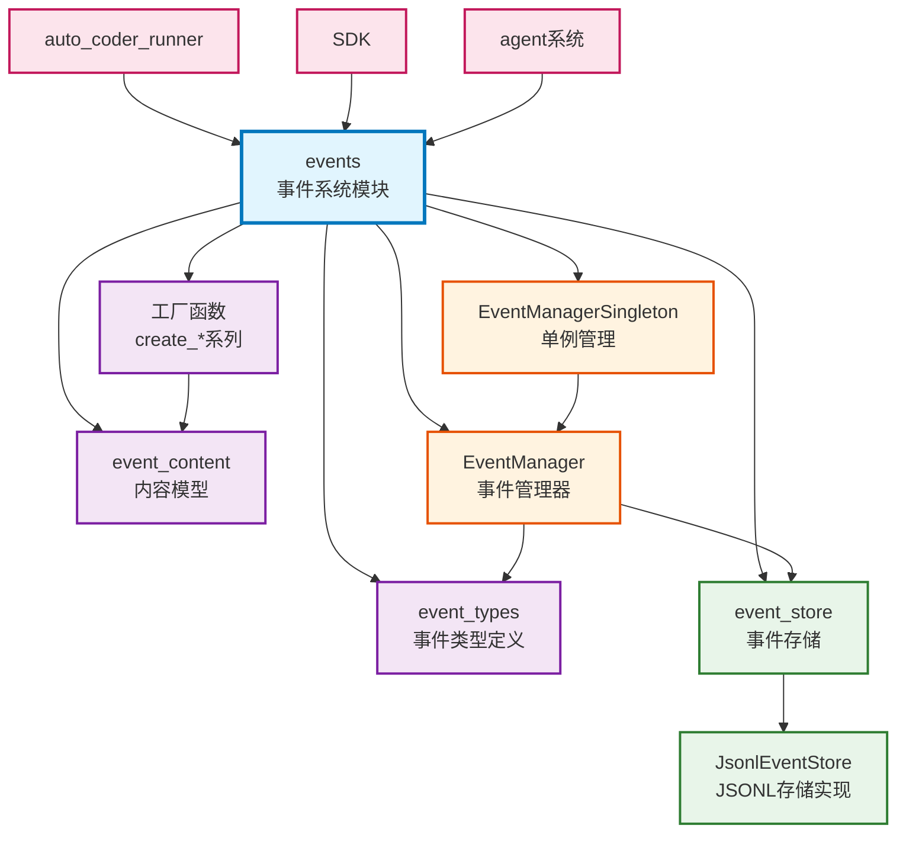

# events

Auto-Coder 的事件系统模块，提供了系统间通信的事件驱动架构，支持流式输出、用户交互、结果传递等多种事件类型，是实现异步通信和状态管理的核心基础设施。

## 模块位置

**源码路径**: `src/autocoder/events/`  
**文档路径**: `specs/events.ac.mod.md`  
**模块类型**: 包模块

## 目录结构

```
src/autocoder/events/
├── __init__.py                 # 包初始化文件，导出主要接口
├── event_types.py              # 事件类型定义（Event, EventType, ResponseEvent）
├── event_content.py            # 事件内容模型（各种Content类）
├── event_store.py              # 事件存储接口和实现（EventStore, JsonlEventStore）
├── event_manager.py            # 事件管理器（EventManager）
├── event_manager_singleton.py  # 单例管理器和工具函数
├── examples/                   # 使用示例
│   ├── error_content_example.py    # 错误事件示例
│   └── completion_content_example.py # 完成事件示例
└── README.md                   # 详细的事件格式参考文档
```

## 快速开始

### 基本使用方式

```python
# 导入必要的模块
from autocoder.events import (
    get_event_manager,
    create_stream_thinking, create_stream_content,
    create_result, create_error, create_completion,
    create_ask_user
)

# 1. 获取事件管理器（单例）
event_manager = get_event_manager()

# 2. 写入流式事件
# 思考过程
thinking = create_stream_thinking("正在分析代码结构...", sequence=1)
event_manager.write_stream(thinking)

# 正式内容
content = create_stream_content("找到了3个潜在问题", sequence=2)
event_manager.write_stream(content)

# 3. 写入结果事件
result = create_result(
    content="分析完成",
    content_type="text",
    metadata={"files_analyzed": 10, "issues_found": 3}
)
event_manager.write_result(result)

# 4. 用户交互
# 请求用户输入（阻塞）
response = event_manager.ask_user(
    prompt="是否要自动修复这些问题？",
    options=["是", "否", "稍后处理"]
)
print(f"用户选择: {response}")

# 5. 错误处理
if something_went_wrong:
    error = create_error(
        error_code="ANALYSIS_FAILED",
        error_message="代码分析失败",
        details={"reason": "语法错误", "line": 42}
    )
    event_manager.write_error(error)

# 6. 完成事件
completion = create_completion(
    success_code="TASK_COMPLETE",
    success_message="所有任务已完成",
    result={"total_time": 5.2, "success_rate": 0.95}
)
event_manager.write_completion(completion)
```

### 事件类型说明

- **STREAM**: 流式输出，用于实时显示处理过程
- **RESULT**: 结果数据，用于返回处理结果
- **ASK_USER**: 请求用户输入，会阻塞等待响应
- **USER_RESPONSE**: 用户响应，对应 ASK_USER
- **ERROR**: 错误事件，表示处理失败
- **COMPLETION**: 完成事件，表示处理成功

### 配置管理

```python
# 使用自定义事件文件
event_file = "/path/to/custom/events.jsonl"
event_manager = get_event_manager(event_file)

# 生成带时间戳的事件文件
from autocoder.events.event_manager_singleton import gengerate_event_file_path
event_file, file_id = gengerate_event_file_path()
# 返回: ('/path/.auto-coder/events/uuid_20231215-143022.jsonl', 'uuid_20231215-143022')
```

## 核心组件详解

### 1. Event 和 EventType

**Event 类**
- **功能**: 所有事件的基础数据结构
- **字段**: 
  - `event_type`: 事件类型枚举
  - `event_id`: 唯一标识符（UUID）
  - `timestamp`: 时间戳
  - `content`: 事件内容（字典）
  - `metadata`: 元数据（字典）
- **方法**: `to_dict()`, `to_json()`, `from_dict()`, `from_json()`

**EventType 枚举**
- 定义了系统支持的所有事件类型

**ResponseEvent 类**
- 继承自 Event，增加 `response_to` 字段
- 用于响应其他事件（如 USER_RESPONSE 响应 ASK_USER）

### 2. EventContent 内容模型

**基础模型**
- `BaseEventContent`: 所有内容模型的基类
- `ContentType`: 内容类型枚举（text, code, markdown 等）
- `StreamState`: 流状态枚举（thinking, content, complete）

**具体内容模型**
- `StreamContent`: 流式内容，支持思考过程和正式输出
- `ResultContent`: 结果内容，包含处理结果和元数据
- `AskUserContent`: 用户询问内容，支持选项和超时
- `UserResponseContent`: 用户响应内容
- `ErrorContent`: 错误内容，包含错误码和详情
- `CompletionContent`: 完成内容，包含成功信息
- `CodeContent`: 代码内容（继承自 StreamContent）
- `MarkdownContent`: Markdown 内容（继承自 StreamContent）

### 3. EventStore 存储层

**EventStore 抽象基类**
- 定义了事件存储的接口规范
- 主要方法: `append_event()`, `get_events()`, `get_event_by_id()`

**JsonlEventStore 实现**
- 基于 JSONL 文件的持久化存储
- 特性:
  - 线程安全（读写锁）
  - 文件监控（自动检测新事件）
  - 批量写入优化
  - 支持事件过滤和分页

### 4. EventManager 事件管理器

**核心功能**
- 事件写入: `write_result()`, `write_stream()`, `write_error()` 等
- 用户交互: `ask_user()` 阻塞等待用户响应
- 事件读取: `read_events()` 支持过滤和阻塞读取
- 响应处理: `respond_to_user()` 响应用户询问

**特殊机制**
- 阻塞事件: ASK_USER 会阻塞直到收到响应
- 回调支持: 可注册响应回调函数
- 事件监控: 后台线程监控新事件

### 5. EventManagerSingleton 单例管理

**单例模式**
- 确保全局只有一个默认 EventManager 实例
- 支持多个命名实例（通过 event_file 参数）

**自动清理**
- 后台线程定期清理旧事件文件
- 保留最新的 N 个文件（默认 100）
- 排除默认的 events.jsonl

**工具函数**
- `get_event_manager()`: 获取事件管理器实例
- `gengerate_event_file_path()`: 生成带时间戳的事件文件路径
- `to_events_prompt()`: 将事件转换为提示文本

## Mermaid 依赖图



## 依赖关系说明

### 对其他模块的依赖
- 标准库依赖：threading, json, uuid, pathlib 等
- 第三方依赖：pydantic, loguru, readerwriterlock

### 被依赖关系
- `specs/auto_coder_runner.ac.mod.md` - 使用事件系统进行状态输出
- `specs/sdk.ac.mod.md` - SDK 的事件流转换依赖事件系统
- `specs/common.ac.mod.md` - v2/agent 使用事件系统
- `specs/agent.ac.mod.md` - 代理系统使用事件进行通信

## 可以验证模块可运行的测试命令

```bash
# Python 模块测试
python -c "from autocoder.events import get_event_manager, create_result; print('Events module loaded')"

# 测试事件写入和读取
python -c "
from autocoder.events import get_event_manager, create_result
em = get_event_manager()
result = create_result('Test result', metadata={'test': True})
event = em.write_result(result)
print(f'Event created: {event.event_id}')
"

# 运行示例
python src/autocoder/events/examples/error_content_example.py
python src/autocoder/events/examples/completion_content_example.py

# 查看事件文件
ls -la .auto-coder/events/
``` 