# lang

Auto-Coder 系统的国际化支持模块，提供系统中所有用户界面文本、参数描述、命令说明的多语言支持，目前支持中文和英文两种语言，为整个系统提供统一的多语言文本管理。

## 模块位置

**源码路径**: `src/autocoder/lang.py`  
**文档路径**: `specs/lang.ac.mod.md`  
**模块类型**: 单文件模块

## 文件结构

```python
# lang.py 内容结构
└── lang_desc                   # 主要的多语言描述字典
    ├── "en"                    # 英文描述字典
    │   ├── 核心参数描述        # source_dir, query, model 等
    │   ├── 模型相关描述        # chat_model, emb_model, vl_model 等
    │   ├── 功能开关描述        # auto_merge, human_as_model 等
    │   ├── 索引配置描述        # index_filter_level, index_workers 等
    │   ├── RAG配置描述         # enable_rag_search, rag_url 等
    │   ├── 图像处理描述        # image_file, image_mode 等
    │   ├── 命令描述            # revert_desc, init_desc 等
    │   └── 系统配置描述        # anti_quota_limit, workers 等
    └── "zh"                    # 中文描述字典
        ├── 核心参数描述        # 源代码目录路径、查询指令、模型名称等
        ├── 模型相关描述        # 聊天模型、嵌入模型、视觉模型等
        ├── 功能开关描述        # 自动合并、人工模型等
        ├── 索引配置描述        # 索引过滤级别、工作线程数等
        ├── RAG配置描述         # 检索增强生成、RAG服务地址等
        ├── 图像处理描述        # 图像文件、处理模式等
        ├── 命令描述            # 撤销操作、项目初始化等
        └── 系统配置描述        # API限流、工作线程等
```

## 快速开始

### 基本使用方式

```python
# 1. 导入多语言描述字典
from autocoder.lang import lang_desc

# 2. 获取英文描述
en_desc = lang_desc["en"]
print(f"Source directory: {en_desc['source_dir']}")
print(f"Query: {en_desc['query']}")

# 3. 获取中文描述  
zh_desc = lang_desc["zh"]
print(f"源代码目录: {zh_desc['source_dir']}")
print(f"查询指令: {zh_desc['query']}")

# 4. 在参数解析中使用
import locale
system_lang, _ = locale.getdefaultlocale()
lang = "zh" if system_lang and system_lang.startswith("zh") else "en"
desc = lang_desc[lang]

# 在argparse中使用
parser.add_argument("--source_dir", help=desc["source_dir"])
parser.add_argument("--query", help=desc["query"])
```

### 在系统中的集成

```python
# 在command_args.py中的使用示例
from autocoder.lang import lang_desc
import locale

def parse_args():
    # 自动检测系统语言
    system_lang, _ = locale.getdefaultlocale()
    lang = "zh" if system_lang and system_lang.startswith("zh") else "en"
    desc = lang_desc[lang]
    
    # 使用多语言描述创建参数解析器
    parser = argparse.ArgumentParser(description=desc["parser_desc"])
    parser.add_argument("--source_dir", help=desc["source_dir"])
    parser.add_argument("--query", help=desc["query"])
    # ... 更多参数
```

### 支持的语言和描述类别

该模块提供全面的多语言支持，涵盖系统的各个方面：

#### 支持的语言
- **英文 (en)**: 完整的英文界面和文档支持
- **中文 (zh)**: 完整的中文界面和文档支持

#### 描述类别

**核心参数类**:
- `source_dir`: 项目源代码目录路径
- `query`: 用户查询或指令
- `target_file`: 生成代码的目标文件路径
- `model`: 主要模型名称
- `file`: 配置文件路径

**模型配置类**:
- `chat_model`: 聊天模型名称
- `code_model`: 代码生成模型名称
- `emb_model`: 嵌入模型名称
- `vl_model`: 视觉语言模型名称
- `sd_model`: 稳定扩散模型名称
- `index_model`: 索引构建模型名称

**功能开关类**:
- `auto_merge`: 自动合并生成的代码
- `execute`: 是否执行生成的代码
- `human_as_model`: 使用人工作为模型
- `skip_build_index`: 跳过索引构建

**索引配置类**:
- `index_filter_level`: 索引过滤级别
- `index_filter_workers`: 索引过滤工作线程数
- `index_build_workers`: 索引构建工作线程数
- `skip_filter_index`: 跳过索引过滤

**RAG配置类**:
- `enable_rag_search`: 启用RAG搜索功能
- `enable_rag_context`: 启用RAG上下文功能
- `rag_url`: RAG服务URL
- `rag_token`: RAG服务认证令牌
- `rag_type`: RAG类型配置

### 主要功能

该模块作为Auto-Coder系统的国际化基础设施，确保所有用户界面、帮助文本、错误消息都能以用户的本地语言显示。

## 核心组件详解

### 1. lang_desc 字典结构

**功能**: 系统的主要多语言配置字典
**结构**: 两级字典结构，第一级为语言代码，第二级为具体的文本键值对

```python
lang_desc = {
    "en": {
        # 英文描述
        "key": "English description",
        # ...
    },
    "zh": {
        # 中文描述  
        "key": "中文描述",
        # ...
    }
}
```

### 2. 主要参数类别详解

#### 核心系统参数
```python
# 项目和文件相关
"source_dir": "项目源代码目录路径"
"target_file": "生成代码写入的文件路径"
"git_url": "克隆源代码的git仓库URL"
"project_type": "项目类型。选项：py, ts, py-script, translate 或文件后缀"

# 基础查询和模型
"query": "处理源代码的用户查询或指令"
"model": "要使用的模型名称"
"template": "生成源代码使用的模板"
```

#### 模型配置参数
```python
# 各种专用模型
"chat_model": "要使用的聊天模型名称"
"code_model": "要使用的代码模型名称"
"emb_model": "要使用的嵌入模型名称"
"vl_model": "要使用的多模态模型名称"
"sd_model": "要使用的稳定扩散模型名称"
"text2voice_model": "要使用的文本转语音模型名称"
"voice2text_model": "要使用的语音转文本模型名称"

# 模型配置参数
"model_max_length": "模型生成代码的最大长度"
"model_max_input_length": "模型的最大输入长度"
```

#### 索引和搜索参数
```python
# 索引配置
"index_model": "用于构建索引的模型名称"
"index_filter_level": "索引过滤级别"
"index_filter_workers": "用于通过索引过滤文件的工作线程数"
"index_build_workers": "用于构建索引的工作线程数"
"skip_build_index": "是否跳过构建源代码索引"

# 搜索引擎集成
"search_engine": "要使用的搜索引擎"
"search_engine_token": "搜索引擎API的令牌"
```

#### RAG系统参数
```python
# RAG配置
"enable_rag_search": "是否开启使用搜索的检索增强生成"
"enable_rag_context": "是否开启使用上下文的检索增强生成"
"rag_url": "RAG服务的URL"
"rag_token": "RAG服务的令牌"
"rag_type": "RAG类型(simple/storage)"
"rag_params_max_tokens": "RAG参数的最大token数"
```

#### 图像处理参数
```python
# 图像相关
"image_file": "要处理的图像文件路径"
"image_mode": "处理图像的模式(direct/iterative)"
"image_max_iter": "图像转html的最大迭代次数"
```

#### 系统控制参数
```python
# 执行控制
"execute": "是否执行生成的代码"
"auto_merge": "是否自动将生成的代码合并到现有文件中"
"anti_quota_limit": "每次API请求后等待的秒数"
"skip_confirm": "跳过任何确认"

# 人工交互
"human_as_model": "是否使用人工作为模型"
"human_model_num": "使用的人工模型数量"
```

#### 命令和操作参数
```python
# 命令描述
"revert_desc": "撤销指定文件所做的更改"
"init_desc": "初始化一个新的auto-coder项目目录"
"index_desc": "构建源代码索引"
"doc_desc": "对文档进行一些操作"
"screenshot_desc": "生成网页的截图"
"store_desc": "一些统计信息，比如token使用等"
```

### 3. 语言自动检测

系统通过以下方式自动检测用户语言：

```python
import locale

# 获取系统默认语言环境
system_lang, _ = locale.getdefaultlocale()

# 判断是否为中文环境
lang = "zh" if system_lang and system_lang.startswith("zh") else "en"

# 使用对应语言的描述
desc = lang_desc[lang]
```

### 4. 文本组织结构

**按功能模块组织**:
- 核心功能参数（source_dir, query, model等）
- 模型配置参数（各种专用模型）
- 索引和搜索参数（index相关、search相关）
- RAG系统参数（rag_url, rag_token等）
- 图像处理参数（image相关）
- 系统控制参数（execute, auto_merge等）
- 命令操作参数（各种desc结尾的描述）

**命名规范**:
- 参数名称：与命令行参数名称保持一致
- 描述内容：简洁明确，包含默认值说明
- 特殊标记：使用统一的格式，如"默认为..."

## Mermaid 依赖图

```mermaid
graph TB
    %% 核心字典
    LangDesc[lang_desc<br/>多语言描述字典]
    
    %% 语言分支
    EnDesc[English Descriptions<br/>英文描述]
    ZhDesc[Chinese Descriptions<br/>中文描述]
    
    %% 参数类别
    CoreParams[核心参数<br/>source_dir, query, model]
    ModelParams[模型参数<br/>chat_model, emb_model, vl_model]
    IndexParams[索引参数<br/>index_filter_level, workers]
    RAGParams[RAG参数<br/>rag_url, rag_token, rag_type]
    ImageParams[图像参数<br/>image_file, image_mode]
    SystemParams[系统参数<br/>auto_merge, execute, skip_confirm]
    CommandParams[命令参数<br/>revert_desc, init_desc]
    
    %% 使用模块
    CommandArgs[command_args<br/>参数解析]
    RAGServer[auto_coder_rag<br/>RAG服务器]
    ChatLang[chat_auto_coder_lang<br/>聊天语言]
    CommonLang[auto_coder_lang<br/>通用语言]
    
    %% 依赖关系
    LangDesc --> EnDesc
    LangDesc --> ZhDesc
    
    EnDesc --> CoreParams
    EnDesc --> ModelParams
    EnDesc --> IndexParams
    EnDesc --> RAGParams
    EnDesc --> ImageParams
    EnDesc --> SystemParams
    EnDesc --> CommandParams
    
    ZhDesc --> CoreParams
    ZhDesc --> ModelParams
    ZhDesc --> IndexParams
    ZhDesc --> RAGParams
    ZhDesc --> ImageParams
    ZhDesc --> SystemParams
    ZhDesc --> CommandParams
    
    LangDesc --> CommandArgs
    LangDesc --> RAGServer
    LangDesc --> ChatLang
    LangDesc --> CommonLang
    
    %% 样式定义
    classDef coreClass fill:#e1f5fe,stroke:#0277bd,stroke-width:2px
    classDef langClass fill:#f3e5f5,stroke:#7b1fa2,stroke-width:1px
    classDef paramClass fill:#e8f5e8,stroke:#2e7d32,stroke-width:1px
    classDef moduleClass fill:#fff3e0,stroke:#ef6c00,stroke-width:1px
    
    class LangDesc coreClass
    class EnDesc,ZhDesc langClass
    class CoreParams,ModelParams,IndexParams,RAGParams,ImageParams,SystemParams,CommandParams paramClass
    class CommandArgs,RAGServer,ChatLang,CommonLang moduleClass
```



## 依赖关系说明

### 对其他模块的依赖
该模块是纯静态配置模块，不依赖其他Auto-Coder模块，仅使用Python标准库。

### 被依赖关系
作为国际化基础设施，该模块被广泛使用：

- `src/autocoder/command_args.py` - 命令行参数的多语言描述
- `src/autocoder/auto_coder_rag.py` - RAG服务器的多语言支持
- `src/autocoder/chat/` - 聊天功能的多语言界面
- `src/autocoder/common/` - 通用功能的多语言消息
- `src/autocoder/agent/` - 代理系统的多语言提示
- **整个AutoCoder生态**: 所有需要用户界面文本的模块

## 可以验证模块可运行的测试命令

```bash
# Python模块测试
python -c "from autocoder.lang import lang_desc; print(f'支持的语言: {list(lang_desc.keys())}')"

# 测试英文描述
python -c "from autocoder.lang import lang_desc; en_desc = lang_desc['en']; print(f'英文参数数量: {len(en_desc)}')"

# 测试中文描述
python -c "from autocoder.lang import lang_desc; zh_desc = lang_desc['zh']; print(f'中文参数数量: {len(zh_desc)}')"

# 验证特定参数描述
python -c "from autocoder.lang import lang_desc; print(f'source_dir (EN): {lang_desc[\"en\"][\"source_dir\"]}'); print(f'source_dir (ZH): {lang_desc[\"zh\"][\"source_dir\"]}')"

# 测试语言自动检测
python -c "import locale; from autocoder.lang import lang_desc; system_lang, _ = locale.getdefaultlocale(); lang = 'zh' if system_lang and system_lang.startswith('zh') else 'en'; print(f'检测到的语言: {lang}'); print(f'查询描述: {lang_desc[lang][\"query\"]}')"

# 验证关键参数是否存在
python -c "from autocoder.lang import lang_desc; required_keys = ['source_dir', 'query', 'model', 'auto_merge']; missing = [k for k in required_keys if k not in lang_desc['en'] or k not in lang_desc['zh']]; print(f'缺失的参数: {missing}' if missing else '所有关键参数都存在')"

# 测试字典结构完整性
python -c "from autocoder.lang import lang_desc; en_keys = set(lang_desc['en'].keys()); zh_keys = set(lang_desc['zh'].keys()); print(f'英文独有: {en_keys - zh_keys}'); print(f'中文独有: {zh_keys - en_keys}')"
``` 