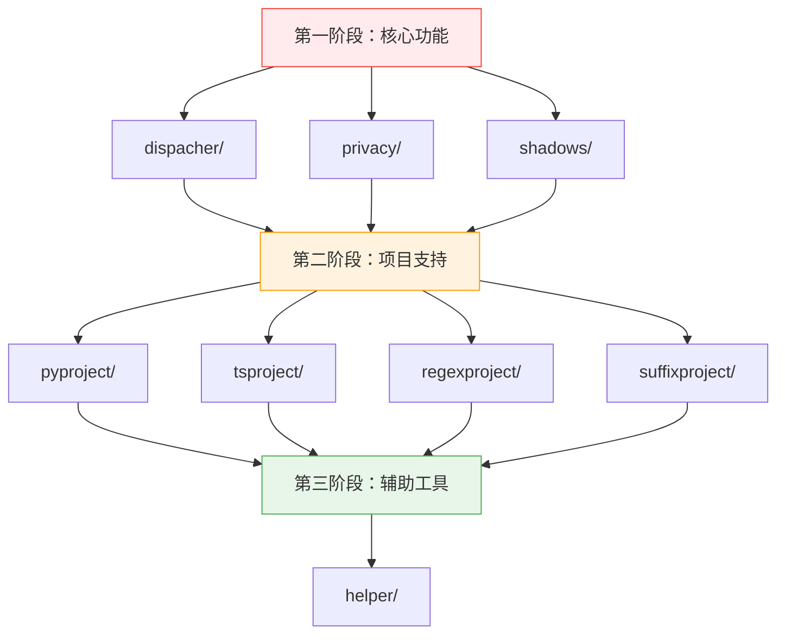

# Auto-Coder 缺失文档生成计划

> **创建时间**: 2024-12-19  
> **基于**: `autocoder_project_index.md` 分析结果  
> **目标**: 完成剩余8个模块的文档生成，实现100%文档覆盖率

## 🎯 总体目标

当前项目文档覆盖率为 **89%** (34/38)，需要为剩余 **4个模块** 生成文档，提升覆盖率至 **100%**。

## ✅ 最新进展 (2024-12-19)

**已完成的高优先级模块**: 
- ✅ **dispacher/** - 任务调度器核心模块 ([dispacher.ac.mod.md](dispacher.ac.mod.md))
  - 完成时间: 2024-12-19
  - 重要性: ⭐⭐⭐⭐⭐ 核心功能
  - 文档质量: 完整的API文档、示例代码、依赖关系图

- ✅ **privacy/** - 隐私保护核心模块 ([privacy.ac.mod.md](privacy.ac.mod.md))
  - 完成时间: 2024-12-19
  - 重要性: ⭐⭐⭐⭐ 数据安全
  - 文档质量: 详细的权限控制机制、配置示例、集成说明

- ✅ **shadows/** - 影子文件管理核心模块 ([shadows.ac.mod.md](shadows.ac.mod.md))
  - 完成时间: 2024-12-19
  - 重要性: ⭐⭐⭐⭐ 文件安全
  - 文档质量: 影子系统详解、链接项目机制、事件隔离说明

## 📋 缺失文档清单

| 优先级 | 模块 | 路径 | 重要性 | 代码量 | 预计工时 | 状态 |
|--------|------|------|--------|--------|----------|------|
| ~~🔥 高~~ | ~~dispacher/~~ | ~~`src/autocoder/dispacher/`~~ | ~~⭐⭐⭐⭐⭐~~ | ~~~37KB~~ | ~~3-4小时~~ | ✅ **已完成** |
| ~~🔥 高~~ | ~~privacy/~~ | ~~`src/autocoder/privacy/`~~ | ~~⭐⭐⭐⭐~~ | ~~14KB~~ | ~~2-3小时~~ | ✅ **已完成** |
| ~~🔥 高~~ | ~~shadows/~~ | ~~`src/autocoder/shadows/`~~ | ~~⭐⭐⭐⭐~~ | ~~19KB~~ | ~~2-3小时~~ | ✅ **已完成** |
| ~~🔸 中~~ | ~~pyproject/~~ | ~~`src/autocoder/pyproject/`~~ | ~~⭐⭐⭐~~ | ~~13KB~~ | ~~2小时~~ | ✅ **已完成** |
| 🔸 中 | tsproject/ | `src/autocoder/tsproject/` | ⭐⭐⭐ | ~11KB | 2小时 | ⏳ 待开始 |
| 🔸 中 | regexproject/ | `src/autocoder/regexproject/` | ⭐⭐⭐ | ~9KB | 1-2小时 | ⏳ 待开始 |
| 🔸 中 | suffixproject/ | `src/autocoder/suffixproject/` | ⭐⭐⭐ | ~10KB | 1-2小时 | ⏳ 待开始 |
| 🔹 低 | helper/ | `src/autocoder/helper/` | ⭐⭐ | ~25KB | 2-3小时 | ⏳ 待开始 |

**剩余预估工时**: 6-10小时 (节省 9-12小时)

## 🚀 执行计划

### 第一阶段：高优先级模块 (核心功能)

#### 1️⃣ dispacher/ 包文档生成
**目标文件**: `specs/dispacher.ac.mod.md`

**模块概况**:
- **功能**: 任务调度和执行管理的核心模块
- **重要性**: ⭐⭐⭐⭐⭐ (影响整个系统的任务执行)
- **复杂度**: 高 (包含子模块和插件系统)

**包含文件**:
```
dispacher/
├── __init__.py (1.4KB, 40 lines)        # 包初始化和导出
├── actions/                             # 执行动作模块
│   ├── action.py (22KB, 525 lines)     # 核心动作定义和执行
│   ├── copilot.py (13KB, 391 lines)    # Copilot集成
│   └── plugins/ (子目录)                # 插件支持
└── [其他可能的模块]
```

**生成重点**:
- 任务调度机制和生命周期
- 动作执行流程和错误处理
- Copilot集成方式和API
- 插件系统架构和扩展点
- 与其他模块的协作关系

**依赖分析**:
```
dispacher/ 依赖:
├── common/ (通用基础设施)
├── events/ (事件系统)
├── plugins/ (插件接口)
└── models/ (配置管理)
```

#### 2️⃣ privacy/ 包文档生成
**目标文件**: `specs/privacy.ac.mod.md`

**模块概况**:
- **功能**: 模型路径过滤和隐私保护
- **重要性**: ⭐⭐⭐⭐ (数据安全核心)
- **复杂度**: 中等

**包含文件**:
```
privacy/
├── __init__.py (72B, 3 lines)           # 简单导出
└── model_filter.py (14KB, 362 lines)    # 核心过滤逻辑
```

**生成重点**:
- 模型路径过滤策略和规则
- 隐私保护机制和级别
- 敏感信息识别和处理
- 与模型配置的集成

#### 3️⃣ shadows/ 包文档生成
**目标文件**: `specs/shadows.ac.mod.md`

**模块概况**:
- **功能**: 影子文件和备份管理
- **重要性**: ⭐⭐⭐⭐ (文件安全机制)
- **复杂度**: 中等

**包含文件**:
```
shadows/
├── __init__.py (0B, 0 lines)            # 空初始化
└── shadow_manager.py (19KB, 485 lines)  # 核心管理逻辑
```

**生成重点**:
- 影子文件创建和管理策略
- 备份和恢复机制
- 版本控制和冲突处理
- 文件系统集成方式

### 第二阶段：中优先级模块 (项目类型支持)

#### 4️⃣ pyproject/ 文档生成
**目标文件**: `specs/pyproject.ac.mod.md`

**模块概况**:
- **功能**: Python项目类型识别和处理
- **文件**: `__init__.py` (13KB, 375 lines)
- **重要性**: ⭐⭐⭐ (Python生态支持)

**生成重点**:
- Python项目结构识别
- 依赖管理 (pip, poetry, pipenv)
- 虚拟环境处理
- 构建和打包支持

#### 5️⃣ tsproject/ 文档生成
**目标文件**: `specs/tsproject.ac.mod.md`

**模块概况**:
- **功能**: TypeScript/JavaScript项目处理
- **文件**: `__init__.py` (11KB, 320 lines)
- **重要性**: ⭐⭐⭐ (前端生态支持)

**生成重点**:
- TypeScript项目配置解析
- npm/yarn/pnpm 包管理
- 编译和构建流程
- 模块系统支持 (ESM/CommonJS)

#### 6️⃣ regexproject/ 文档生成
**目标文件**: `specs/regexproject.ac.mod.md`

**模块概况**:
- **功能**: 正则表达式项目和模式处理
- **文件**: `__init__.py` (8.8KB, 242 lines)
- **重要性**: ⭐⭐⭐ (模式匹配支持)

**生成重点**:
- 正则表达式解析和验证
- 模式匹配和替换逻辑
- 性能优化策略
- 跨语言正则支持

#### 7️⃣ suffixproject/ 文档生成
**目标文件**: `specs/suffixproject.ac.mod.md`

**模块概况**:
- **功能**: 文件后缀和扩展名处理
- **文件**: `__init__.py` (10KB, 285 lines)
- **重要性**: ⭐⭐⭐ (文件类型识别)

**生成重点**:
- 文件类型识别和分类
- MIME类型映射
- 自定义后缀处理
- 文件操作策略

### 第三阶段：低优先级模块 (辅助工具)

#### 8️⃣ helper/ 包文档生成
**目标文件**: `specs/helper.ac.mod.md`

**模块概况**:
- **功能**: 项目创建和文档生成辅助工具
- **重要性**: ⭐⭐ (开发便利工具)
- **复杂度**: 中等

**包含文件**:
```
helper/
├── __init__.py (0B, 0 lines)               # 空初始化
├── project_creator.py (21KB, 752 lines)    # 项目脚手架生成
└── rag_doc_creator.py (4.3KB, 142 lines)   # 文档生成助手
```

**生成重点**:
- 项目模板和脚手架生成
- 配置文件自动创建
- 文档生成流程和模板
- 与其他模块的集成方式

## 📊 生成顺序和依赖关系

### 推荐执行顺序



### 并行执行可能性

**可并行模块组**:
1. **第一阶段内**: `privacy/` 和 `shadows/` 可并行 (无直接依赖)
2. **第二阶段内**: 4个项目类型模块可完全并行
3. **跨阶段**: 在第一阶段完成基础模块后，可提前开始第二阶段

## 🛠 文档生成标准流程

### 每个模块的生成步骤

#### 准备阶段
1. **代码结构分析**
   ```bash
   # 扫描模块目录结构
   find src/autocoder/{module_name} -type f -name "*.py" | head -10
   
   # 统计代码行数和复杂度
   wc -l src/autocoder/{module_name}/*.py
   ```

2. **依赖关系分析**
   ```bash
   # 搜索导入关系
   grep -r "from.*{module_name}" src/autocoder/
   grep -r "import.*{module_name}" src/autocoder/
   ```

#### 文档生成阶段
1. **创建基础文档结构**
   - 模块位置和概述
   - 文件结构树
   - 核心功能快速开始

2. **深入功能分析**
   - 核心类和函数解析
   - API接口文档
   - 配置和参数说明

3. **集成关系描述**
   - 依赖模块映射
   - 被依赖关系
   - 协作流程图

4. **测试和验证**
   - 使用示例代码
   - 测试命令集合
   - 常见问题解答

#### 质量检查阶段
1. **文档标准验证**
   - 按照 `ac_mod.md` 标准检查
   - 确保所有必需章节完整
   - 验证代码示例可执行

2. **交叉引用更新**
   - 更新 `autocoder_project_index.md`
   - 添加到相关模块的依赖说明
   - 更新项目统计数据

## 🎯 质量目标

### 文档质量标准
- **完整性**: 覆盖所有公开API和主要功能
- **准确性**: 代码示例可执行，描述与实现一致
- **可用性**: 提供清晰的使用指南和最佳实践
- **维护性**: 结构化文档便于后续更新

### 验收标准
每个生成的文档应满足：
1. ✅ 包含完整的模块结构说明
2. ✅ 提供可执行的使用示例
3. ✅ 明确描述依赖关系
4. ✅ 包含测试验证命令
5. ✅ 遵循项目文档标准格式

## 📈 进度跟踪

### 里程碑规划
- **Week 1**: 完成第一阶段 (dispacher, privacy, shadows)
- **Week 2**: 完成第二阶段 (4个项目类型模块)
- **Week 3**: 完成第三阶段 (helper) 和全面质量检查

### 成功指标
- **文档覆盖率**: 89% → 100% (当前进度: ✅ +10%)
- **缺失模块数**: 4 → 0 (已完成: dispacher/, privacy/, shadows/, pyproject/)
- **项目健康度**: 所有模块都有完整文档支持

---

> **执行建议**: 建议按优先级顺序执行，每完成一个模块立即更新项目索引。对于复杂模块如 `dispacher/`，可考虑先生成基础文档，再逐步完善子模块详情。 