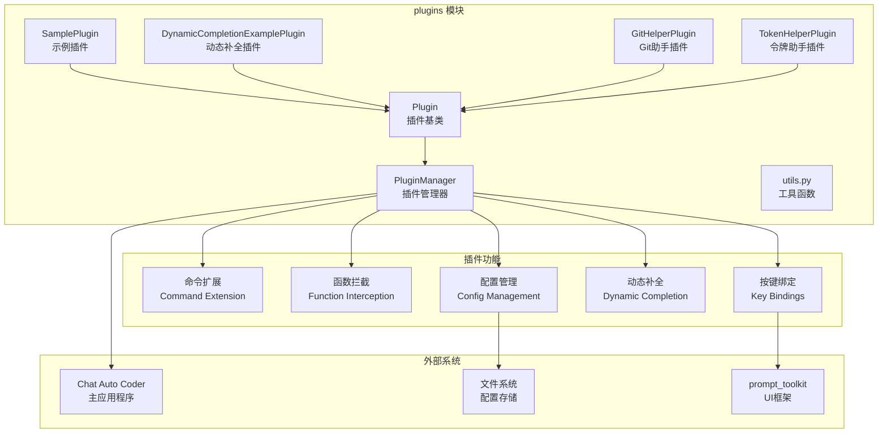

# plugins.ac.mod.md

## 模块概述

`plugins` 模块是 Auto-Coder 系统的插件系统核心，提供非侵入式的功能扩展架构，允许在运行时动态加载和管理插件。该模块支持命令扩展、函数拦截、按键绑定、动态补全等功能，为 Auto-Coder 提供强大的可扩展性。

**模块类型**: 包模块  
**主要功能**: 插件系统架构、功能扩展、动态加载  
**依赖关系**: 独立模块，被其他模块使用

## 核心组件

### 1. 插件基础框架
- **Plugin**: 插件基类，所有插件的父类
- **PluginManager**: 插件管理器，负责插件的发现、加载和管理
- **插件生命周期**: 初始化、注册、运行、卸载

### 2. 扩展功能
- **命令扩展**: 添加新的斜杠命令
- **函数拦截**: 拦截和修改现有函数调用
- **按键绑定**: 自定义键盘快捷键
- **动态补全**: 上下文相关的命令补全

### 3. 配置管理
- **插件配置**: 独立的插件配置文件
- **全局插件目录**: 跨项目的插件共享
- **项目插件目录**: 项目特定的插件

### 4. 内置插件
- **SamplePlugin**: 示例插件，展示基本功能
- **DynamicCompletionExamplePlugin**: 动态补全示例插件
- **GitHelperPlugin**: Git 命令助手插件
- **TokenHelperPlugin**: 令牌助手插件

## 主要功能

### 1. 创建基础插件

```python
from autocoder.plugins import Plugin

class MyPlugin(Plugin):
    name = "my_plugin"
    description = "我的自定义插件"
    version = "1.0.0"
    
    def __init__(self, manager, config=None, config_path=None):
        super().__init__(manager, config, config_path)
        self.counter = 0
    
    def initialize(self) -> bool:
        """插件初始化"""
        print(f"[{self.name}] 插件初始化中...")
        
        # 注册函数拦截
        self.manager.register_function_interception(self.name, "ask")
        self.manager.register_function_interception(self.name, "coding")
        
        return True
    
    def get_commands(self):
        """注册插件命令"""
        return {
            "hello": (self.hello_command, "打招呼命令"),
            "count": (self.count_command, "计数器命令"),
        }
    
    def hello_command(self, args):
        """Hello 命令处理器"""
        name = args.strip() or "World"
        print(f"Hello, {name}!")
        return f"Hello, {name}!"
    
    def count_command(self, args):
        """计数器命令处理器"""
        self.counter += 1
        print(f"计数器: {self.counter}")
        return f"计数器: {self.counter}"
    
    def shutdown(self):
        """插件关闭清理"""
        print(f"[{self.name}] 插件关闭，计数器: {self.counter}")
```

### 2. 高级插件功能

```python
from typing import Any, Callable, Dict, List, Optional, Tuple

class AdvancedPlugin(Plugin):
    name = "advanced_plugin"
    description = "高级插件功能演示"
    version = "1.0.0"
    dynamic_cmds = ["/advanced"]  # 需要动态补全的命令
    
    def get_keybindings(self):
        """注册按键绑定"""
        return [
            ("c-a", self.shortcut_handler, "高级插件快捷键"),
            ("c-shift-a", self.another_shortcut, "另一个快捷键"),
        ]
    
    def shortcut_handler(self, event):
        """快捷键处理器"""
        print("高级插件快捷键被按下！")
    
    def another_shortcut(self, event):
        """另一个快捷键处理器"""
        print("另一个快捷键被按下！")
    
    def get_completions(self):
        """静态命令补全"""
        return {
            "/advanced": ["option1", "option2", "option3"],
            "/mycommand": ["start", "stop", "status"],
        }
    
    def get_dynamic_completions(self, command: str, current_input: str):
        """动态命令补全"""
        if command.startswith("/advanced"):
            # 根据当前输入提供动态补全
            if "option1" in current_input:
                return [
                    ("value1", "第一个值"),
                    ("value2", "第二个值"),
                ]
            elif "option2" in current_input:
                return [
                    ("config1", "配置选项1"),
                    ("config2", "配置选项2"),
                ]
        return []
    
    def intercept_command(self, command: str, args: str):
        """拦截命令"""
        if command == "ask":
            # 修改 ask 命令的参数
            modified_args = f"[增强版] {args}"
            return True, command, modified_args
        
        # 允许正常处理
        return True, command, args
    
    def intercept_function(self, func_name: str, args: List[Any], kwargs: Dict[str, Any]):
        """拦截函数调用"""
        if func_name == "coding":
            print(f"[{self.name}] 拦截到 coding 函数调用")
            # 修改参数
            if args and isinstance(args[0], str):
                args = list(args)
                args[0] = f"[插件增强] {args[0]}"
        
        return True, args, kwargs
    
    def post_function(self, func_name: str, result: Any):
        """处理函数结果"""
        if func_name == "coding":
            print(f"[{self.name}] coding 函数执行完成")
        return result
    
    def export_config(self, config_path=None):
        """导出插件配置"""
        config = {
            "counter": getattr(self, 'counter', 0),
            "settings": {
                "enabled": True,
                "debug": False
            }
        }
        return config
```

### 3. 插件管理器使用

```python
from autocoder.plugins import PluginManager

# 创建插件管理器
plugin_manager = PluginManager()

# 添加插件目录
success, message = plugin_manager.add_plugin_directory("/path/to/plugins")
print(f"添加插件目录: {message}")

# 添加全局插件目录
success, message = plugin_manager.add_global_plugin_directory("/global/plugins")
print(f"添加全局插件目录: {message}")

# 发现可用插件
available_plugins = plugin_manager.discover_plugins()
print(f"发现 {len(available_plugins)} 个插件:")
for plugin_class in available_plugins:
    print(f"  - {plugin_class.id_name()}: {plugin_class.description}")

# 加载插件
for plugin_class in available_plugins:
    if plugin_class.name == "my_plugin":
        success = plugin_manager.load_plugin(plugin_class)
        print(f"加载插件 {plugin_class.name}: {'成功' if success else '失败'}")

# 获取已加载的插件
loaded_plugins = plugin_manager.plugins
print(f"已加载插件: {list(loaded_plugins.keys())}")

# 处理命令
result = plugin_manager.process_command("/hello World")
if result:
    plugin_name, handler, args = result
    if handler:
        handler(args[0])

# 获取所有命令
all_commands = plugin_manager.get_all_commands()
print(f"可用命令: {list(all_commands.keys())}")
```

### 4. 动态补全系统

```python
class CompletionPlugin(Plugin):
    name = "completion_plugin"
    description = "动态补全插件"
    version = "1.0.0"
    dynamic_cmds = ["/example"]
    
    def __init__(self, manager, config=None, config_path=None):
        super().__init__(manager, config, config_path)
        self.items = ["item1", "item2", "item3", "custom_item"]
    
    def initialize(self):
        # 注册为动态补全提供者
        self.manager.register_dynamic_completion_provider(self.name, ["/example"])
        return True
    
    def get_commands(self):
        return {
            "example": (self.example_command, "示例命令"),
            "example/add": (self.add_item, "添加项目"),
            "example/list": (self.list_items, "列出所有项目"),
        }
    
    def example_command(self, args):
        """示例命令处理器"""
        parts = args.split()
        if len(parts) >= 2:
            action = parts[0]
            item = parts[1]
            
            if action == "select":
                return f"选择了项目: {item}"
            elif action == "delete":
                if item in self.items:
                    self.items.remove(item)
                    return f"删除了项目: {item}"
                else:
                    return f"项目不存在: {item}"
        
        return "用法: /example <select|delete> <item>"
    
    def add_item(self, args):
        """添加项目"""
        item = args.strip()
        if item and item not in self.items:
            self.items.append(item)
            return f"添加了项目: {item}"
        return "项目已存在或为空"
    
    def list_items(self, args):
        """列出所有项目"""
        return f"可用项目: {', '.join(self.items)}"
    
    def get_dynamic_completions(self, command: str, current_input: str):
        """提供动态补全"""
        if command.startswith("/example"):
            parts = current_input.split()
            
            if len(parts) == 2:  # /example <action>
                return [
                    ("select", "选择项目"),
                    ("delete", "删除项目"),
                ]
            elif len(parts) == 3:  # /example <action> <item>
                action = parts[1]
                if action in ["select", "delete"]:
                    return [(item, f"项目: {item}") for item in self.items]
        
        return []
```

### 5. 函数拦截系统

```python
class InterceptorPlugin(Plugin):
    name = "interceptor_plugin"
    description = "函数拦截插件"
    version = "1.0.0"
    
    def initialize(self):
        # 注册要拦截的函数
        self.manager.register_function_interception(self.name, "ask")
        self.manager.register_function_interception(self.name, "coding")
        self.manager.register_function_interception(self.name, "chat")
        return True
    
    def intercept_function(self, func_name: str, args: List[Any], kwargs: Dict[str, Any]):
        """拦截函数调用前"""
        print(f"[拦截器] 函数 {func_name} 被调用")
        
        if func_name == "ask":
            # 为 ask 函数添加前缀
            if args and isinstance(args[0], str):
                args = list(args)
                args[0] = f"[智能助手] {args[0]}"
        
        elif func_name == "coding":
            # 为 coding 函数添加编程最佳实践提示
            if args and isinstance(args[0], str):
                args = list(args)
                args[0] = f"{args[0]}\n\n请遵循编程最佳实践，包括代码注释和错误处理。"
        
        elif func_name == "chat":
            # 记录聊天日志
            self.log_chat_interaction(args, kwargs)
        
        return True, args, kwargs
    
    def post_function(self, func_name: str, result: Any):
        """处理函数调用后"""
        print(f"[拦截器] 函数 {func_name} 执行完成")
        
        if func_name == "coding":
            # 对代码生成结果进行后处理
            if isinstance(result, str):
                result = self.enhance_code_result(result)
        
        return result
    
    def log_chat_interaction(self, args, kwargs):
        """记录聊天交互"""
        # 实现聊天日志记录
        pass
    
    def enhance_code_result(self, code_result: str) -> str:
        """增强代码生成结果"""
        # 添加代码质量检查提示
        enhanced = f"{code_result}\n\n# 代码质量提示：请检查代码的可读性、性能和安全性"
        return enhanced
```

## 插件配置管理

### 1. 配置文件结构

```python
# 插件配置示例 (.auto-coder/plugins/{plugin_id}/config.json)
{
    "enabled": true,
    "settings": {
        "debug_mode": false,
        "log_level": "info",
        "custom_options": {
            "option1": "value1",
            "option2": 42
        }
    },
    "keybindings": {
        "shortcut1": "c-a",
        "shortcut2": "c-shift-a"
    }
}
```

### 2. 配置加载和保存

```python
class ConfigurablePlugin(Plugin):
    name = "configurable_plugin"
    description = "可配置插件"
    version = "1.0.0"
    
    def initialize(self):
        # 加载配置
        self.load_config()
        
        # 设置默认配置
        if not self.config:
            self.config = {
                "enabled": True,
                "debug_mode": False,
                "custom_settings": {}
            }
        
        return True
    
    def get_commands(self):
        return {
            "config": (self.config_command, "配置管理命令"),
        }
    
    def config_command(self, args):
        """配置管理命令"""
        parts = args.split()
        if not parts:
            return f"当前配置: {self.config}"
        
        if parts[0] == "set" and len(parts) >= 3:
            key = parts[1]
            value = " ".join(parts[2:])
            
            # 尝试转换为合适的类型
            if value.lower() == "true":
                value = True
            elif value.lower() == "false":
                value = False
            elif value.isdigit():
                value = int(value)
            
            self.config[key] = value
            self.export_config()  # 保存配置
            return f"设置 {key} = {value}"
        
        elif parts[0] == "get" and len(parts) >= 2:
            key = parts[1]
            value = self.config.get(key, "未设置")
            return f"{key} = {value}"
        
        return "用法: /config set <key> <value> 或 /config get <key>"
    
    def export_config(self, config_path=None):
        """导出配置"""
        return super().export_config(config_path)
```

## 插件目录管理

### 1. 全局插件目录

```python
from autocoder.plugins import register_global_plugin_dir

# 注册全局插件目录（通常在插件安装脚本中使用）
register_global_plugin_dir("/usr/local/share/auto-coder-plugins")

# 或者通过插件管理器
plugin_manager = PluginManager()
plugin_manager.add_global_plugin_directory("/path/to/global/plugins")
```

### 2. 项目特定插件目录

```python
# 通过命令行管理插件目录
# /plugins/dirs /add /path/to/project/plugins
# /plugins/dirs /remove /path/to/project/plugins
# /plugins/dirs /clear
# /plugins/dirs

# 通过代码管理
plugin_manager.add_plugin_directory("/path/to/project/plugins")
plugin_manager.remove_plugin_directory("/path/to/project/plugins")
plugin_manager.clear_plugin_directories()
```

### 3. 插件发现和加载

```python
def discover_and_load_plugins():
    """发现并加载所有可用插件"""
    plugin_manager = PluginManager()
    
    # 加载全局插件目录
    plugin_manager.load_global_plugin_dirs()
    
    # 发现所有插件
    available_plugins = plugin_manager.discover_plugins()
    
    # 按优先级加载插件
    for plugin_class in available_plugins:
        try:
            success = plugin_manager.load_plugin(plugin_class)
            if success:
                print(f"✅ 加载插件: {plugin_class.name}")
            else:
                print(f"❌ 加载失败: {plugin_class.name}")
        except Exception as e:
            print(f"❌ 加载错误: {plugin_class.name} - {e}")
    
    return plugin_manager
```

## 内置插件详解

### 1. SamplePlugin - 示例插件

```python
# 展示基本插件功能
- 命令注册: /sample, /counter
- 函数拦截: ask, coding
- 按键绑定: c-s
- 配置管理: 计数器状态
```

### 2. DynamicCompletionExamplePlugin - 动态补全插件

```python
# 展示动态补全功能
- 动态命令: /example
- 上下文补全: 根据输入提供不同选项
- 项目管理: 添加、删除、列出项目
```

### 3. GitHelperPlugin - Git 助手插件

```python
# Git 命令增强
- Git 命令简化
- 状态检查
- 分支管理
- 提交助手
```

### 4. TokenHelperPlugin - 令牌助手插件

```python
# 令牌管理功能
- 令牌计数
- 使用统计
- 成本估算
- 性能监控
```

## 依赖关系图



## 使用示例

### 完整插件开发示例

```python
#!/usr/bin/env python3
"""
完整的插件开发示例
展示插件系统的所有主要功能
"""

from autocoder.plugins import Plugin, PluginManager
from typing import Any, Callable, Dict, List, Optional, Tuple
import os
import json

class ComprehensivePlugin(Plugin):
    """综合功能插件示例"""
    
    name = "comprehensive_plugin"
    description = "展示插件系统所有功能的综合示例"
    version = "1.0.0"
    dynamic_cmds = ["/comp"]
    
    def __init__(self, manager, config=None, config_path=None):
        super().__init__(manager, config, config_path)
        self.data = []
        self.stats = {"commands_executed": 0, "functions_intercepted": 0}
    
    def initialize(self) -> bool:
        """插件初始化"""
        print(f"[{self.name}] 初始化综合插件...")
        
        # 注册函数拦截
        self.manager.register_function_interception(self.name, "ask")
        self.manager.register_function_interception(self.name, "coding")
        
        # 注册动态补全
        self.manager.register_dynamic_completion_provider(self.name, ["/comp"])
        
        # 加载配置
        self.load_default_config()
        
        return True
    
    def load_default_config(self):
        """加载默认配置"""
        if not self.config:
            self.config = {
                "enabled": True,
                "debug": False,
                "max_data_items": 100,
                "keybindings": {
                    "quick_action": "c-q"
                }
            }
    
    def get_commands(self) -> Dict[str, Tuple[Callable, str]]:
        """注册插件命令"""
        return {
            "comp": (self.comp_command, "综合插件主命令"),
            "comp/add": (self.add_data, "添加数据"),
            "comp/list": (self.list_data, "列出数据"),
            "comp/clear": (self.clear_data, "清空数据"),
            "comp/stats": (self.show_stats, "显示统计"),
            "comp/config": (self.config_command, "配置管理"),
        }
    
    def get_keybindings(self) -> List[Tuple[str, Callable, str]]:
        """注册按键绑定"""
        return [
            ("c-q", self.quick_action, "快速操作"),
            ("c-shift-q", self.advanced_action, "高级操作"),
        ]
    
    def get_completions(self) -> Dict[str, List[str]]:
        """静态补全"""
        return {
            "/comp": ["add", "list", "clear", "stats", "config"],
            "/comp/config": ["set", "get", "show"],
        }
    
    def get_dynamic_completions(self, command: str, current_input: str) -> List[Tuple[str, str]]:
        """动态补全"""
        parts = current_input.split()
        
        if command.startswith("/comp"):
            if len(parts) == 2:  # /comp <action>
                return [
                    ("add", "添加新数据项"),
                    ("list", "列出所有数据"),
                    ("clear", "清空所有数据"),
                    ("stats", "显示使用统计"),
                    ("config", "配置管理"),
                ]
            elif len(parts) >= 3:
                action = parts[1]
                if action == "add":
                    return [
                        ("item1", "示例数据项1"),
                        ("item2", "示例数据项2"),
                    ]
                elif action == "config":
                    if len(parts) == 3:
                        return [
                            ("set", "设置配置值"),
                            ("get", "获取配置值"),
                            ("show", "显示所有配置"),
                        ]
        
        return []
    
    def comp_command(self, args: str) -> str:
        """主命令处理器"""
        self.stats["commands_executed"] += 1
        
        if not args:
            return self.show_help()
        
        parts = args.split()
        action = parts[0]
        
        if action == "add" and len(parts) > 1:
            item = " ".join(parts[1:])
            return self.add_data(item)
        elif action == "list":
            return self.list_data("")
        elif action == "clear":
            return self.clear_data("")
        elif action == "stats":
            return self.show_stats("")
        elif action == "config":
            config_args = " ".join(parts[1:]) if len(parts) > 1 else ""
            return self.config_command(config_args)
        else:
            return f"未知操作: {action}"
    
    def add_data(self, args: str) -> str:
        """添加数据"""
        item = args.strip()
        if item:
            max_items = self.config.get("max_data_items", 100)
            if len(self.data) >= max_items:
                return f"数据项已达上限 ({max_items})"
            
            self.data.append(item)
            return f"添加数据: {item}"
        return "请提供要添加的数据"
    
    def list_data(self, args: str) -> str:
        """列出数据"""
        if not self.data:
            return "没有数据"
        
        result = "数据列表:\n"
        for i, item in enumerate(self.data, 1):
            result += f"  {i}. {item}\n"
        return result.strip()
    
    def clear_data(self, args: str) -> str:
        """清空数据"""
        count = len(self.data)
        self.data.clear()
        return f"已清空 {count} 个数据项"
    
    def show_stats(self, args: str) -> str:
        """显示统计"""
        return f"统计信息:\n" \
               f"  数据项数量: {len(self.data)}\n" \
               f"  命令执行次数: {self.stats['commands_executed']}\n" \
               f"  函数拦截次数: {self.stats['functions_intercepted']}"
    
    def config_command(self, args: str) -> str:
        """配置管理"""
        if not args:
            return f"当前配置: {json.dumps(self.config, indent=2, ensure_ascii=False)}"
        
        parts = args.split()
        if parts[0] == "set" and len(parts) >= 3:
            key = parts[1]
            value = " ".join(parts[2:])
            
            # 类型转换
            if value.lower() == "true":
                value = True
            elif value.lower() == "false":
                value = False
            elif value.isdigit():
                value = int(value)
            
            self.config[key] = value
            self.export_config()
            return f"设置 {key} = {value}"
        
        elif parts[0] == "get" and len(parts) >= 2:
            key = parts[1]
            value = self.config.get(key, "未设置")
            return f"{key} = {value}"
        
        elif parts[0] == "show":
            return f"所有配置:\n{json.dumps(self.config, indent=2, ensure_ascii=False)}"
        
        return "用法: config <set|get|show> [key] [value]"
    
    def show_help(self) -> str:
        """显示帮助"""
        return """综合插件帮助:
  /comp add <item>    - 添加数据项
  /comp list          - 列出所有数据
  /comp clear         - 清空数据
  /comp stats         - 显示统计
  /comp config        - 配置管理
  
快捷键:
  Ctrl+Q             - 快速操作
  Ctrl+Shift+Q       - 高级操作"""
    
    def quick_action(self, event):
        """快速操作快捷键"""
        print("执行快速操作！")
        self.stats["commands_executed"] += 1
    
    def advanced_action(self, event):
        """高级操作快捷键"""
        print("执行高级操作！")
        self.stats["commands_executed"] += 1
    
    def intercept_command(self, command: str, args: str) -> Tuple[bool, Optional[str], Optional[str]]:
        """拦截命令"""
        if self.config.get("debug", False):
            print(f"[{self.name}] 拦截命令: /{command} {args}")
        
        return True, command, args
    
    def intercept_function(self, func_name: str, args: List[Any], kwargs: Dict[str, Any]) -> Tuple[bool, List[Any], Dict[str, Any]]:
        """拦截函数调用"""
        self.stats["functions_intercepted"] += 1
        
        if self.config.get("debug", False):
            print(f"[{self.name}] 拦截函数: {func_name}")
        
        if func_name == "ask" and args and isinstance(args[0], str):
            args = list(args)
            args[0] = f"[综合插件增强] {args[0]}"
        
        return True, args, kwargs
    
    def post_function(self, func_name: str, result: Any) -> Any:
        """处理函数结果"""
        if self.config.get("debug", False):
            print(f"[{self.name}] 函数 {func_name} 执行完成")
        
        return result
    
    def export_config(self, config_path=None):
        """导出配置"""
        config_to_export = {
            **self.config,
            "stats": self.stats,
            "data_count": len(self.data)
        }
        return super().export_config(config_path)
    
    def shutdown(self):
        """插件关闭"""
        print(f"[{self.name}] 插件关闭")
        print(f"  数据项: {len(self.data)}")
        print(f"  命令执行: {self.stats['commands_executed']}")
        print(f"  函数拦截: {self.stats['functions_intercepted']}")

# 插件安装脚本示例
def install_plugin():
    """安装插件到全局目录"""
    import sys
    from pathlib import Path
    
    try:
        plugin_dir = Path(__file__).parent
        from autocoder.plugins import register_global_plugin_dir
        
        register_global_plugin_dir(str(plugin_dir))
        print(f"✅ 插件安装成功: {plugin_dir}")
        return True
    except Exception as e:
        print(f"❌ 插件安装失败: {e}")
        return False

if __name__ == "__main__":
    install_plugin()
```

## 验证命令

验证 plugins 模块功能：

```bash
# 检查模块结构
list_dir("src/autocoder/plugins")

# 验证核心类
grep_search("class Plugin" --include="*.py")
grep_search("class PluginManager" --include="*.py")

# 验证插件功能
grep_search("def get_commands" --include="*.py" "src/autocoder/plugins")
grep_search("def intercept_" --include="*.py" "src/autocoder/plugins")
grep_search("def get_dynamic_completions" --include="*.py" "src/autocoder/plugins")

# 验证内置插件
grep_search("class.*Plugin" --include="*.py" "src/autocoder/plugins")

# 检查插件管理功能
grep_search("def load_plugin" --include="*.py" "src/autocoder/plugins")
grep_search("def discover_plugins" --include="*.py" "src/autocoder/plugins")
grep_search("def process_command" --include="*.py" "src/autocoder/plugins")
```

通过这些验证命令可以确认 plugins 模块的完整性和功能正确性。 