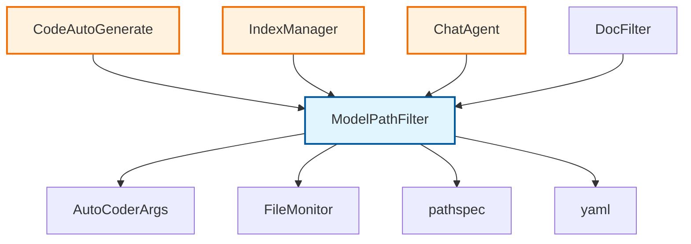

# privacy/ 包模块文档

## 📍 模块位置
- **源码路径**: `src/autocoder/privacy/`
- **文档路径**: `specs/privacy.ac.mod.md`  
- **模块类型**: 包模块 (Package Module)
- **重要性**: ⭐⭐⭐⭐ 数据安全核心

## 📋 模块概述

`privacy` 包是 Auto-Coder 的数据安全和隐私保护核心模块，负责控制不同AI模型对文件系统的访问权限。该包实现了基于规则的路径过滤机制，支持文件级和行级别的细粒度访问控制，确保敏感代码和数据的安全。

### 🎯 核心功能
- **模型路径过滤**: 根据模型类型控制文件访问权限
- **细粒度权限控制**: 支持读写分离和行级权限管理
- **动态配置管理**: 支持配置文件热重载和临时规则
- **模式匹配**: 使用 gitignore 风格的灵活模式匹配
- **系统集成**: 深度集成到代码生成、索引、聊天等核心功能

## 🗂 文件结构

```
privacy/
├── __init__.py          # 包初始化，导出主要类
└── model_filter.py      # 核心模型路径过滤器实现
```

## 🚀 快速开始

### 基本用法

```python
from autocoder.privacy import ModelPathFilter
from autocoder.common import AutoCoderArgs

# 创建参数配置
args = AutoCoderArgs(
    source_dir="/path/to/project",
    model_filter_path=".model_filters.yml"  # 可选
)

# 创建模型过滤器
filter = ModelPathFilter(
    model_name="gpt-4",
    args=args,
    default_rules=[
        {"pattern": "*.secret", "permission": "DENY"},
        {"pattern": "config/private/**", "permission": "DENY_READ"}
    ]
)

# 检查文件访问权限
if filter.is_readable("src/main.py"):
    print("文件可读取")

if filter.is_writable("logs/debug.log"):
    print("文件可写入")
```

### 从 LLM 对象创建过滤器

```python
import byzerllm
from autocoder.privacy import ModelPathFilter

# 初始化 LLM
llm = byzerllm.ByzerLLM()
llm.setup_default_model_name("gpt-4")

# 从 LLM 对象创建过滤器
filter = ModelPathFilter.from_model_object(
    llm_obj=llm,
    args=args,
    default_rules=[
        {"pattern": "secrets/**", "permission": "DENY"}
    ]
)
```

### 配置文件格式

创建 `.model_filters.yml` 配置文件：

```yaml
# 默认规则（适用于所有模型）
default_rules:
  - pattern: "*.key"
    permission: "DENY"
  - pattern: "*.env"
    permission: "DENY_READ"
  - pattern: "logs/**"
    permission: "ALLOW"

# 模型特定规则
model_filters:
  gpt-4:
    rules:
      - pattern: "sensitive/**"
        permission: "DENY"
      - pattern: "public/**"
        permission: "ALLOW"
        
  claude-3:
    rules:
      - pattern: "internal/docs/**"
        permission: "DENY_READ"
        line_ranges:
          - start: 1
            end: 50
```

## 🔧 核心组件详解

### 1. 权限枚举类型

```python
class Permission(str, Enum):
    """权限枚举类型"""
    ALLOW = "ALLOW"           # 显式允许访问
    DENY = "DENY"             # 完全禁止访问
    DENY_READ = "DENY_READ"   # 禁止读取但允许写入
    DENY_WRITE = "DENY_WRITE" # 禁止写入但允许读取

class AccessOperation(str, Enum):
    """访问操作类型"""
    READ = "READ"
    WRITE = "WRITE"
```

**权限优先级**:
1. `ALLOW` - 最高优先级，显式允许
2. `DENY` - 完全禁止访问
3. `DENY_READ` / `DENY_WRITE` - 操作特定禁止
4. 默认 - 如无明确规则，默认允许

### 2. 行范围控制

```python
@dataclass
class LineRange:
    """行范围定义"""
    start: int
    end: int
    
    def contains(self, line_number: int) -> bool:
        """检查指定行号是否在范围内"""
        return self.start <= line_number <= self.end

# 使用示例
range1 = LineRange(start=1, end=100)    # 前100行
range2 = LineRange(start=200, end=float('inf'))  # 200行到文件末尾
```

**行级权限控制应用**:
- **敏感信息隐藏**: 隐藏包含密钥的特定行
- **版权保护**: 控制特定代码段的访问
- **分级访问**: 不同模型访问不同代码区域

### 3. 访问规则定义

```python
@dataclass
class AccessRule:
    """访问规则"""
    pattern: str                    # gitignore风格模式
    permission: Permission          # 权限类型
    line_ranges: List[LineRange]    # 可选的行范围限制
    
    @classmethod
    def from_dict(cls, rule_dict: Dict[str, Any]) -> 'AccessRule':
        """从字典创建规则"""
        # 支持完整的配置加载
```

**规则匹配机制**:
- **模式匹配**: 使用 `pathspec` 库的 gitignore 语法
- **优先级处理**: 按规则顺序匹配，首个匹配规则生效
- **行范围过滤**: 可选的行级别精确控制

### 4. ModelPathFilter 核心类

```python
class ModelPathFilter:
    def __init__(self,
                 model_name: str,
                 args: AutoCoderArgs,
                 default_rules: List[Dict[str, Any]] = None):
        """
        模型路径过滤器
        :param model_name: 当前使用的模型名称
        :param args: 自动编码器参数
        :param default_rules: 默认访问规则
        """
```

#### 配置文件加载机制

```python
def _load_rules(self):
    """加载并编译路径过滤规则"""
    # 配置文件优先级:
    # 1. args.model_filter_path 指定路径
    # 2. 项目根目录 .model_filters.yml
    # 3. .auto-coder/.model_filters.yml
    
    # 规则合并顺序:
    # 模型特定规则 + 默认配置规则 + 代码传入的默认规则
```

#### 文件监控和热重载

```python
def _setup_file_monitor(self):
    """设置文件监控，当过滤器文件变化时重新加载规则"""
    # 使用 FileMonitor 监控配置文件变化
    # 自动重新加载规则，无需重启应用

def _on_filter_file_changed(self, change_type: Change, changed_path: str):
    """当过滤器文件发生变化时的回调函数"""
    # 实时响应配置文件变更
```

#### 访问权限检查

```python
def is_accessible(self, 
                  file_path: str, 
                  operation: Union[AccessOperation, str] = AccessOperation.READ,
                  line_number: int = None) -> bool:
    """
    检查文件路径在指定操作和行号下是否可访问
    
    权限判断逻辑:
    1. 获取所有适用规则
    2. 检查行范围限制 (如果指定)
    3. 按优先级处理权限 (ALLOW > DENY_specific > DENY)
    4. 默认允许访问
    """
    
def is_readable(self, file_path: str, line_number: int = None) -> bool:
    """检查文件是否可读取"""
    return self.is_accessible(file_path, AccessOperation.READ, line_number)
    
def is_writable(self, file_path: str, line_number: int = None) -> bool:
    """检查文件是否可写入"""
    return self.is_accessible(file_path, AccessOperation.WRITE, line_number)
```

#### 行范围查询

```python
def get_accessible_line_ranges(self, 
                              file_path: str, 
                              operation: Union[AccessOperation, str] = AccessOperation.READ) -> List[LineRange]:
    """
    获取文件在指定操作下的可访问行范围
    
    计算逻辑:
    1. 如果有 ALLOW 规则，返回完全可访问
    2. 如果有完全 DENY 规则，返回空范围
    3. 根据受限范围计算补集，返回可访问行范围
    """
```

#### 动态规则管理

```python
def add_temp_rule(self, pattern: str, permission: Union[Permission, str] = Permission.DENY):
    """添加临时规则 - 运行时动态添加"""
    
def reload_rules(self):
    """重新加载规则配置 - 手动刷新"""
    
def has_rules(self):
    """检查是否存在规则 - 状态查询"""
```

## 🔗 系统集成

### 在代码生成中的应用

```python
# src/autocoder/common/code_auto_generate.py
def single_round_run(self, query: str, source_code_list: SourceCodeList):
    # 应用模型过滤器
    for llm in self.llms:
        model_filter = ModelPathFilter.from_model_object(llm, self.args)
        filtered_sources = []
        for source in source_code_list.sources:
            if model_filter.is_accessible(source.module_name):
                filtered_sources.append(source)
            else:
                # 记录被过滤的文件
                printer.print_in_terminal("index_file_filtered",
                                          file_path=source.module_name,
                                          model_name=model_name)
```

### 在索引管理中的应用

```python
# src/autocoder/index/index.py
class IndexManager:
    def __init__(self, llm: byzerllm.ByzerLLM, sources: List[SourceCode], args: AutoCoderArgs):
        # 为不同的模型创建专用过滤器
        if self.index_llm:
            self.index_model_filter = ModelPathFilter.from_model_object(
                self.index_llm, args)
        if self.index_filter_llm:
            self.index_filter_model_filter = ModelPathFilter.from_model_object(
                self.index_filter_llm, args)
```

### 在聊天代理中的应用

```python
# src/autocoder/agent/entry_command_agent/chat.py
def _build_conversations(self, commands_info, chat_history):
    # 应用模型过滤器到聊天上下文
    chat_llm = self.llm.get_sub_client("chat_model") or self.llm
    model_filter = ModelPathFilter.from_model_object(chat_llm, self.args)
    
    filtered_sources = []
    for source in sources:
        if model_filter.is_accessible(source.module_name):
            filtered_sources.append(source)
```

## 📊 配置文件示例

### 基础配置示例

```yaml
# .model_filters.yml
default_rules:
  # 全局敏感文件保护
  - pattern: "*.env"
    permission: "DENY"
  - pattern: "*.key"
    permission: "DENY"
  - pattern: "secrets/**"
    permission: "DENY"
  
  # 日志文件只读
  - pattern: "logs/**"
    permission: "DENY_WRITE"
  
  # 公开文档完全开放
  - pattern: "docs/**"
    permission: "ALLOW"

model_filters:
  # GPT-4 模型特定规则
  gpt-4:
    rules:
      - pattern: "internal/**"
        permission: "DENY_READ"
      - pattern: "src/core/**"
        permission: "ALLOW"
        
  # Claude 模型特定规则  
  claude-3-sonnet:
    rules:
      - pattern: "experimental/**"
        permission: "DENY"
      - pattern: "stable/**"
        permission: "ALLOW"
```

### 高级配置示例

```yaml
# 行级别权限控制
model_filters:
  gpt-3.5-turbo:
    rules:
      # 配置文件的敏感部分
      - pattern: "config/database.py"
        permission: "DENY_READ"
        line_ranges:
          - start: 1
            end: 20     # 密码配置区域
          - start: 50
            end: 60     # API密钥区域
      
      # 核心算法保护
      - pattern: "src/algorithm/core.py"
        permission: "DENY_READ"
        line_ranges:
          - start: 100
            end: 200    # 专利算法实现
      
      # 测试文件完全开放
      - pattern: "tests/**"
        permission: "ALLOW"
```

## 🔗 依赖关系

### 内部依赖


### 外部依赖

| 依赖模块 | 用途 | 重要性 |
|---------|------|--------|
| `pathspec` | gitignore风格模式匹配 | ⭐⭐⭐⭐⭐ |
| `yaml` | 配置文件解析 | ⭐⭐⭐⭐ |
| `autocoder.common` | 基础参数类型 | ⭐⭐⭐⭐⭐ |
| `autocoder.common.file_monitor` | 文件变更监控 | ⭐⭐⭐ |
| `autocoder.utils.llms` | LLM工具函数 | ⭐⭐⭐⭐ |

### 被依赖关系

```python
# 主要被以下模块使用
from autocoder.common.code_auto_generate import CodeAutoGenerate
from autocoder.index.index import IndexManager
from autocoder.agent.entry_command_agent.chat import ChatAgent
from autocoder.rag.doc_filter import DocFilter

# 使用模式
model_filter = ModelPathFilter.from_model_object(llm, args)
if model_filter.is_accessible(file_path):
    # 处理文件
```

## ⚡ 性能和安全特点

### 性能优化
- **规则缓存**: 编译后的规则缓存在内存中
- **路径标准化**: 统一路径格式，避免重复计算
- **短路求值**: 优先级匹配，首个规则匹配即返回
- **增量更新**: 文件监控支持增量重载

### 安全特性
- **默认拒绝**: 当规则冲突时，倾向于更严格的权限
- **多层防护**: 支持文件级、行级多层权限控制
- **动态响应**: 配置文件变更实时生效
- **审计日志**: 过滤操作可记录到终端输出

## 🧪 测试和验证

### 基本功能测试

```bash
# 测试权限检查
python -c "
from autocoder.privacy import ModelPathFilter
from autocoder.common import AutoCoderArgs

args = AutoCoderArgs(source_dir='.')
filter = ModelPathFilter('test-model', args)

# 测试默认行为（应该允许访问）
assert filter.is_readable('test.py')
assert filter.is_writable('test.py')
print('✅ 默认权限测试通过')
"

# 测试规则应用
python -c "
from autocoder.privacy import ModelPathFilter
from autocoder.common import AutoCoderArgs

args = AutoCoderArgs(source_dir='.')
filter = ModelPathFilter('test-model', args, default_rules=[
    {'pattern': '*.secret', 'permission': 'DENY'}
])

# 测试规则生效
assert not filter.is_readable('test.secret')
assert filter.is_readable('test.py')
print('✅ 规则应用测试通过')
"
```

### 配置文件测试

```bash
# 创建测试配置文件
cat > .model_filters.yml << EOF
default_rules:
  - pattern: "*.env"
    permission: "DENY"
model_filters:
  test-model:
    rules:
      - pattern: "public/**"
        permission: "ALLOW"
EOF

# 测试配置加载
python -c "
from autocoder.privacy import ModelPathFilter
from autocoder.common import AutoCoderArgs

args = AutoCoderArgs(source_dir='.')
filter = ModelPathFilter('test-model', args)

assert not filter.is_readable('.env')
assert filter.is_readable('public/readme.txt')
print('✅ 配置文件测试通过')
"

# 清理测试文件
rm .model_filters.yml
```

### 行级权限测试

```bash
# 测试行级权限控制
python -c "
from autocoder.privacy import ModelPathFilter, LineRange
from autocoder.common import AutoCoderArgs

args = AutoCoderArgs(source_dir='.')
filter = ModelPathFilter('test-model', args, default_rules=[
    {
        'pattern': 'config.py',
        'permission': 'DENY_READ',
        'line_ranges': [{'start': 1, 'end': 10}]
    }
])

# 测试行级控制
assert not filter.is_readable('config.py', line_number=5)  # 受限行
assert filter.is_readable('config.py', line_number=15)     # 允许行
print('✅ 行级权限测试通过')
"
```

### 集成测试

```bash
# 测试与 LLM 对象的集成
python -c "
import byzerllm
from autocoder.privacy import ModelPathFilter
from autocoder.common import AutoCoderArgs

# 模拟 LLM 设置
class MockLLM:
    def __init__(self, model_name):
        self.default_model_name = model_name

llm = MockLLM('gpt-4')
args = AutoCoderArgs(source_dir='.')

# 测试从 LLM 对象创建
try:
    filter = ModelPathFilter.from_model_object(llm, args)
    print('✅ LLM 集成测试通过')
except:
    print('❌ LLM 集成测试失败')
"
```

## 🔍 故障排除

### 常见问题

1. **配置文件不生效**
   ```
   问题: 修改配置文件后权限没有变化
   原因: 配置文件路径错误或格式错误
   解决: 
   - 检查配置文件路径是否正确
   - 验证 YAML 格式是否有效
   - 检查 FileMonitor 是否正常工作
   ```

2. **权限过于严格**
   ```
   问题: 合法文件无法访问
   原因: 规则优先级或模式匹配错误
   解决:
   - 检查规则顺序，ALLOW 规则应该优先
   - 验证模式匹配是否正确
   - 使用 has_rules() 检查规则是否加载
   ```

3. **性能问题**
   ```
   问题: 权限检查耗时过长
   原因: 规则过多或模式复杂
   解决:
   - 简化规则模式
   - 合并相似规则
   - 检查路径标准化是否正常
   ```

### 调试技巧

```python
# 启用详细日志
import logging
logging.basicConfig(level=logging.DEBUG)

# 检查规则加载状态
filter = ModelPathFilter(model_name, args)
print(f"是否有规则: {filter.has_rules()}")
print(f"规则缓存: {filter._rules_cache}")

# 调试特定文件的规则匹配
applicable_rules = filter._get_applicable_rules("src/test.py")
print(f"适用规则: {applicable_rules}")

# 测试不同操作的权限
from autocoder.privacy.model_filter import AccessOperation
print(f"读权限: {filter.is_accessible('test.py', AccessOperation.READ)}")
print(f"写权限: {filter.is_accessible('test.py', AccessOperation.WRITE)}")

# 查看可访问行范围
ranges = filter.get_accessible_line_ranges("config.py", AccessOperation.READ)
print(f"可访问行范围: {ranges}")
```

---

## 📝 总结

`privacy` 包是 Auto-Coder 系统的关键安全组件，通过细粒度的访问控制保护敏感代码和数据。其灵活的配置机制、强大的模式匹配能力和深度的系统集成，为不同AI模型提供了差异化的访问权限管理。

### 关键优势
- **细粒度控制**: 支持文件级和行级权限管理
- **动态配置**: 配置文件热重载，无需重启
- **灵活匹配**: gitignore风格模式，易于配置
- **深度集成**: 在代码生成、索引、聊天等核心功能中无缝工作
- **安全优先**: 默认安全策略，多层防护机制

该模块为 Auto-Coder 在企业环境中的安全部署提供了坚实的基础保障。 