# rag

Auto-Coder 系统的检索增强生成（RAG）核心模块，提供文档检索、过滤、分块和问答生成的完整RAG流程，支持多种存储后端、混合索引、向量搜索和智能文档处理。

## 模块位置

**源码路径**: `src/autocoder/rag/`  
**文档路径**: `specs/rag.ac.mod.md`  
**模块类型**: 包模块

## 目录结构

```
src/autocoder/rag/
├── __init__.py                 # 包初始化文件
├── rag_entry.py               # RAG入口管理（RAGFactory, RAGManager）
├── long_context_rag.py        # 长上下文RAG核心实现
├── document_retriever.py      # 文档检索器（LocalDocumentRetriever等）
├── doc_filter.py              # 文档过滤器和相关性评分
├── token_limiter.py           # 令牌限制器，管理上下文窗口
├── token_counter.py           # 令牌计数器
├── relevant_utils.py          # 相关性工具函数
├── variable_holder.py         # 变量持有器
├── loaders/                   # 文档加载器目录
│   ├── __init__.py
│   ├── pdf_loader.py          # PDF文档加载
│   ├── docx_loader.py         # Word文档加载
│   ├── excel_loader.py        # Excel文档加载
│   ├── image_loader.py        # 图像文档加载
│   └── filter_utils.py        # 过滤工具
├── cache/                     # 缓存系统目录
│   ├── __init__.py
│   ├── local_duckdb_storage_cache.py  # DuckDB本地缓存
│   ├── local_byzer_storage_cache.py   # Byzer本地缓存
│   ├── byzer_storage_cache.py         # Byzer远程缓存
│   ├── simple_cache.py               # 简单文件缓存
│   └── cache_result_merge.py         # 缓存结果合并
├── tools/                     # RAG工具目录
│   ├── __init__.py
│   ├── recall_tool.py         # 文档召回工具
│   └── search_tool.py         # 文档搜索工具
└── stream_event/              # 流事件目录
    ├── __init__.py
    ├── event_writer.py        # 事件写入器
    └── types.py               # 事件类型定义
```

**注意**: 本文档保存在 `specs/` 目录下，不在包源码目录中。

## 快速开始

### 基本使用方式

```python
# 导入必要的模块
from autocoder.rag import RAGManager, RAGFactory
from autocoder.common import AutoCoderArgs
from byzerllm import ByzerLLM

# 1. 创建RAG管理器
llm = ByzerLLM()
args = AutoCoderArgs()
project_path = "/path/to/project"
rag_manager = RAGManager(llm, args, project_path)

# 2. 执行搜索
results = rag_manager.search("如何实现用户认证？")
for result in results:
    print(f"文件: {result.module_name}")
    print(f"内容: {result.source_code[:200]}...")

# 3. 流式对话
conversations = [{"role": "user", "content": "解释代码架构"}]
response_generator, contexts = rag_manager.stream_chat_oai(conversations)
for content, meta in response_generator:
    print(content, end="", flush=True)

# 4. 文档检索和过滤
from autocoder.rag.document_retriever import LocalDocumentRetriever
from autocoder.rag.doc_filter import DocFilter

retriever = LocalDocumentRetriever(
    args=args, llm=llm, path=project_path,
    required_exts=[".py", ".js", ".md"]
)
documents = list(retriever.retrieve_documents())

doc_filter = DocFilter(llm, args)
filtered_result = doc_filter.filter_docs(conversations, documents)
```

### 子模块说明

- **loaders**: 各种文档格式的加载和转换功能
- **cache**: 多种缓存存储后端（DuckDB、Byzer、文件缓存）
- **tools**: Agent集成的RAG工具（召回、搜索）
- **stream_event**: RAG过程中的流式事件处理

### 配置管理

```python
# RAG相关配置
args = AutoCoderArgs(
    rag_context_window_limit=120000,    # RAG上下文窗口限制
    rag_doc_filter_relevance=5,         # 文档过滤相关性阈值
    full_text_ratio=0.4,                # 全文区域比例
    segment_ratio=0.4,                  # 分段区域比例
    enable_hybrid_index=True,           # 启用混合索引
    required_exts=".py,.js,.md,.txt"    # 需要的文件扩展名
)
```

## 核心组件详解

### 1. RAG 入口管理

**RAGManager**: RAG管理器，提供统一的RAG接口
- **功能**: 管理整个RAG流程，包括文档检索、过滤、对话生成
- **主要方法**: `search()`, `stream_chat_oai()`, `get_contexts()`

**RAGFactory**: RAG实现工厂类
- **功能**: 根据配置创建不同类型的RAG实例

**LongContextRAG**: 长上下文RAG核心实现
- **功能**: 处理大规模文档的检索和生成

### 2. 文档检索与过滤

**LocalDocumentRetriever**: 本地文档检索器
- **功能**: 从本地文件系统检索文档，支持多种文件格式过滤

**DocFilter**: 文档过滤器
- **功能**: 基于LLM判断文档与查询的相关性，提供智能过滤

**TokenLimiter**: 令牌限制器
- **功能**: 管理上下文窗口，确保不超过模型的令牌限制

### 3. 缓存系统

支持多种缓存后端：
- **LocalDuckDBStorageCache**: DuckDB向量数据库缓存
- **LocalByzerStorageCache**: Byzer本地缓存
- **SimpleCache**: 简单文件缓存

## Mermaid 依赖图

```mermaid
graph TB
    %% 核心模块定义
    rag[rag<br/>RAG检索增强生成模块]
    
    %% 主要组件
    rag_entry[rag_entry<br/>RAG入口管理]
    long_context_rag[long_context_rag<br/>长上下文RAG]
    document_retriever[document_retriever<br/>文档检索器]
    doc_filter[doc_filter<br/>文档过滤器]
    token_limiter[token_limiter<br/>令牌限制器]
    
    %% 子模块
    loaders[loaders<br/>文档加载器]
    cache[cache<br/>缓存系统]
    tools[tools<br/>RAG工具]
    stream_event[stream_event<br/>流事件]
    
    %% 外部依赖模块
    common[common<br/>通用工具模块]
    utils[utils<br/>工具模块]
    events[events<br/>事件系统]
    
    %% 内部依赖关系
    rag --> rag_entry
    rag --> long_context_rag
    rag --> document_retriever
    rag --> doc_filter
    rag --> token_limiter
    rag --> loaders
    rag --> cache
    rag --> tools
    rag --> stream_event
    
    %% 外部依赖关系
    rag --> common
    rag --> utils
    rag --> events
    
    %% 样式定义
    classDef coreClass fill:#e1f5fe,stroke:#0277bd,stroke-width:3px
    classDef componentClass fill:#f3e5f5,stroke:#7b1fa2,stroke-width:2px
    classDef subClass fill:#e8f5e9,stroke:#2e7d32,stroke-width:1px
    classDef externalClass fill:#fff3e0,stroke:#e65100,stroke-width:2px
    
    class rag coreClass
    class rag_entry,long_context_rag,document_retriever,doc_filter,token_limiter componentClass
    class loaders,cache,tools,stream_event subClass
    class common,utils,events externalClass
```



## 依赖关系说明

### 对其他模块的依赖
列出该模块依赖的其他具有 `.ac.mod.md` 文档的模块（使用specs目录下的文档路径）：

- `specs/common.ac.mod.md` - 使用AutoCoderArgs、SourceCode等基础类型
- `specs/utils_llms.ac.mod.md` - 使用LLM工具函数
- `specs/events.ac.mod.md` - 使用事件系统进行流式处理

### 被依赖关系
列出依赖于该模块的其他模块：

- `specs/auto_coder_runner.ac.mod.md` - 使用RAG功能进行文档检索
- `specs/agent.ac.mod.md` - 智能代理使用RAG工具
- `specs/common_v2.ac.mod.md` - v2代理系统集成RAG功能

## 可以验证模块可运行的测试命令

提供可执行的验证命令，例如：

```bash
# 包模块测试
python -c "from autocoder.rag import RAGManager, RAGFactory; print('RAG module imported successfully')"

# 验证核心组件
python -c "from autocoder.rag.document_retriever import LocalDocumentRetriever; print('Document retriever OK')"
python -c "from autocoder.rag.doc_filter import DocFilter; print('Doc filter OK')"
python -c "from autocoder.rag.token_limiter import TokenLimiter; print('Token limiter OK')"

# 验证子模块
python -c "from autocoder.rag.cache.local_duckdb_storage_cache import LocalDuckDBStorageCache; print('Cache OK')"
python -c "from autocoder.rag.tools.recall_tool import RecallTool; print('Tools OK')"

# 检查依赖关系
python -c "from autocoder.common import AutoCoderArgs; from byzerllm import ByzerLLM; print('Dependencies available')"
``` 