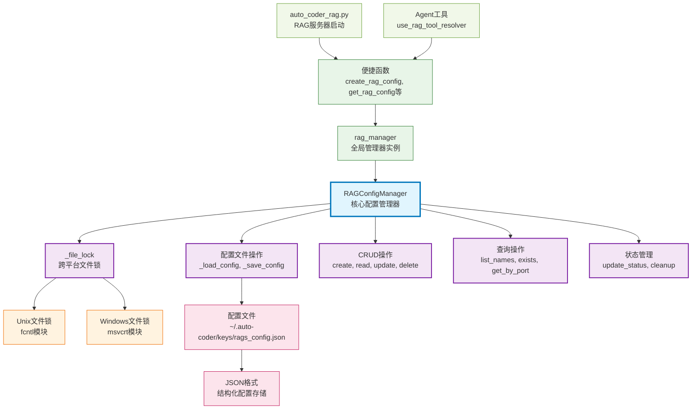

# rags

Auto-Coder 系统的 RAG 配置管理模块，提供 RAG 服务配置的持久化存储、并发安全的增删改查操作、状态管理和跨平台文件锁支持，为整个系统的 RAG 服务提供统一的配置管理基础设施。

## 模块位置

**源码路径**: `src/autocoder/rags.py`  
**文档路径**: `specs/rags.ac.mod.md`  
**模块类型**: 单文件模块

## 文件结构

```python
# rags.py 内容结构
├── 导入部分                    # json, os, platform, contextlib等依赖导入
├── RAGS_JSON                   # 配置文件路径常量
├── RAGConfigManager            # 核心配置管理器类
│   ├── __init__()             # 初始化配置管理器
│   ├── _ensure_config_dir()   # 确保配置目录存在
│   ├── _file_lock()           # 跨平台文件锁上下文管理器
│   ├── _load_config()         # 加载配置文件
│   ├── _save_config()         # 保存配置文件
│   ├── create()               # 创建RAG配置
│   ├── read()                 # 读取RAG配置
│   ├── update()               # 更新RAG配置
│   ├── delete()               # 删除RAG配置
│   ├── list_names()           # 列出所有配置名称
│   ├── exists()               # 检查配置是否存在
│   ├── get_by_port()          # 根据端口获取配置
│   ├── get_running_services() # 获取运行中的服务
│   ├── update_status()        # 更新服务状态
│   └── cleanup_stopped_services() # 清理停止服务的临时信息
├── rag_manager                 # 全局RAG管理器实例
└── 便捷函数                    # 模块级别的便捷函数
    ├── create_rag_config()     # 创建配置便捷函数
    ├── get_rag_config()        # 获取配置便捷函数
    ├── update_rag_config()     # 更新配置便捷函数
    ├── delete_rag_config()     # 删除配置便捷函数
    ├── list_rag_names()        # 列出名称便捷函数
    ├── rag_exists()            # 检查存在便捷函数
    ├── get_rag_by_port()       # 按端口获取便捷函数
    ├── get_running_rags()      # 获取运行服务便捷函数
    └── update_rag_status()     # 更新状态便捷函数
```

## 快速开始

### 基本使用方式

```python
# 1. 导入模块
from autocoder.rags import (
    create_rag_config,
    get_rag_config,
    update_rag_config,
    delete_rag_config,
    list_rag_names,
    rag_exists
)

# 2. 创建RAG配置
config = {
    "host": "127.0.0.1",
    "port": 8000,
    "model": "gpt-4",
    "doc_dir": "/path/to/docs",
    "description": "项目文档RAG服务"
}
success = create_rag_config("my_rag", config)
print(f"创建配置: {'成功' if success else '失败'}")

# 3. 读取配置
config = get_rag_config("my_rag")
if config:
    print(f"RAG服务状态: {config.get('status', 'unknown')}")

# 4. 更新配置
update_data = {"status": "running", "process_id": 12345}
update_rag_config("my_rag", update_data)

# 5. 检查服务状态
if rag_exists("my_rag"):
    print("RAG服务配置存在")

# 6. 列出所有RAG服务
names = list_rag_names()
print(f"已配置的RAG服务: {names}")
```

### 使用RAGConfigManager类

```python
# 1. 创建配置管理器
from autocoder.rags import RAGConfigManager

manager = RAGConfigManager()

# 2. 批量操作
configs = {
    "docs_rag": {
        "host": "127.0.0.1", 
        "port": 8001,
        "model": "gpt-4",
        "doc_dir": "/docs"
    },
    "code_rag": {
        "host": "127.0.0.1",
        "port": 8002, 
        "model": "gpt-3.5-turbo",
        "doc_dir": "/code"
    }
}

for name, config in configs.items():
    manager.create(name, config)

# 3. 查询运行中的服务
running = manager.get_running_services()
print(f"运行中的服务: {list(running.keys())}")

# 4. 根据端口查找服务
service = manager.get_by_port(8001)
if service:
    print(f"端口8001的服务: {service['name']}")
```

### 配置文件格式

该模块管理的配置文件位于 `~/.auto-coder/keys/rags_config.json`：

```json
{
  "my_rag": {
    "name": "my_rag",
    "host": "127.0.0.1",
    "port": 8000,
    "model": "gpt-4",
    "doc_dir": "/path/to/docs",
    "description": "项目文档RAG服务",
    "status": "running",
    "created_at": "2024-01-15T10:30:00",
    "updated_at": "2024-01-15T12:45:00",
    "process_id": 12345
  },
  "docs_rag": {
    "name": "docs_rag",
    "host": "127.0.0.1",
    "port": 8001,
    "model": "gpt-3.5-turbo",
    "doc_dir": "/docs",
    "status": "stopped",
    "created_at": "2024-01-15T11:00:00",
    "updated_at": "2024-01-15T11:00:00"
  }
}
```

### 主要功能

该模块提供完整的RAG服务配置管理，包括配置的持久化、并发安全操作、状态跟踪、服务发现等功能，为Auto-Coder系统的RAG功能提供基础设施支持。

## 核心组件详解

### 1. RAGConfigManager 类

**功能**: 核心的RAG配置管理器，提供线程安全的配置操作

**初始化**:
```python
def __init__(self, config_path: str = RAGS_JSON):
    self.config_path = config_path
    self._ensure_config_dir()
```

**主要方法**:

#### 配置文件操作

**_file_lock(mode='r')**
- **功能**: 跨平台文件锁上下文管理器，确保并发安全
- **支持平台**: Unix (fcntl) 和 Windows (msvcrt)
- **锁类型**: 
  - 读取模式: 共享锁 (Unix) / 独占锁 (Windows)
  - 写入模式: 独占锁
- **容错机制**: 锁获取失败时继续执行，不阻塞程序

**_load_config() -> Dict[str, Any]**
- **功能**: 从文件加载配置
- **返回值**: 配置字典，失败时返回空字典
- **异常处理**: 自动处理文件不存在和JSON解析错误

**_save_config(config: Dict[str, Any])**
- **功能**: 保存配置到文件
- **格式**: JSON格式，自动缩进和UTF-8编码

#### CRUD操作

**create(name: str, config: Dict[str, Any]) -> bool**
- **功能**: 创建新的RAG服务配置
- **自动添加**: name, status, created_at, updated_at字段
- **返回值**: 成功返回True，名称已存在返回False

**read(name: Optional[str] = None) -> Optional[Dict[str, Any]]**
- **功能**: 读取RAG服务配置
- **参数**: name为None时返回所有配置
- **返回值**: 配置字典或None

**update(name: str, config: Dict[str, Any]) -> bool**
- **功能**: 更新RAG服务配置
- **合并策略**: 新配置与现有配置合并
- **自动更新**: updated_at字段
- **返回值**: 成功返回True，名称不存在返回False

**delete(name: str) -> bool**
- **功能**: 删除RAG服务配置
- **返回值**: 成功返回True，名称不存在返回False

#### 查询和状态管理

**list_names() -> List[str]**
- **功能**: 获取所有RAG服务名称列表

**exists(name: str) -> bool**
- **功能**: 检查RAG服务配置是否存在

**get_by_port(port: int) -> Optional[Dict[str, Any]]**
- **功能**: 根据端口号查找RAG服务配置
- **用途**: 避免端口冲突，服务发现

**get_running_services() -> Dict[str, Any]**
- **功能**: 获取所有状态为"running"的RAG服务
- **返回值**: 运行中服务的配置字典

**update_status(name: str, status: str, **kwargs) -> bool**
- **功能**: 更新RAG服务状态和相关信息
- **支持字段**: process_id, stdout_fd, stderr_fd等
- **自动更新**: updated_at字段

**cleanup_stopped_services()**
- **功能**: 清理已停止服务的临时状态信息
- **清理字段**: process_id, stdout_fd, stderr_fd, cache_build_task_id

### 2. 文件锁实现

该模块实现了跨平台的文件锁机制：

**Unix系统 (fcntl)**:
```python
# 共享锁（读取）
fcntl.flock(file_handle.fileno(), fcntl.LOCK_SH)
# 独占锁（写入）
fcntl.flock(file_handle.fileno(), fcntl.LOCK_EX)
# 释放锁
fcntl.flock(file_handle.fileno(), fcntl.LOCK_UN)
```

**Windows系统 (msvcrt)**:
```python
# 非阻塞独占锁
msvcrt.locking(file_handle.fileno(), msvcrt.LK_NBLCK, 1)
# 阻塞独占锁
msvcrt.locking(file_handle.fileno(), msvcrt.LK_LOCK, 1)
# 释放锁
msvcrt.locking(file_handle.fileno(), msvcrt.LK_UNLCK, 1)
```

### 3. 便捷函数

模块提供了全套便捷函数，包装了RAGConfigManager的功能：

```python
# 全局实例
rag_manager = RAGConfigManager()

# 便捷函数映射
def create_rag_config(name: str, config: Dict[str, Any]) -> bool:
    return rag_manager.create(name, config)

def get_rag_config(name: Optional[str] = None) -> Optional[Dict[str, Any]]:
    return rag_manager.read(name)

# ... 其他便捷函数
```

### 4. 配置字段说明

**必需字段**:
- `name`: RAG服务名称（唯一标识）
- `host`: 服务主机地址
- `port`: 服务端口号
- `model`: 使用的AI模型名称

**可选字段**:
- `doc_dir`: 文档目录路径
- `description`: 服务描述
- `api_key`: API密钥
- `base_url`: 服务基础URL

**自动管理字段**:
- `status`: 服务状态 (running/stopped)
- `created_at`: 创建时间
- `updated_at`: 更新时间
- `process_id`: 进程ID（运行时）
- `stdout_fd`: 标准输出文件描述符（临时）
- `stderr_fd`: 标准错误文件描述符（临时）

### 5. 状态管理

该模块支持完整的RAG服务状态管理：

**状态类型**:
- `stopped`: 服务已停止
- `running`: 服务正在运行
- `starting`: 服务启动中
- `stopping`: 服务停止中

**状态转换**:
```python
# 启动服务
update_rag_status("my_rag", "running", process_id=12345)

# 停止服务
update_rag_status("my_rag", "stopped")

# 清理临时信息
manager.cleanup_stopped_services()
```

## Mermaid 依赖图



## 依赖关系说明

### 对其他模块的依赖
该模块是基础设施模块，仅依赖Python标准库：
- **json**: 配置文件序列化
- **os**: 文件系统操作
- **platform**: 平台检测
- **fcntl**: Unix文件锁（可选）
- **msvcrt**: Windows文件锁（可选）

### 被依赖关系
作为RAG配置管理的基础设施，被以下模块使用：

- `src/autocoder/auto_coder_rag.py` - RAG服务器启动时获取配置
- `src/autocoder/common/v2/agent/agentic_edit_tools/use_rag_tool_resolver.py` - Agent工具中的RAG调用
- **未来扩展**: 其他需要RAG配置管理的模块

## 可以验证模块可运行的测试命令

```bash
# Python模块测试
python -c "from autocoder.rags import RAGConfigManager; manager = RAGConfigManager(); print('配置管理器创建成功')"

# 测试便捷函数
python -c "from autocoder.rags import create_rag_config, get_rag_config; print('便捷函数导入成功')"

# 测试配置创建和读取
python -c "
from autocoder.rags import create_rag_config, get_rag_config, delete_rag_config
config = {'host': '127.0.0.1', 'port': 8000, 'model': 'test'}
result = create_rag_config('test_rag', config)
print(f'创建测试配置: {result}')
read_config = get_rag_config('test_rag')
print(f'读取配置成功: {read_config is not None}')
delete_rag_config('test_rag')
print('测试配置已清理')
"

# 测试文件锁功能
python -c "
from autocoder.rags import RAGConfigManager
import tempfile, os
temp_file = tempfile.mktemp(suffix='.json')
try:
    manager = RAGConfigManager(temp_file)
    with manager._file_lock('w') as f:
        f.write('{}')
    print('文件锁测试成功')
finally:
    if os.path.exists(temp_file):
        os.remove(temp_file)
"

# 测试查询操作
python -c "
from autocoder.rags import list_rag_names, rag_exists, get_running_rags
names = list_rag_names()
running = get_running_rags()
print(f'配置名称列表: {names}')
print(f'运行中服务: {list(running.keys())}')
"

# 验证配置文件路径
python -c "from autocoder.rags import RAGS_JSON; import os; print(f'配置文件路径: {RAGS_JSON}'); print(f'目录存在: {os.path.exists(os.path.dirname(RAGS_JSON))}')"

# 测试状态管理
python -c "
from autocoder.rags import update_rag_status, RAGConfigManager
manager = RAGConfigManager()
print('状态管理功能可用')
"
``` 