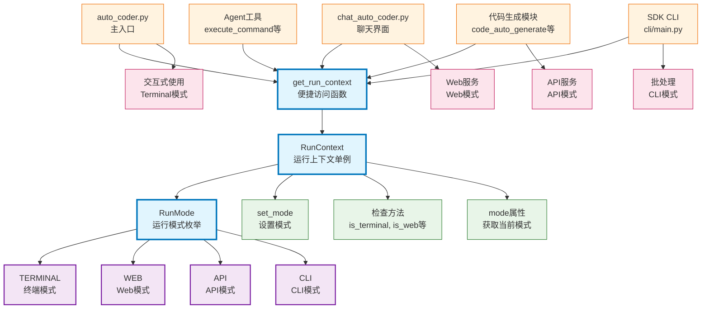

# run_context

Auto-Coder 系统的运行上下文管理模块，提供运行模式的统一管理和状态跟踪，支持 Terminal、Web、API、CLI 四种运行模式，通过单例模式确保全局状态的一致性，为整个系统提供运行环境感知能力。

## 模块位置

**源码路径**: `src/autocoder/run_context.py`  
**文档路径**: `specs/run_context.ac.mod.md`  
**模块类型**: 单文件模块

## 文件结构

```python
# run_context.py 内容结构
├── 导入部分                    # enum, typing 等依赖导入
├── RunMode                     # 运行模式枚举
│   ├── TERMINAL               # 终端模式
│   ├── WEB                    # Web模式
│   ├── API                    # API模式
│   └── CLI                    # CLI模式
├── RunContext                  # 运行上下文单例类
│   ├── __new__()              # 单例模式实现
│   ├── mode                   # 当前运行模式属性
│   ├── set_mode()             # 设置运行模式
│   ├── is_terminal()          # 检查是否为Terminal模式
│   ├── is_web()               # 检查是否为Web模式
│   ├── is_cli()               # 检查是否为CLI模式
│   └── is_api()               # 检查是否为API模式
└── get_run_context()          # 获取单例实例的便捷函数
```

## 快速开始

### 基本使用方式

```python
# 1. 导入模块
from autocoder.run_context import get_run_context, RunMode

# 2. 获取运行上下文
context = get_run_context()

# 3. 检查当前运行模式
if context.mode == RunMode.WEB:
    print("当前运行在Web模式")
elif context.mode == RunMode.TERMINAL:
    print("当前运行在Terminal模式")

# 4. 使用便捷方法检查模式
if context.is_terminal():
    # 在终端模式下的特定逻辑
    print("终端模式：显示详细输出")
elif context.is_web():
    # 在Web模式下的特定逻辑
    print("Web模式：返回JSON格式")

# 5. 设置运行模式
context.set_mode(RunMode.WEB)
print(f"模式已切换为: {context.mode}")
```

### 在不同场景中的使用

```python
# 1. 在代码生成模块中使用
from autocoder.run_context import get_run_context, RunMode

def generate_code():
    context = get_run_context()
    
    if context.is_web():
        # Web模式：返回结构化数据
        return {"status": "success", "code": "generated_code"}
    else:
        # 终端模式：直接输出到控制台
        print("代码生成完成")

# 2. 在Agent工具中使用
def execute_command_tool():
    context = get_run_context()
    
    if context.is_terminal():
        # 终端模式：直接执行命令
        os.system("ls -la")
    elif context.is_web():
        # Web模式：安全检查
        return "Web模式下不允许执行系统命令"

# 3. 在聊天界面中使用
def chat_interface():
    context = get_run_context()
    
    if context.is_cli():
        # CLI模式：简化交互
        return input("请输入命令: ")
    else:
        # 其他模式：富交互界面
        return show_rich_interface()
```

### 运行模式说明

该模块支持四种运行模式，每种模式对应不同的使用场景：

#### TERMINAL 模式
- **使用场景**: 命令行终端直接运行
- **特点**: 支持完整的交互功能、彩色输出、进度条
- **入口**: `auto-coder` 命令行工具

#### WEB 模式  
- **使用场景**: Web服务器环境运行
- **特点**: 返回结构化数据、安全限制、无交互输出
- **入口**: `auto-coder-serve` Web服务

#### API 模式
- **使用场景**: API服务环境运行
- **特点**: RESTful接口、JSON格式、无用户交互
- **入口**: API服务调用

#### CLI 模式
- **使用场景**: 命令行工具脚本化使用
- **特点**: 简化输出、脚本友好、批处理模式
- **入口**: SDK CLI工具

### 主要功能

该模块提供全局运行模式管理，确保系统各组件能够感知当前运行环境并做出相应的行为调整，实现统一的运行时状态管理。

## 核心组件详解

### 1. RunMode 枚举

**定义**: 
```python
class RunMode(Enum):
    TERMINAL = auto()
    WEB = auto()  
    API = auto()
    CLI = auto()
```

**功能**: 定义Auto-Coder系统支持的四种运行模式

**模式说明**:

**TERMINAL**
- **描述**: 交互式终端模式
- **特征**: 支持用户交互、彩色输出、实时反馈
- **适用**: 开发调试、手动操作、学习使用

**WEB** 
- **描述**: Web服务器模式
- **特征**: 结构化响应、安全限制、无阻塞操作
- **适用**: Web应用集成、远程服务、多用户环境

**API**
- **描述**: API服务模式
- **特征**: RESTful接口、JSON通信、无状态操作
- **适用**: 系统集成、自动化调用、第三方服务

**CLI**
- **描述**: 命令行工具模式
- **特征**: 脚本友好、批处理、简化输出
- **适用**: 自动化脚本、CI/CD、批量处理

### 2. RunContext 单例类

**功能**: 管理全局运行模式状态的单例类

**设计模式**: 使用单例模式确保全局唯一实例

**实现方式**:
```python
class RunContext:
    _instance: Optional['RunContext'] = None
    
    def __new__(cls):
        if cls._instance is None:
            cls._instance = super(RunContext, cls).__new__(cls)
            cls._instance._mode = RunMode.TERMINAL  # 默认为终端模式
        return cls._instance
```

**主要方法**:

#### 属性访问

**mode: RunMode**
- **功能**: 获取当前运行模式
- **返回值**: 当前的RunMode枚举值
- **使用**: `context.mode == RunMode.WEB`

#### 模式设置

**set_mode(mode: RunMode) -> None**
- **功能**: 设置当前运行模式
- **参数**: mode - 新的运行模式
- **使用**: `context.set_mode(RunMode.WEB)`

#### 模式检查方法

**is_terminal() -> bool**
- **功能**: 检查是否为Terminal模式
- **返回值**: 是Terminal模式返回True

**is_web() -> bool**
- **功能**: 检查是否为Web模式
- **返回值**: 是Web模式返回True

**is_cli() -> bool**
- **功能**: 检查是否为CLI模式
- **返回值**: 是CLI模式返回True

**is_api() -> bool**
- **功能**: 检查是否为API模式
- **返回值**: 是API模式返回True

### 3. 便捷函数

**get_run_context() -> RunContext**
- **功能**: 获取RunContext单例实例的便捷函数
- **返回值**: RunContext单例对象
- **优势**: 简化导入和使用，提供统一的访问方式

### 4. 在系统中的应用

该模块被广泛用于系统的各个组件中：

#### 代码生成模块
```python
# 在代码生成中根据模式调整输出
from autocoder.run_context import get_run_context

def generate_output(content):
    context = get_run_context()
    if context.is_web():
        return {"content": content, "format": "json"}
    else:
        print(content)
```

#### Agent工具模块
```python
# 在Agent工具中根据模式调整行为
from autocoder.run_context import get_run_context

def execute_command(cmd):
    context = get_run_context()
    if context.is_terminal():
        # 终端模式：直接执行
        return os.system(cmd)
    elif context.is_web():
        # Web模式：安全检查
        raise SecurityError("Web模式下不允许执行系统命令")
```

#### 聊天界面模块
```python
# 在聊天界面中根据模式调整交互方式
from autocoder.run_context import get_run_context

def handle_user_input():
    context = get_run_context()
    if context.is_cli():
        return simple_input()
    else:
        return rich_interactive_input()
```

### 5. 模式切换策略

系统在不同入口点自动设置相应的运行模式：

**自动模式设置**:
```python
# 在auto_coder.py中
def main():
    context = get_run_context()
    context.set_mode(RunMode.TERMINAL)

# 在auto_coder_server.py中  
def start_server():
    context = get_run_context()
    context.set_mode(RunMode.WEB)

# 在SDK CLI中
def cli_main():
    context = get_run_context()
    context.set_mode(RunMode.CLI)
```

**手动模式切换**:
```python
# 临时切换模式
original_mode = context.mode
context.set_mode(RunMode.WEB)
try:
    # 执行Web模式特定逻辑
    result = web_specific_operation()
finally:
    # 恢复原始模式
    context.set_mode(original_mode)
```

## Mermaid 依赖图



## 依赖关系说明

### 对其他模块的依赖
该模块是基础设施模块，仅依赖Python标准库：
- **enum**: 枚举类型定义
- **typing**: 类型注解支持

### 被依赖关系
作为运行模式管理的核心模块，被整个系统广泛使用：

- `src/autocoder/auto_coder.py` - 主入口设置终端模式
- `src/autocoder/chat_auto_coder.py` - 聊天界面模式感知
- `src/autocoder/common/code_auto_generate*.py` - 代码生成模块的模式适配
- `src/autocoder/agent/` - Agent工具的行为调整
- `src/autocoder/sdk/cli/` - SDK CLI的模式设置
- `src/autocoder/commands/` - 命令模块的模式感知
- **autocoder-slim**: Slim版本中的对应模块

## 可以验证模块可运行的测试命令

```bash
# Python模块测试
python -c "from autocoder.run_context import get_run_context, RunMode; context = get_run_context(); print(f'当前模式: {context.mode}')"

# 测试单例模式
python -c "from autocoder.run_context import get_run_context; c1 = get_run_context(); c2 = get_run_context(); print(f'单例验证: {c1 is c2}')"

# 测试模式设置和检查
python -c "
from autocoder.run_context import get_run_context, RunMode
context = get_run_context()
print(f'默认模式: {context.mode}')
context.set_mode(RunMode.WEB)
print(f'设置后模式: {context.mode}')
print(f'是否为Web模式: {context.is_web()}')
"

# 测试所有模式检查方法
python -c "
from autocoder.run_context import get_run_context, RunMode
context = get_run_context()
for mode in RunMode:
    context.set_mode(mode)
    print(f'{mode}: terminal={context.is_terminal()}, web={context.is_web()}, cli={context.is_cli()}, api={context.is_api()}')
"

# 验证枚举值
python -c "from autocoder.run_context import RunMode; print(f'运行模式: {[mode.name for mode in RunMode]}')"

# 测试模式切换
python -c "
from autocoder.run_context import get_run_context, RunMode
context = get_run_context()
original = context.mode
context.set_mode(RunMode.API)
print(f'切换到API模式: {context.mode}')
context.set_mode(original)
print(f'恢复原始模式: {context.mode}')
"

# 验证类型注解
python -c "
from autocoder.run_context import RunContext, get_run_context
import typing
context = get_run_context()
print(f'类型验证: {isinstance(context, RunContext)}')
"
``` 