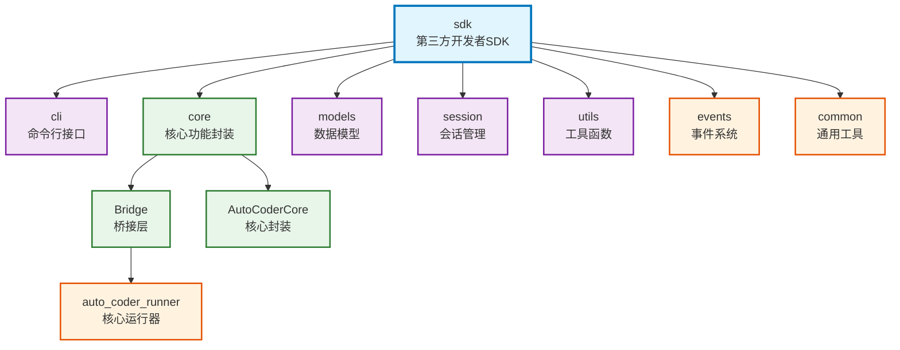

# sdk

第三方开发者SDK，提供Python API和命令行工具，通过Bridge模式连接Auto-Coder的核心功能，支持同步/异步查询和完整的事件流处理。

## 模块位置

**源码路径**: `src/autocoder/sdk/`  
**文档路径**: `specs/sdk.ac.mod.md`  
**模块类型**: 包模块

## 目录结构

```
src/autocoder/sdk/
├── __init__.py                 # SDK主入口，提供公共API
├── constants.py               # 常量定义（版本、默认值、配置选项等）
├── exceptions.py              # 自定义异常类
├── cli/                       # 命令行接口模块
│   ├── __init__.py
│   ├── __main__.py           # CLI模块入口点
│   ├── completion_wrapper.py # 自动补全包装器
│   ├── formatters.py         # 输出格式化器
│   ├── handlers.py           # 命令处理器（打印模式、会话模式）
│   ├── install_completion.py # 自动补全安装脚本
│   ├── main.py               # CLI主入口点
│   └── options.py            # CLI选项定义
├── core/                      # 核心功能模块
│   ├── __init__.py
│   ├── auto_coder_core.py    # AutoCoder核心封装类
│   └── bridge.py             # 桥接层，连接现有功能
├── models/                    # 数据模型
│   ├── __init__.py
│   ├── options.py            # 配置选项模型
│   ├── messages.py           # 消息模型
│   └── responses.py          # 响应模型
├── session/                   # 会话管理
│   ├── __init__.py
│   ├── session.py            # 单个会话类
│   └── session_manager.py    # 会话管理器
└── utils/                     # 工具函数
    ├── __init__.py
    ├── formatters.py         # 格式化工具
    ├── io_utils.py           # IO工具
    └── validators.py         # 验证工具
```

**注意**: 本文档保存在 `specs/` 目录下，不在包源码目录中。

## 快速开始

### 基本使用方式

```python
# 导入必要的模块
from autocoder.sdk import query, query_sync, query_with_events, AutoCodeOptions

# 1. 同步查询 - 最简单的使用方式
response = query_sync(
    "Write a function to calculate Fibonacci numbers",
    options=AutoCodeOptions(model="v3_chat")
)
print(response)

# 2. 异步查询 - 支持流式处理
import asyncio

async def async_example():
    options = AutoCodeOptions(model="v3_chat")
    
    async for message in query("Explain how Python decorators work", options):
        print(f"[{message.role}] {message.content}")

asyncio.run(async_example())

# 3. 事件流处理 - 详细的事件监控
async def event_example():
    options = AutoCodeOptions(model="v3_chat", verbose=True)
    
    async for event in query_with_events("Write a REST API using FastAPI", options):
        if event.event_type == "tool_call":
            print(f"🛠️ 执行工具: {event.data.get('tool_name')}")
        elif event.event_type == "completion":
            print(f"🏁 任务完成: {event.data.get('result')}")

asyncio.run(event_example())
```

### 子模块说明

- **cli**: 命令行接口，提供auto-coder.run命令和自动补全
- **core**: 核心功能封装，包含AutoCoderCore和Bridge桥接层
- **models**: 数据模型定义，包含配置、消息、响应等模型
- **session**: 会话管理系统，支持多轮对话和持久化
- **utils**: 工具函数集合，包含格式化、IO、验证等功能

### 配置管理

```python
from autocoder.sdk.models import AutoCodeOptions

# 基本配置
options = AutoCodeOptions(
    model="v3_chat",
    max_turns=10,
    output_format="text",
    verbose=False,
    project_type=".py,.ts",
    source_dir="."
)

# 命令行工具配置
# 编辑 ~/.auto-coder/keys/models.json 文件配置模型
# 将API KEY放到同目录下的对应文件中
```

## 核心组件详解

### 1. AutoCoderCore 主类

**核心功能：**
- 桥接Auto-Coder核心功能，提供统一的SDK接口
- 支持同步和异步查询模式
- 事件流处理和状态管理
- 配置转换和参数验证

**主要方法：**
- `query()`: 异步流式查询，返回消息生成器
- `query_sync()`: 同步查询，返回最终结果字符串
- `query_with_events()`: 事件流查询，返回详细事件信息
- `initialize()`: 初始化核心组件和配置

### 2. Bridge 桥接层

**Bridge类**: SDK与Auto-Coder核心系统的桥接层
- **connect_to_autocoder()**: 连接到Auto-Coder核心系统
- **convert_options()**: 将SDK选项转换为Auto-Coder参数
- **handle_events()**: 处理核心系统事件并转换为SDK格式
- **manage_session()**: 管理会话状态和持久化

### 3. CLI命令行接口

**CLIMain**: 命令行主入口类
- **run()**: 执行查询命令
- **handle_completion_mode()**: 处理自动补全模式
- **handle_session_mode()**: 处理会话管理模式
- **setup_logging()**: 配置日志系统

**CLIOptions**: 命令行选项配置
- 支持模型选择、输出格式、会话管理等选项
- 自动补全和参数验证

## Mermaid 依赖图



## 依赖关系说明

### 对其他模块的依赖
列出该模块依赖的其他具有 `.ac.mod.md` 文档的模块（使用specs目录下的文档路径）：

- `specs/auto_coder_runner.ac.mod.md` - 通过Bridge桥接层调用核心运行器功能
- `specs/events.ac.mod.md` - 使用事件系统进行状态通信和流式处理
- `specs/common.ac.mod.md` - 使用基础配置类和工具函数

### 被依赖关系
列出依赖于该模块的其他模块：

- 第三方开发者应用 - 通过Python API和CLI工具集成Auto-Coder功能
- 外部工具和脚本 - 使用auto-coder.run命令行工具

## 可以验证模块可运行的测试命令

提供可执行的验证命令，例如：

```bash
# 包模块测试
pytest src/autocoder/sdk/tests -v

# 直接运行模块验证
python -c "from autocoder.sdk import query_sync, AutoCodeOptions; print('SDK imported successfully')"
python -c "from autocoder.sdk.core import AutoCoderCore; print('Core imported successfully')"
python -c "from autocoder.sdk.cli.main import cli; print('CLI imported successfully')"

# 命令行工具测试
auto-coder.run --help
auto-coder.run --version

# 验证桥接层
python -c "from autocoder.sdk.core.bridge import Bridge; print('Bridge imported successfully')"

# 验证会话管理
python -c "from autocoder.sdk.session import SessionManager; print('Session manager imported successfully')"
``` 