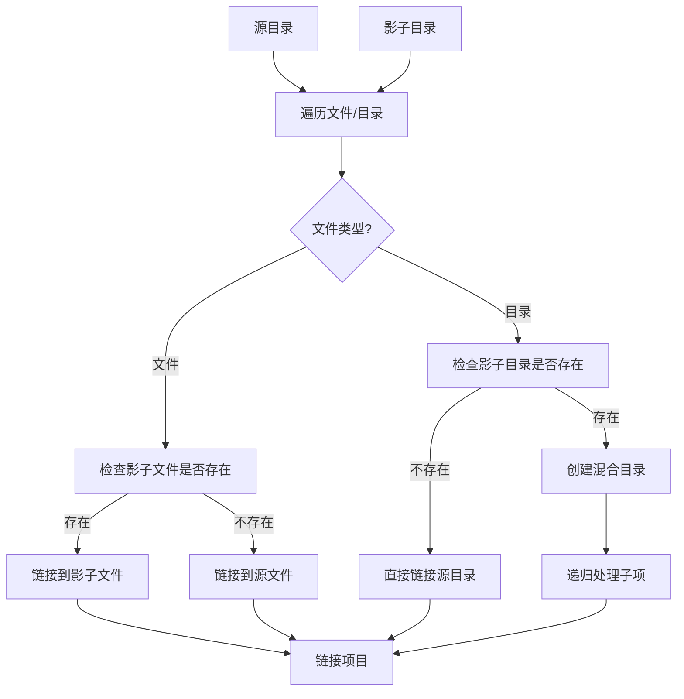

# shadows/ 包模块文档

## 📍 模块位置
- **源码路径**: `src/autocoder/shadows/`
- **文档路径**: `specs/shadows.ac.mod.md`  
- **模块类型**: 包模块 (Package Module)
- **重要性**: ⭐⭐⭐⭐ 文件安全机制

## 📋 模块概述

`shadows` 包是 Auto-Coder 的文件管理和备份核心模块，负责在安全的影子环境中管理文件变更。该包实现了影子文件系统，支持文件备份、版本控制、实验性修改的安全隔离，以及基于事件的独立命名空间管理。

### 🎯 核心功能
- **影子文件管理**: 在独立目录中镜像项目结构
- **事件隔离**: 基于事件ID的独立影子空间
- **链接项目创建**: 混合原始文件和修改文件的统一视图
- **路径转换**: 项目路径与影子路径的双向转换
- **目录比较**: 源目录与影子目录的差异分析
- **安全清理**: 支持批量清理和选择性保留

## 🗂 文件结构

```
shadows/
├── __init__.py          # 空的包初始化文件
└── shadow_manager.py    # 核心影子管理器实现
```

## 🚀 快速开始

### 基本用法

```python
from autocoder.shadows.shadow_manager import ShadowManager

# 创建影子管理器
shadow_manager = ShadowManager(
    source_dir="/path/to/project",
    event_file_id="task_001",  # 可选的事件隔离ID
    ignore_clean_shadows=False
)

# 保存文件到影子目录
shadow_path = shadow_manager.save_file("src/main.py", "print('Hello Shadow')")
print(f"文件保存到: {shadow_path}")

# 读取影子文件
content = shadow_manager.read_file("src/main.py")
print(f"影子文件内容: {content}")

# 创建链接项目（混合视图）
link_project_path = shadow_manager.create_link_project()
print(f"链接项目路径: {link_project_path}")
```

### 路径转换

```python
# 项目路径转影子路径
project_file = "/project/src/main.py"
shadow_file = shadow_manager.to_shadow_path(project_file)
print(f"影子路径: {shadow_file}")

# 影子路径转项目路径
original_file = shadow_manager.from_shadow_path(shadow_file)
print(f"原始路径: {original_file}")

# 检查是否为影子路径
is_shadow = shadow_manager.is_shadow_path(shadow_file)
print(f"是否为影子路径: {is_shadow}")
```

### 事件隔离使用

```python
# 为不同任务创建独立的影子空间
task1_manager = ShadowManager("/project", event_file_id="task_001")
task2_manager = ShadowManager("/project", event_file_id="task_002")

# 各自的修改不会相互干扰
task1_manager.save_file("config.py", "CONFIG_VERSION = 1")
task2_manager.save_file("config.py", "CONFIG_VERSION = 2")

# 创建各自的链接项目
task1_link = task1_manager.create_link_project()
task2_link = task2_manager.create_link_project()
```

## 🔧 核心组件详解

### 1. ShadowManager 类初始化

```python
class ShadowManager:
    def __init__(self, source_dir, event_file_id=None, ignore_clean_shadows=False):
        """
        初始化影子管理器
        
        参数:
            source_dir (str): 项目根目录的绝对路径
            event_file_id (str, optional): 事件文件ID，创建独立影子空间
            ignore_clean_shadows (bool, optional): 是否忽略清理影子目录
        """
```

**目录结构说明**:
```
project_root/
├── src/               # 用户项目文件
├── .auto-coder/
│   └── shadows/
│       ├── [general]/          # 默认影子目录
│       ├── [event_001]/        # 事件001的影子目录
│       ├── [event_002]/        # 事件002的影子目录
│       └── link_projects/      # 链接项目目录
│           ├── [general]/
│           ├── [event_001]/
│           └── [event_002]/
```

### 2. 路径转换系统

```python
def to_shadow_path(self, path):
    """
    将项目路径转换为影子路径
    
    转换逻辑:
    /project/src/main.py → /project/.auto-coder/shadows/[event_id]/src/main.py
    """
    
def from_shadow_path(self, shadow_path):
    """
    将影子路径转换回项目路径
    
    逆向转换:
    /project/.auto-coder/shadows/[event_id]/src/main.py → /project/src/main.py
    """
    
def is_shadow_path(self, path):
    """
    检查路径是否为影子路径
    
    判断依据: 路径是否以 shadows_dir 开头
    """
```

**路径转换示例**:
```python
# 假设项目根目录为 /home/user/myproject
shadow_manager = ShadowManager("/home/user/myproject", "task_001")

# 转换示例
project_path = "/home/user/myproject/src/utils.py"
shadow_path = shadow_manager.to_shadow_path(project_path)
# 结果: /home/user/myproject/.auto-coder/shadows/task_001/src/utils.py

# 逆向转换
original = shadow_manager.from_shadow_path(shadow_path)
# 结果: /home/user/myproject/src/utils.py
```

### 3. 文件操作接口

```python
def save_file(self, file_path, content):
    """
    保存内容到影子文件
    
    操作流程:
    1. 转换为影子路径
    2. 确保父目录存在
    3. 写入文件内容
    4. 返回影子路径
    """

def update_file(self, file_path, content):
    """
    更新影子文件（等同于save_file）
    """

def read_file(self, file_path):
    """
    读取影子文件内容
    
    异常处理:
    - FileNotFoundError: 影子文件不存在
    """

def delete_file(self, file_path):
    """
    删除影子文件
    
    返回:
    - True: 文件已删除
    - False: 文件不存在
    """
```

### 4. 链接项目系统

```python
def create_link_project(self):
    """
    创建链接项目 - 核心功能
    
    链接策略:
    1. 如果文件在影子目录存在 → 链接到影子文件
    2. 如果文件只在源目录存在 → 链接到源文件
    3. 如果目录部分存在影子 → 创建混合目录结构
    4. 如果目录完全没有影子 → 直接链接整个目录
    
    返回: 链接项目的根路径
    """
```

**链接项目工作原理**:


### 5. 目录比较功能

```python
def compare_directories(self):
    """
    比较源目录和链接项目的差异
    
    返回类型:
    - source_only: 仅在源目录存在的项目
    - link_only: 仅在链接项目存在的项目  
    - type_diff: 同名但类型不同的项目
    """

def _compare_dir_recursive(self, source_path, link_path, rel_path, 
                          source_only, link_only, type_diff):
    """
    递归比较目录差异
    
    比较逻辑:
    1. 获取两个目录的文件列表
    2. 找出仅在各目录存在的项目
    3. 比较同名项目的类型差异
    4. 递归处理子目录
    """
```

### 6. 清理和维护

```python
def clean_shadows(self):
    """
    清理影子目录
    
    清理策略:
    1. 检查 ignore_clean_shadows 标志
    2. 删除影子目录中的所有文件和子目录
    3. 保留影子目录本身
    4. 异常处理和错误报告
    """

def _clean_link_project_dir(self):
    """
    清理链接项目目录
    
    清理范围:
    - 所有符号链接
    - 所有常规文件
    - 所有子目录
    """
```

## 🔗 系统集成应用

### 在代码生成中的应用

```python
# src/autocoder/common/v2/code_editblock_manager.py
class CodeEditBlockManager:
    def __init__(self, llm, args, action=None):
        # 创建影子管理器用于安全检查
        self.shadow_manager = ShadowManager(
            args.source_dir, args.event_file, args.ignore_clean_shadows)
        self.shadow_linter = ShadowLinter(self.shadow_manager)
        self.shadow_compiler = ShadowCompiler(self.shadow_manager)
    
    def _create_shadow_files_from_edits(self, generation_result):
        """从代码生成结果创建影子文件用于检查"""
        # 先清理旧的影子文件
        self.shadow_manager.clean_shadows()
        
        # 创建新的影子文件
        for file_path, content in edits:
            self.shadow_manager.update_file(file_path, content)
```

### 在影子编译中的应用

```python
# src/autocoder/compilers/shadow_compiler.py
class ShadowCompiler:
    def __init__(self, shadow_manager: ShadowManager):
        self.shadow_manager = shadow_manager
    
    def compile_all_shadow_files(self):
        """编译所有影子文件"""
        # 创建链接项目提供完整的项目视图
        link_projects_dir = self.shadow_manager.create_link_project()
        
        # 在链接项目中进行编译
        result = self.compiler.compile_project(link_projects_dir)
        
        # 将结果路径转换回源项目路径
        result.project_path = self.shadow_manager.source_dir
        return result
```

### 在文件检查点中的应用

```python
# src/autocoder/common/file_checkpoint/utils.py
def apply_shadow_changes(source_dir: str, changes: Dict[str, Any]):
    """将影子系统的变更应用到用户项目"""
    manager = FileChangeManager(source_dir)
    
    # 转换影子变更为文件变更对象
    file_changes = {}
    for file_path, change in changes.items():
        file_changes[file_path] = FileChange(
            file_path=file_path,
            content=change.get('content', ''),
            is_new=not os.path.exists(os.path.join(source_dir, file_path))
        )
    
    # 应用变更到实际项目
    return manager.apply_changes(file_changes)
```

## 📊 使用模式和最佳实践

### 模式1: 安全代码生成

```python
def safe_code_generation(source_dir, event_id, modifications):
    """安全的代码生成模式"""
    # 1. 创建事件隔离的影子管理器
    shadow_manager = ShadowManager(source_dir, event_id)
    
    # 2. 在影子目录中应用修改
    for file_path, content in modifications.items():
        shadow_manager.save_file(file_path, content)
    
    # 3. 创建链接项目进行检查
    link_project = shadow_manager.create_link_project()
    
    # 4. 运行测试和检查
    lint_result = run_linter(link_project)
    compile_result = run_compiler(link_project)
    
    # 5. 如果检查通过，应用到实际项目
    if lint_result.success and compile_result.success:
        apply_shadow_changes(source_dir, modifications)
        shadow_manager.clean_shadows()
    
    return link_project
```

### 模式2: 实验性功能开发

```python
def experimental_development(source_dir):
    """实验性功能开发模式"""
    # 为实验创建独立影子空间
    experiment_manager = ShadowManager(source_dir, "experiment_001")
    
    # 进行实验性修改
    experiment_manager.save_file("new_feature.py", experimental_code)
    experiment_manager.update_file("config.py", updated_config)
    
    # 创建实验环境
    experiment_env = experiment_manager.create_link_project()
    
    # 在实验环境中测试
    test_results = run_tests(experiment_env)
    
    # 比较差异
    differences = experiment_manager.compare_directories()
    
    # 决定是否保留实验结果
    if test_results.success:
        # 保留有价值的修改
        return experiment_env
    else:
        # 丢弃实验结果
        experiment_manager.clean_shadows()
        return None
```

### 模式3: 并发任务管理

```python
def concurrent_task_management(source_dir, tasks):
    """并发任务管理模式"""
    task_managers = {}
    
    # 为每个任务创建独立影子空间
    for task_id, task_config in tasks.items():
        manager = ShadowManager(source_dir, f"task_{task_id}")
        task_managers[task_id] = manager
        
        # 在独立空间中执行任务
        for file_path, content in task_config.modifications.items():
            manager.save_file(file_path, content)
    
    # 并行创建链接项目和执行检查
    results = {}
    for task_id, manager in task_managers.items():
        link_project = manager.create_link_project()
        results[task_id] = {
            'link_project': link_project,
            'lint_result': run_linter(link_project),
            'test_result': run_tests(link_project)
        }
    
    # 选择最佳结果或合并结果
    best_task = select_best_task(results)
    
    # 清理其他任务的影子文件
    for task_id, manager in task_managers.items():
        if task_id != best_task:
            manager.clean_shadows()
    
    return results[best_task]
```

## ⚡ 性能和存储特点

### 性能优化
- **符号链接**: 链接项目使用符号链接，避免文件复制
- **增量更新**: 只更新变化的文件，不重建整个影子目录
- **延迟创建**: 影子文件只在需要时创建
- **路径缓存**: 路径转换结果可复用

### 存储管理
- **事件隔离**: 每个事件拥有独立的存储空间
- **自动清理**: 支持批量清理过期的影子文件
- **选择性保留**: 可配置忽略清理重要的影子文件
- **目录复用**: 相同的目录结构可以复用符号链接

## 🧪 测试和验证

### 基本功能测试

```bash
# 测试影子管理器创建
python -c "
from autocoder.shadows.shadow_manager import ShadowManager
import tempfile
import os

# 创建临时项目目录
with tempfile.TemporaryDirectory() as temp_dir:
    manager = ShadowManager(temp_dir, 'test_event')
    print(f'✅ 影子管理器创建成功: {manager.shadows_dir}')
"

# 测试文件操作
python -c "
from autocoder.shadows.shadow_manager import ShadowManager
import tempfile
import os

with tempfile.TemporaryDirectory() as temp_dir:
    manager = ShadowManager(temp_dir)
    
    # 测试保存和读取
    test_content = 'Hello Shadow World!'
    shadow_path = manager.save_file('test.txt', test_content)
    read_content = manager.read_file('test.txt')
    
    assert read_content == test_content
    print('✅ 文件保存和读取测试通过')
"
```

### 路径转换测试

```bash
# 测试路径转换功能
python -c "
from autocoder.shadows.shadow_manager import ShadowManager
import tempfile
import os

with tempfile.TemporaryDirectory() as temp_dir:
    manager = ShadowManager(temp_dir, 'test_event')
    
    # 测试路径转换
    project_file = os.path.join(temp_dir, 'src', 'main.py')
    shadow_file = manager.to_shadow_path(project_file)
    original_file = manager.from_shadow_path(shadow_file)
    
    assert original_file == project_file
    assert manager.is_shadow_path(shadow_file)
    assert not manager.is_shadow_path(project_file)
    
    print('✅ 路径转换测试通过')
"
```

### 链接项目测试

```bash
# 测试链接项目创建
python -c "
from autocoder.shadows.shadow_manager import ShadowManager
import tempfile
import os

with tempfile.TemporaryDirectory() as temp_dir:
    # 创建源文件
    src_file = os.path.join(temp_dir, 'test.py')
    with open(src_file, 'w') as f:
        f.write('print(\"original\")')
    
    manager = ShadowManager(temp_dir)
    
    # 创建影子文件
    manager.save_file('test.py', 'print(\"modified\")')
    
    # 创建链接项目
    link_project = manager.create_link_project()
    
    # 验证链接项目中的文件指向影子文件
    link_file = os.path.join(link_project, 'test.py')
    assert os.path.islink(link_file)
    
    with open(link_file, 'r') as f:
        content = f.read()
    assert 'modified' in content
    
    print('✅ 链接项目创建测试通过')
"
```

### 事件隔离测试

```bash
# 测试事件隔离功能
python -c "
from autocoder.shadows.shadow_manager import ShadowManager
import tempfile

with tempfile.TemporaryDirectory() as temp_dir:
    # 创建两个独立的事件管理器
    manager1 = ShadowManager(temp_dir, 'event_001')
    manager2 = ShadowManager(temp_dir, 'event_002')
    
    # 在不同事件中保存相同文件名但不同内容
    manager1.save_file('config.py', 'VERSION = 1')
    manager2.save_file('config.py', 'VERSION = 2')
    
    # 验证事件隔离
    content1 = manager1.read_file('config.py')
    content2 = manager2.read_file('config.py')
    
    assert 'VERSION = 1' in content1
    assert 'VERSION = 2' in content2
    
    print('✅ 事件隔离测试通过')
"
```

## 🔍 故障排除

### 常见问题

1. **影子文件不存在**
   ```
   问题: FileNotFoundError when reading shadow file
   原因: 尝试读取未创建的影子文件
   解决: 先使用 save_file() 创建影子文件
   ```

2. **路径转换错误**
   ```
   问题: ValueError: 路径不在源目录内
   原因: 尝试转换项目外部的路径
   解决: 确保路径在项目根目录下
   ```

3. **链接项目创建失败**
   ```
   问题: Permission denied when creating symlinks
   原因: 文件系统不支持符号链接或权限不足
   解决: 检查文件系统支持和用户权限
   ```

4. **影子目录空间不足**
   ```
   问题: No space left on device
   原因: 影子目录占用过多磁盘空间
   解决: 定期清理不需要的影子文件
   ```

### 调试技巧

```python
# 启用详细日志
import logging
logging.basicConfig(level=logging.DEBUG)

# 检查影子管理器状态
shadow_manager = ShadowManager(source_dir, event_id)
print(f"源目录: {shadow_manager.source_dir}")
print(f"影子目录: {shadow_manager.shadows_dir}")
print(f"链接项目目录: {shadow_manager.link_projects_dir}")
print(f"事件ID: {shadow_manager.event_file_id}")

# 检查目录结构
import os
def print_directory_tree(root_path, max_depth=3):
    for root, dirs, files in os.walk(root_path):
        level = root.replace(root_path, '').count(os.sep)
        if level >= max_depth:
            dirs[:] = []  # 停止进一步遍历
            continue
        indent = ' ' * 2 * level
        print(f"{indent}{os.path.basename(root)}/")
        subindent = ' ' * 2 * (level + 1)
        for file in files:
            print(f"{subindent}{file}")

print("影子目录结构:")
print_directory_tree(shadow_manager.shadows_dir)

# 比较目录差异
differences = shadow_manager.compare_directories()
print("目录差异分析:")
print(f"仅在源目录: {differences[0]}")
print(f"仅在链接项目: {differences[1]}")
print(f"类型差异: {differences[2]}")
```

---

## 📝 总结

`shadows` 包是 Auto-Coder 系统的关键安全组件，通过影子文件系统提供了安全的文件管理和实验环境。其事件隔离机制、链接项目系统和路径转换功能为代码生成、编译检查和文件备份提供了强大的基础设施支持。

### 关键优势
- **安全隔离**: 实验性修改不会直接影响用户项目
- **事件管理**: 基于事件ID的独立命名空间
- **混合视图**: 链接项目提供统一的项目视图
- **高效存储**: 使用符号链接避免文件复制
- **灵活清理**: 支持批量和选择性清理策略

该模块为 Auto-Coder 在复杂项目环境中的安全可靠运行提供了坚实的文件管理基础。 