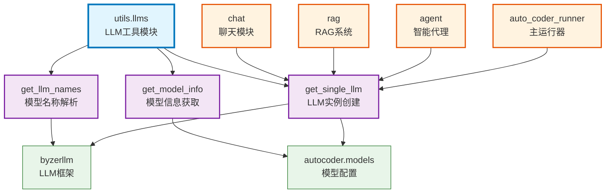

# utils.llms

Auto-Coder 系统中专门处理大语言模型（LLM）相关功能的工具模块，提供LLM实例创建、模型信息获取、模型名称解析等核心功能，支持pro和lite两种产品模式。

## 模块位置

**源码路径**: `src/autocoder/utils/llms.py`  
**文档路径**: `specs/utils_llms.ac.mod.md`  
**模块类型**: 单文件模块

## 文件结构

```python
# llms.py 内容结构
├── 导入部分                    # byzerllm, autocoder.models 等依赖导入
├── get_llm_names()            # 获取LLM模型名称列表
├── get_model_info()           # 获取模型详细信息
└── get_single_llm()           # 创建单个LLM实例
```

## 快速开始

### 基本使用方式

```python
# 导入模块
from autocoder.utils.llms import get_llm_names, get_model_info, get_single_llm
from byzerllm import ByzerLLM

# 1. 获取模型名称列表
llm = ByzerLLM()
model_names = get_llm_names(llm)
print(f"可用模型: {model_names}")

# 2. 获取模型信息（Lite模式）
model_info = get_model_info("gpt-4", "lite")
if model_info:
    print(f"模型类型: {model_info['model_type']}")
    print(f"基础URL: {model_info['base_url']}")

# 3. 创建LLM实例
# Pro模式
pro_llm = get_single_llm("gpt-4", "pro")

# Lite模式
lite_llm = get_single_llm("gpt-4", "lite")

# 4. 使用LLM进行推理
import byzerllm

@byzerllm.prompt()
def simple_chat(question: str) -> str:
    """请回答以下问题：{{ question }}"""

response = simple_chat.with_llm(lite_llm).run("什么是人工智能？")
print(response)
```

### 主要功能

该模块提供三个核心函数，用于LLM的名称解析、信息获取和实例创建，支持pro和lite两种产品模式的不同配置需求。

## 核心组件详解

### 1. 主要函数

**get_llm_names**
- **功能**: 获取LLM模型名称列表，支持单个/多个实例和特定类型过滤
- **参数**: llm实例或字符串、目标模型类型（可选）
- **返回值**: 模型名称列表
- **使用示例**: 
```python
model_names = get_llm_names(llm, target_model_type="qa_model")
```

**get_model_info**
- **功能**: 获取模型详细信息，根据产品模式返回不同信息
- **参数**: 模型名称字符串、产品模式（"pro"或"lite"）
- **返回值**: 模型信息字典（pro模式返回None）
- **使用示例**: 
```python
model_info = get_model_info("gpt-4", "lite")
```

**get_single_llm**
- **功能**: 创建单个LLM实例，支持pro和lite产品模式
- **参数**: 模型名称字符串、产品模式
- **返回值**: ByzerLLM或SimpleByzerLLM实例
- **使用示例**: 
```python
llm = get_single_llm("gpt-4", "lite")
```

### 2. 产品模式差异

**Pro模式**: 使用ByzerLLM.from_default_model()创建实例，依赖预配置的模型服务，适用于企业级部署

**Lite模式**: 使用SimpleByzerLLM创建实例，需要手动配置模型参数，从autocoder.models获取模型信息，适用于个人和小团队使用

## Mermaid 依赖图



## 依赖关系说明

### 对其他模块的依赖
- 外部依赖：byzerllm框架、autocoder.models模块

### 被依赖关系
列出依赖于该模块的其他模块：

- `specs/chat.ac.mod.md` - 聊天模块使用get_single_llm创建LLM实例
- `specs/rag.ac.mod.md` - RAG系统使用LLM工具函数
- `specs/agent.ac.mod.md` - 智能代理模块使用LLM管理功能
- `specs/auto_coder_runner.ac.mod.md` - 主运行器使用LLM实例创建

## 可以验证模块可运行的测试命令

```bash
# 单文件模块测试
python -c "from autocoder.utils.llms import get_llm_names, get_model_info, get_single_llm; print('Utils.llms imported successfully')"

# 验证核心函数
python -c "from autocoder.utils.llms import get_single_llm; llm = get_single_llm('gpt-4', 'lite'); print('LLM created successfully')"

# 检查依赖关系
python -c "import byzerllm; from autocoder import models; print('Dependencies available')"

# 验证使用情况
grep -r "from autocoder.utils.llms" src/ --include="*.py"
grep -r "get_single_llm" src/ --include="*.py"
``` 