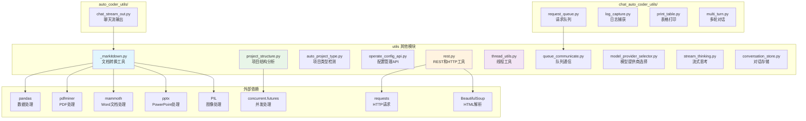

# utils_other.ac.mod.md

## 模块概述

`utils` 其他模块是 Auto-Coder 系统的工具函数集合，除了 `llms.py` 外，还包含文档处理、项目分析、配置管理、REST API、线程工具等多种实用功能。这些工具为 Auto-Coder 的各个组件提供基础支持和辅助功能。

**模块类型**: 包模块  
**主要功能**: 工具函数、文档处理、项目分析、配置管理  
**依赖关系**: 被其他模块广泛使用的基础工具模块

## 核心组件

### 1. 文档处理工具
- **_markitdown.py**: 文档格式转换工具，支持多种格式转 Markdown
- **MarkItDown**: 主要文档转换类
- **DocumentConverter**: 文档转换器基类

### 2. 项目分析工具
- **project_structure.py**: 项目结构分析工具
- **EnhancedFileAnalyzer**: 增强文件分析器
- **auto_project_type.py**: 自动项目类型检测

### 3. 配置管理工具
- **operate_config_api.py**: 配置操作 API
- **model_provider_selector.py**: 模型提供商选择器

### 4. 网络和 REST 工具
- **rest.py**: REST API 和 HTTP 文档处理
- **HttpDoc**: HTTP 文档处理类

### 5. 线程和并发工具
- **thread_utils.py**: 线程工具函数
- **queue_communicate.py**: 队列通信工具

### 6. 其他工具模块
- **auto_coder_utils/**: Auto-Coder 专用工具集
- **chat_auto_coder_utils/**: 聊天相关工具集

## 主要功能

### 1. 文档格式转换

```python
from autocoder.utils._markitdown import MarkItDown

# 创建文档转换器
markitdown = MarkItDown(
    llm=llm,
    product_mode="lite"
)

# 转换 PDF 文档
result = markitdown.convert("document.pdf")
print(f"转换结果: {result.text_content}")

# 转换网页内容
result = markitdown.convert("https://example.com")
print(f"网页内容: {result.text_content}")

# 转换 Office 文档
result = markitdown.convert("presentation.pptx")
print(f"演示文稿内容: {result.text_content}")

# 支持的格式
supported_formats = [
    ".pdf",      # PDF 文档
    ".docx",     # Word 文档
    ".pptx",     # PowerPoint 演示文稿
    ".xlsx",     # Excel 表格
    ".html",     # HTML 网页
    ".txt",      # 纯文本
    ".md",       # Markdown
    ".wav",      # 音频文件（需要语音识别）
    ".mp3",      # 音频文件
]
```

### 2. 项目结构分析

```python
from autocoder.utils.project_structure import EnhancedFileAnalyzer, AnalysisConfig
from autocoder.common import AutoCoderArgs

# 配置分析参数
config = AnalysisConfig(
    exclude_dirs=[".git", "node_modules", "__pycache__"],
    exclude_extensions=[".log", ".tmp"],
    max_depth=5,
    show_hidden=False,
    parallel_processing=True
)

# 创建文件分析器
args = AutoCoderArgs(source_dir="/path/to/project")
analyzer = EnhancedFileAnalyzer(args, llm, config)

# 执行完整分析
analysis_result = analyzer.analyze()

print("项目结构:")
print(analysis_result["structure"])

print("文件扩展名分析:")
print(analysis_result["extensions"])

print("目录统计:")
print(analysis_result["stats"])

# 获取树形结构
tree_structure = analyzer.get_tree_structure()

# 分析文件扩展名
extensions = analyzer.analyze_extensions()
print(f"代码文件: {extensions.get('code', [])}")
print(f"配置文件: {extensions.get('config', [])}")
print(f"数据文件: {extensions.get('data', [])}")
```

### 3. 项目类型自动检测

```python
from autocoder.utils.auto_project_type import ProjectTypeAnalyzer

# 创建项目类型分析器
analyzer = ProjectTypeAnalyzer(args, llm)

# 遍历项目文件
analyzer.traverse_project()

# 获取文件扩展名统计
ext_counts = analyzer.count_extensions()
print(f"文件扩展名统计: {ext_counts}")

# 检测项目类型
project_type = analyzer.detect_project_type()
print(f"检测到的项目类型: {project_type}")

# 保存统计结果
analyzer.save_stats()

# 加载之前的统计结果
stats = analyzer.load_stats()
print(f"历史统计: {stats}")
```

### 4. 配置管理 API

```python
from autocoder.utils.operate_config_api import (
    convert_yaml_to_config, 
    get_llm, 
    get_llm_friendly_package_docs
)

# 转换 YAML 配置为 AutoCoderArgs
yaml_file = "config.yml"
args = convert_yaml_to_config(yaml_file)
print(f"配置参数: {args}")

# 获取 LLM 实例
memory = {"conf": {"model": "gpt-4"}, "current_files": {"files": []}}
llm = get_llm(memory, model="gpt-4")

# 获取包文档
docs = get_llm_friendly_package_docs(
    memory=memory,
    package_name="requests",
    return_paths=False
)
print(f"包文档: {docs}")

# 配置值转换
def convert_config_value(key: str, value: str):
    """转换配置值为合适的类型"""
    if key in ["skip_build_index", "skip_confirm", "silence"]:
        return value.lower() == "true"
    elif key in ["max_iterations", "temperature"]:
        try:
            return int(value) if "." not in value else float(value)
        except ValueError:
            return value
    return value
```

### 5. HTTP 文档处理

```python
from autocoder.utils.rest import HttpDoc

# 创建 HTTP 文档处理器
http_doc = HttpDoc(args, llm, urls=[
    "https://docs.python.org/3/",
    "/path/to/local/file.pdf",
    "/path/to/directory/"
])

# 爬取 URL 内容
source_codes = http_doc.crawl_urls()

for source_code in source_codes:
    print(f"文件: {source_code.module_name}")
    print(f"内容: {source_code.source_code[:200]}...")

# 处理本地文件
local_files = http_doc._process_local_file("/path/to/document.pdf")
for file_content in local_files:
    print(f"本地文件: {file_content.module_name}")
    print(f"内容: {file_content.source_code[:200]}...")
```

### 6. 线程工具

```python
from autocoder.utils.thread_utils import run_in_raw_thread
import time

# 使用线程装饰器
@run_in_raw_thread(token="my_task", context={"user": "admin"})
def long_running_task(duration: int, message: str):
    """长时间运行的任务"""
    for i in range(duration):
        print(f"{message} - 进度: {i+1}/{duration}")
        time.sleep(1)
    return f"任务完成: {message}"

# 启动线程任务
print("启动长时间任务...")
long_running_task(5, "数据处理任务")
print("任务已在后台运行")

# 带错误处理的线程任务
@run_in_raw_thread()
def risky_task():
    """可能出错的任务"""
    # 模拟可能的错误
    import random
    if random.random() < 0.5:
        raise ValueError("随机错误")
    return "任务成功"

# 执行有风险的任务
risky_task()
```

### 7. 队列通信

```python
from autocoder.utils.queue_communicate import (
    CommunicateEventType, 
    QueueCommunicate
)

# 创建队列通信器
communicator = QueueCommunicate()

# 发送事件
communicator.send_event(
    event_type=CommunicateEventType.CODE_GENERATE_START,
    data={"task_id": "123", "query": "生成用户模块"}
)

# 接收事件
event = communicator.receive_event(timeout=5.0)
if event:
    print(f"收到事件: {event.event_type}")
    print(f"数据: {event.data}")

# 支持的事件类型
event_types = [
    CommunicateEventType.CODE_MERGE,
    CommunicateEventType.CODE_GENERATE,
    CommunicateEventType.CODE_MERGE_RESULT,
    CommunicateEventType.CODE_START,
    CommunicateEventType.CODE_END,
    CommunicateEventType.ASK_HUMAN,
    CommunicateEventType.CODE_ERROR,
    CommunicateEventType.CODE_INDEX_BUILD_START,
    CommunicateEventType.CODE_RAG_SEARCH_START,
]
```

### 8. 模型提供商选择

```python
from autocoder.utils.model_provider_selector import ModelProviderSelector

# 创建模型提供商选择器
selector = ModelProviderSelector()

# 选择最佳提供商
provider = selector.select_best_provider(
    model_name="gpt-4",
    requirements={
        "max_tokens": 8000,
        "supports_streaming": True,
        "cost_per_token": 0.0001
    }
)

print(f"推荐提供商: {provider.name}")
print(f"API 端点: {provider.endpoint}")
print(f"支持的功能: {provider.features}")

# 获取所有可用提供商
providers = selector.get_available_providers()
for provider in providers:
    print(f"提供商: {provider.name}")
    print(f"  支持的模型: {provider.supported_models}")
    print(f"  价格: {provider.pricing}")
```

## Auto-Coder 专用工具

### 1. 聊天流输出工具

```python
from autocoder.utils.auto_coder_utils.chat_stream_out import stream_out

# 流式输出处理
def process_streaming_response(llm_response_generator):
    """处理流式响应"""
    
    def stream_generator():
        for chunk in llm_response_generator:
            # 处理每个响应块
            yield chunk, {"timestamp": time.time()}
    
    # 使用流输出工具
    full_response, metadata = stream_out(
        stream_generator=stream_generator(),
        request_id="req_123",
        model_name="gpt-4",
        title="代码生成",
        final_title="生成完成",
        args=args
    )
    
    return full_response, metadata
```

### 2. 请求队列管理

```python
from autocoder.utils.request_queue import RequestQueue, RequestValue

# 创建请求队列
queue = RequestQueue()

# 添加请求
request = RequestValue(
    request_id="req_123",
    query="生成用户登录功能",
    status="pending",
    priority=1
)

queue.add_request(request)

# 获取请求
pending_request = queue.get_next_request()
if pending_request:
    print(f"处理请求: {pending_request.query}")
    
    # 更新请求状态
    queue.update_request_status(pending_request.request_id, "processing")
    
    # 完成请求
    queue.complete_request(pending_request.request_id, "success")

# 获取队列统计
stats = queue.get_statistics()
print(f"队列统计: {stats}")
```

### 3. 日志捕获工具

```python
from autocoder.utils.log_capture import LogCapture

# 创建日志捕获器
log_capture = LogCapture()

# 开始捕获日志
log_capture.start_capture()

# 执行需要记录的操作
print("这是一条测试日志")
import logging
logging.info("这是一条 info 日志")
logging.error("这是一条 error 日志")

# 停止捕获并获取日志
captured_logs = log_capture.stop_capture()
print(f"捕获的日志: {captured_logs}")

# 保存日志到文件
log_capture.save_logs("captured_logs.txt")
```

## 高级功能

### 1. 多线程文件处理

```python
from autocoder.utils.project_structure import EnhancedFileAnalyzer
from concurrent.futures import ThreadPoolExecutor
import os

def parallel_file_analysis(project_dirs: list):
    """并行分析多个项目目录"""
    
    def analyze_single_project(project_dir):
        args = AutoCoderArgs(source_dir=project_dir)
        analyzer = EnhancedFileAnalyzer(args, llm)
        return analyzer.analyze()
    
    # 使用线程池并行处理
    with ThreadPoolExecutor(max_workers=4) as executor:
        results = list(executor.map(analyze_single_project, project_dirs))
    
    return results

# 分析多个项目
projects = ["/path/to/project1", "/path/to/project2", "/path/to/project3"]
analysis_results = parallel_file_analysis(projects)

for i, result in enumerate(analysis_results):
    print(f"项目 {i+1} 分析结果:")
    print(f"  文件数量: {result['stats']['file_count']}")
    print(f"  代码文件: {len(result['extensions']['code'])}")
```

### 2. 智能文档提取

```python
from autocoder.utils._markitdown import MarkItDown, try_parse_image

# 创建智能文档转换器
converter = MarkItDown(llm=llm, product_mode="lite")

def extract_structured_content(file_path: str):
    """提取结构化文档内容"""
    
    # 转换文档
    result = converter.convert(file_path)
    
    if not result.text_content:
        return None
    
    # 如果是图片，尝试 OCR 解析
    if file_path.lower().endswith(('.png', '.jpg', '.jpeg')):
        ocr_result = try_parse_image(file_path, llm)
        if ocr_result:
            result.text_content += f"\n\n# OCR 解析结果\n{ocr_result}"
    
    return {
        "file_path": file_path,
        "content": result.text_content,
        "title": result.title or "未知标题",
        "metadata": {
            "file_type": os.path.splitext(file_path)[1],
            "size": os.path.getsize(file_path),
            "processed_at": time.time()
        }
    }

# 批量处理文档
document_files = [
    "report.pdf",
    "presentation.pptx", 
    "data.xlsx",
    "diagram.png"
]

extracted_contents = []
for file_path in document_files:
    if os.path.exists(file_path):
        content = extract_structured_content(file_path)
        if content:
            extracted_contents.append(content)

print(f"成功提取 {len(extracted_contents)} 个文档的内容")
```

### 3. 配置热重载

```python
import os
import time
from watchdog.observers import Observer
from watchdog.events import FileSystemEventHandler

class ConfigReloader(FileSystemEventHandler):
    """配置文件热重载器"""
    
    def __init__(self, config_file: str, reload_callback):
        self.config_file = config_file
        self.reload_callback = reload_callback
        self.last_modified = 0
    
    def on_modified(self, event):
        if event.src_path.endswith(self.config_file):
            # 防止重复触发
            current_time = time.time()
            if current_time - self.last_modified > 1:  # 1秒防抖
                self.last_modified = current_time
                print(f"配置文件已更改: {event.src_path}")
                self.reload_callback()

def setup_config_hot_reload(config_file: str):
    """设置配置热重载"""
    
    def reload_config():
        """重新加载配置"""
        try:
            new_args = convert_yaml_to_config(config_file)
            print(f"配置已重新加载: {new_args}")
            # 这里可以更新全局配置
        except Exception as e:
            print(f"配置重载失败: {e}")
    
    # 设置文件监控
    event_handler = ConfigReloader(config_file, reload_config)
    observer = Observer()
    observer.schedule(event_handler, os.path.dirname(config_file), recursive=False)
    observer.start()
    
    print(f"已启动配置热重载监控: {config_file}")
    return observer

# 使用配置热重载
config_observer = setup_config_hot_reload("config.yml")
```

## 工具函数集合

### 1. 文件操作工具

```python
from autocoder.utils import get_last_yaml_file, open_yaml_file_in_editor

# 获取最新的 YAML 文件
latest_yaml = get_last_yaml_file("actions")
if latest_yaml:
    print(f"最新的 YAML 文件: {latest_yaml}")
    
    # 在编辑器中打开
    open_yaml_file_in_editor(f"actions/{latest_yaml}")
```

### 2. 表格打印工具

```python
from autocoder.utils.print_table import print_table

# 打印表格数据
data = [
    ["名称", "类型", "大小", "修改时间"],
    ["file1.py", "Python", "1.2KB", "2024-01-01"],
    ["file2.js", "JavaScript", "2.5KB", "2024-01-02"],
    ["file3.md", "Markdown", "800B", "2024-01-03"],
]

print_table(data)
```

### 3. 多轮对话工具

```python
from autocoder.utils.multi_turn import MultiTurnConversation

# 创建多轮对话管理器
conversation = MultiTurnConversation()

# 添加对话轮次
conversation.add_turn("user", "你好，请帮我生成一个用户类")
conversation.add_turn("assistant", "好的，我来为您生成一个用户类...")
conversation.add_turn("user", "请添加邮箱验证功能")

# 获取对话历史
history = conversation.get_history()
print(f"对话历史: {history}")

# 获取上下文
context = conversation.get_context(max_turns=3)
print(f"最近3轮对话: {context}")
```

## 依赖关系图



## 使用示例

### 完整文档处理流水线

```python
#!/usr/bin/env python3
"""
完整的文档处理流水线示例
展示 utils 模块的综合应用
"""

import os
import time
from pathlib import Path
from autocoder.utils._markitdown import MarkItDown
from autocoder.utils.project_structure import EnhancedFileAnalyzer
from autocoder.utils.auto_project_type import ProjectTypeAnalyzer
from autocoder.utils.rest import HttpDoc
from autocoder.utils.thread_utils import run_in_raw_thread
from autocoder.common import AutoCoderArgs

class DocumentProcessor:
    """文档处理器"""
    
    def __init__(self, args, llm):
        self.args = args
        self.llm = llm
        self.markitdown = MarkItDown(llm=llm, product_mode=args.product_mode)
        self.results = []
    
    def process_project(self, project_dir: str):
        """处理整个项目"""
        print(f"开始处理项目: {project_dir}")
        
        # 1. 项目结构分析
        structure_result = self.analyze_project_structure(project_dir)
        
        # 2. 项目类型检测
        type_result = self.detect_project_type(project_dir)
        
        # 3. 文档转换
        docs_result = self.convert_documents(project_dir)
        
        # 4. 生成报告
        report = self.generate_report(structure_result, type_result, docs_result)
        
        return report
    
    def analyze_project_structure(self, project_dir: str):
        """分析项目结构"""
        print("  分析项目结构...")
        
        args = AutoCoderArgs(source_dir=project_dir)
        analyzer = EnhancedFileAnalyzer(args, self.llm)
        
        return analyzer.analyze()
    
    def detect_project_type(self, project_dir: str):
        """检测项目类型"""
        print("  检测项目类型...")
        
        args = AutoCoderArgs(source_dir=project_dir)
        analyzer = ProjectTypeAnalyzer(args, self.llm)
        
        analyzer.traverse_project()
        project_type = analyzer.detect_project_type()
        ext_counts = analyzer.count_extensions()
        
        return {
            "project_type": project_type,
            "extension_counts": ext_counts
        }
    
    @run_in_raw_thread()
    def convert_documents(self, project_dir: str):
        """转换文档（在后台线程中执行）"""
        print("  转换文档...")
        
        doc_files = []
        for root, dirs, files in os.walk(project_dir):
            for file in files:
                if file.lower().endswith(('.pdf', '.docx', '.pptx', '.xlsx')):
                    doc_files.append(os.path.join(root, file))
        
        converted_docs = []
        for doc_file in doc_files:
            try:
                result = self.markitdown.convert(doc_file)
                if result.text_content:
                    converted_docs.append({
                        "file": doc_file,
                        "content": result.text_content[:500] + "...",  # 截取前500字符
                        "title": result.title
                    })
            except Exception as e:
                print(f"    转换失败 {doc_file}: {e}")
        
        return converted_docs
    
    def generate_report(self, structure, project_type, docs):
        """生成分析报告"""
        print("  生成报告...")
        
        report = {
            "timestamp": time.time(),
            "project_structure": {
                "total_files": len(structure.get("structure", {})),
                "extensions": structure.get("extensions", {}),
                "stats": structure.get("stats", {})
            },
            "project_type": project_type,
            "documents": {
                "total_docs": len(docs) if docs else 0,
                "converted_docs": docs if docs else []
            }
        }
        
        return report
    
    def process_multiple_projects(self, project_dirs: list):
        """批量处理多个项目"""
        print(f"批量处理 {len(project_dirs)} 个项目...")
        
        reports = []
        for project_dir in project_dirs:
            try:
                report = self.process_project(project_dir)
                reports.append(report)
            except Exception as e:
                print(f"处理项目失败 {project_dir}: {e}")
        
        return reports

# 网络文档处理示例
def process_web_documents(urls: list, args, llm):
    """处理网络文档"""
    print(f"处理 {len(urls)} 个网络文档...")
    
    http_doc = HttpDoc(args, llm, urls=urls)
    source_codes = http_doc.crawl_urls()
    
    processed_docs = []
    for source_code in source_codes:
        processed_docs.append({
            "url": source_code.module_name,
            "content_length": len(source_code.source_code),
            "preview": source_code.source_code[:200] + "..."
        })
    
    return processed_docs

# 主程序示例
def main():
    """主程序"""
    # 配置参数
    args = AutoCoderArgs()
    args.source_dir = "/path/to/project"
    args.product_mode = "lite"
    
    # 创建 LLM（这里需要根据实际情况配置）
    import byzerllm
    llm = byzerllm.ByzerLLM()
    
    # 创建文档处理器
    processor = DocumentProcessor(args, llm)
    
    # 处理单个项目
    print("=== 单项目处理 ===")
    report = processor.process_project("/path/to/single/project")
    print(f"项目分析报告: {report}")
    
    # 批量处理项目
    print("\n=== 批量项目处理 ===")
    projects = [
        "/path/to/project1",
        "/path/to/project2", 
        "/path/to/project3"
    ]
    batch_reports = processor.process_multiple_projects(projects)
    print(f"批量处理完成，生成 {len(batch_reports)} 个报告")
    
    # 处理网络文档
    print("\n=== 网络文档处理 ===")
    web_urls = [
        "https://docs.python.org/3/tutorial/",
        "https://github.com/user/repo/blob/main/README.md",
        "/path/to/local/document.pdf"
    ]
    web_docs = process_web_documents(web_urls, args, llm)
    print(f"网络文档处理完成，处理 {len(web_docs)} 个文档")

if __name__ == "__main__":
    main()
```

## 验证命令

验证 utils 其他模块功能：

```bash
# 检查模块结构
list_dir("src/autocoder/utils")
list_dir("src/autocoder/utils/auto_coder_utils")
list_dir("src/autocoder/utils/chat_auto_coder_utils")

# 验证文档处理工具
grep_search("class MarkItDown" --include="*.py")
grep_search("def convert" --include="*.py" "src/autocoder/utils/_markitdown.py")

# 验证项目分析工具
grep_search("class EnhancedFileAnalyzer" --include="*.py")
grep_search("class ProjectTypeAnalyzer" --include="*.py")

# 验证配置管理工具
grep_search("def convert_yaml_to_config" --include="*.py")
grep_search("def get_llm" --include="*.py" "src/autocoder/utils/operate_config_api.py")

# 验证网络工具
grep_search("class HttpDoc" --include="*.py")
grep_search("def crawl_urls" --include="*.py")

# 验证线程工具
grep_search("def run_in_raw_thread" --include="*.py")
grep_search("class.*Communicate" --include="*.py")

# 检查依赖关系
grep_search("import pandas" --include="*.py" "src/autocoder/utils")
grep_search("import requests" --include="*.py" "src/autocoder/utils")
grep_search("from concurrent.futures" --include="*.py" "src/autocoder/utils")
```

通过这些验证命令可以确认 utils 其他模块的完整性和功能正确性。 